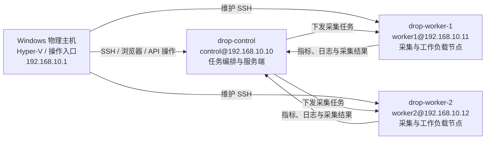
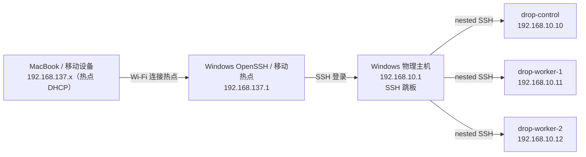

# Mini-Drop 三节点实验集群配置说明

> 最后验证时间：2026-08-10
> 用途：腾讯 Drop 系统轻量复刻、AI 功能探索、采集任务下发与多节点联调实验。

> 定位说明：本文只描述当前 Hyper-V 实验 `EnvironmentProfile`，不是 Mini-Drop 的产品架构或规模边界。当前 AI 路线见 [`docs/drop_ai_exploration_roadmap.md`](docs/drop_ai_exploration_roadmap.md)，功能和授权边界见 [`docs/ai_authorization_and_tooling.md`](docs/ai_authorization_and_tooling.md)。

## 1. 集群概览

本环境运行在一台 Windows 物理主机的 Hyper-V 上，由一个控制节点和两个采集/执行节点组成。



Windows 是操作入口，负责运行 Hyper-V、浏览器、PowerShell 和开发工具；control 是集群内的控制平面，负责保存任务、编排、调度和汇总结果；worker 负责运行被测工作负载并执行实际采集。Windows 可以直接维护任何节点，但正式演示流程应由 control 向 worker 下发任务。

## 2. 网络配置

| 项目 | 配置 |
|---|---|
| Hyper-V 虚拟交换机 | `MiniDrop` |
| 交换机类型 | Internal（内部交换机） |
| IPv4 子网 | `192.168.10.0/24` |
| Windows/默认网关 | `192.168.10.1` |
| 外网出口 | 虚拟机默认网关指向 Windows；当前对公网镜像仓库的实测为超时，不得假定 NAT 已可用 |
| 首选 DNS | `223.5.5.5` |
| 备用 DNS | `1.1.1.1` |
| IPv4 分配方式 | 静态地址，Netplan 持久化 |

节点地址：

| 节点 | 主机名 | IPv4 | 默认网关 | 用途 |
|---|---|---:|---:|---|
| Windows 主机 | `LENOVO` | `192.168.10.1` | 物理网络网关 | Hyper-V、NAT、开发与操作入口 |
| control | `control` | `192.168.10.10/24` | `192.168.10.1` | 控制平面、任务调度、API 和数据汇总 |
| worker1 | `worker1` | `192.168.10.11/24` | `192.168.10.1` | 第一采集节点、被测工作负载 |
| worker2 | `worker2` | `192.168.10.12/24` | `192.168.10.1` | 第二采集节点、并发和故障实验 |

Ubuntu 的持久网络配置文件为：

```text
/etc/netplan/99-mini-drop.yaml
```

worker1 和 worker2 已验证：静态地址、默认路由和 DNS 在重启后均能正确恢复，两个 worker 与 control 及彼此之间均可互相 Ping。

### 2.1 热点接入（MacBook / 移动设备）

实验环境默认只允许 Windows 物理主机直接操作虚拟机。当 MacBook 或移动设备
通过 Windows 移动热点接入时，当前稳定、已验证的路径是使用 Windows OpenSSH
作跳板。不要在未从真实热点客户端验证前，声称客户端可直达 `192.168.10.0/24`。



MacBook 连上热点后自动获得 `192.168.137.x` 地址，默认网关是
`192.168.137.1`。Windows OpenSSH 已运行并设置为开机自启，TCP 22 入站规则只放行
`192.168.137.0/24`。Windows 本机到三台 VM 的 SSH 已通过。

在 Windows 主机上执行的配置（需管理员权限，重启后保持）：

| 配置项 | 命令 / 说明 |
|---|---|
| Windows OpenSSH | `sshd` 为 `Running` / `AUTO_START` |
| SSH 防火墙边界 | `MiniDrop-Windows-SSH-Hotspot`，只放行 `192.168.137.0/24` 到 TCP 22 |
| 接口 forwarding | `vEthernet (MiniDrop)` 与热点接口均为 `Enabled`；这只是路由前置条件，不等于已验证端到端转发 |

已实测验证：

| 目标 | 端口 | 结果 |
|---|---|---|
| 热点客户端 → Windows OpenSSH | 22 | ✅ Windows 本机端口自检通过；入站边界已限制为热点网段 |
| Windows → control SSH | 22 | ✅ 连通 |
| Windows → control Web / API | 443 | ✅ 健康检查通过 |
| Windows → worker1 / worker2 SSH | 22 | ✅ 连通 |
| 热点客户端 → VM 直连 | — | ⚠️ 未完成端到端验证，当前使用 SSH 跳板 |

> **注意**：从 Windows 主机以 `192.168.10.1` 作源地址访问 VM，不等于从
> `192.168.137.x` 热点客户端完成转发验证。验收直连前，必须在真实客户端上测试
> TCP 22/443，并同时确认返回路由。

热点设备侧连接入口：

```bash
# 第一跳：MacBook 登录 Windows
ssh szjyl@192.168.137.1

# 第二跳：在 Windows 中登录目标 VM
ssh control@192.168.10.10
```

## 3. 虚拟机资源

| Hyper-V 名称 | 内存 | vCPU | 系统盘 | 操作系统 | 当前内核 |
|---|---:|---:|---:|---|---|
| `drop-control` | 6 GB | 4 | 80 GB | Ubuntu Server 24.04.4 LTS | `6.8.0-136-generic` |
| `drop-worker-1` | 4 GB | 4 | 80 GB | Ubuntu Server 24.04.4 LTS | `6.8.0-136-generic` |
| `drop-worker-2` | 4 GB | 4 | 80 GB | Ubuntu Server 24.04.4 LTS | `6.8.0-137-generic` |

Hyper-V 基线配置：

- 第二代虚拟机（Generation 2）。
- 固定启动内存，未启用动态内存。
- 自动检查点关闭，检查点类型为 ProductionOnly。
- Secure Boot 使用 Microsoft UEFI Certificate Authority。
- 关机操作设置为正常关闭来宾系统。
- Ubuntu 安装 ISO 已从三个节点弹出。
- 第一启动设备为虚拟硬盘，避免重启后再次进入安装程序。
- 虚拟机文件统一存放在 `E:\Hyper_v_Linix\` 下的节点目录中。

宿主机共有 32 GB 内存，三台虚拟机合计分配 14 GB，仍为 Windows、IDE 和浏览器保留了足够空间。两个 worker 各配置约 3.8 GB Swap，用于降低并发实验时因瞬时内存压力导致进程直接退出的概率。

## 4. 节点角色与数据关系

### control

- 接收来自 Windows 浏览器、命令行或 API 的操作。
- 保存采集任务、目标节点、采集参数和任务状态。
- 将任务分配给一个或多个 worker。
- 接收 worker 返回的指标、日志、调用栈或分析结果。
- 后续承载 Mini-Drop API、任务队列、数据库、对象存储和 AI 分析入口。

### worker1 / worker2

- 接收 control 下发的采集任务。
- 运行采集 Agent 和被测程序/容器。
- 使用 perf、bpftrace 等工具执行 CPU、I/O 和内核事件采集。
- 将任务状态与采集结果回传 control。
- 用两个节点验证并发调度、节点离线、失败重试、任务迁移和结果对比。

典型任务链路：

```text
Windows 发起操作
  -> control 创建并调度任务
  -> worker1/worker2 执行采集
  -> worker 回传状态与数据
  -> control 存储、展示并调用 AI 分析
  -> Windows 查看结果
```

## 5. 已安装的软件和采集能力

三个节点已具备基础开发和容器运行环境；worker 额外完成采集工具验证。

| 组件 | control | worker1 | worker2 |
|---|---|---|---|
| OpenSSH Server | 已启用 | 已启用 | 已启用 |
| Git、Make、GCC/G++ | 已安装 | 已安装 | 已安装 |
| Python 3、pip、venv | 已安装 | 已安装 | 已安装 |
| Docker Engine | `29.1.3` | `29.1.3` | `29.1.3` |
| Docker Compose | `2.40.3` | `2.40.3` | `2.40.3` |
| perf | 基础环境已安装 | `6.8.12` | `6.8.12` |
| bpftrace | 按控制服务需要使用 | `0.20.2` | `0.20.2` |
| py-spy | 不运行采集 Agent | Agent 虚拟环境内已安装 | Agent 虚拟环境内已安装 |
| Go / Graphviz | 按控制服务需要使用 | `Go 1.22` / 已安装 | 按实验需要安装 |

worker 的采集相关内核参数保存在：

```text
/etc/sysctl.d/99-mini-drop.conf
```

当前配置：

```text
kernel.perf_event_paranoid=1
kernel.kptr_restrict=0
```

以上配置允许 Agent 在受控提权或 systemd 服务身份下使用 perf/eBPF 采集，同时没有为普通用户全局开放不受约束的 root 权限。worker 用户均已加入 `docker` 组，重新登录后可直接运行 Docker 命令。

## 6. 当前验证状态

截至最后验证时间（2026-08-10）：

- 三台虚拟机均能从虚拟硬盘正常启动。
- worker1 运行 `6.8.0-136-generic`，worker2 运行 `6.8.0-137-generic`。
- worker1、worker2 的 SSH 和 Docker 服务均为 `active`。
- 两个 worker 的 Docker 客户端能正常连接本机 Docker daemon。
- 两个 worker 均能使用
  `tracepoint:block:block_rq_issue` / `tracepoint:block:block_rq_complete`；
  Mini-Drop 的 eBPF I/O 脚本已切换到适配当前 6.8 内核的 tracepoint。
- 两个 worker 的系统待升级软件包数量均为 `0`。
- worker1、worker2 能访问 control，两个 worker 之间也可互通。
- 根分区当前约使用 12%，剩余空间约 65 GB。
- 时区统一为 `Asia/Shanghai`。
- Ubuntu 软件源统一为阿里云 HTTPS 镜像。

Mini-Drop 已完成三节点部署并于 2026-08-10 升级到当前 AI/Agent 基线：

- control 使用原生 systemd 运行 `mini-drop-server` 和实验用 S3 兼容存储
  `mini-drop-s3`，Nginx 提供 HTTPS Web/API 入口；
- worker1、worker2 使用 systemd 运行 `mini-drop-agent`，均已设置开机启动；
- Control 和两个 Worker 当前发布目录均为
  `/home/<user>/mini-drop-release-20260810-ai-agent-v1`，`mini-drop-active`
  通过软链接指向当前版本；2026-08-06 的旧发布目录仍保留作为回滚点；
- 数据库和证书继续保存在稳定目录 `/home/control/mini-drop/`，升级未覆盖历史数据；
- Windows 可通过 `https://192.168.10.10/` 访问 Web，通过
  `https://192.168.10.10/api/healthz` 检查健康状态；
- 两个 Agent 均以 `ONLINE` 状态注册。worker1 动态上报
  `continuous_perf`、`ebpf_io`、`go_pprof`、`java_async`、`log_scan`、
  `memory_smaps`、`perf_cpu`、`process_scan`、`pyspy`、`sys_metrics`；
  worker2 未安装 Java/async-profiler，因此不声明 `java_async`，其余九种能力正常。

2026-07-28 已完成两台 worker 的并发 perf 验收：

| Agent | 验收任务 | 结果 | 产物 |
|---|---|---|---|
| `linux-worker-1` | `task_20260728_091016_ef4c5e` | `DONE` | raw、火焰图 JSON/SVG、TopN、建议 |
| `linux-worker-2` | `task_20260728_091016_daf4a8` | `DONE` | raw、火焰图 JSON/SVG、TopN、建议 |

两条任务均完成
`PENDING → RUNNING → UPLOADING → ANALYZING → DONE`，共 10 个产物全部记录
SHA-256；从 Web/API 下载的原始 perf 文件与数据库哈希一致。创建幂等、取消幂等、
重试幂等和 `TASK_RETRIED` 审计也已通过集群验证。DeepSeek
`deepseek-v4-flash` 的内置 AI 验证套件返回 `PASSED`，NLP、RCA 和任务摘要功能已启用。

随后使用真实虚拟机负载完成了扩展采集矩阵：

| 采集器 | 验收任务 | 结果 | 关键验证 |
|---|---|---|---|
| py-spy | `task_20260728_095657_3081c4` | `DONE` | Python 火焰图和 SHA-256 |
| continuous_perf | `task_20260728_095657_dd6044` | `DONE` | 多窗口汇总、SVG、TopN；最终窗口不再额外等待 |
| sys_metrics | `task_20260728_095657_6cbb8e` | `DONE` | 系统多维指标产物 |
| memory_smaps | `task_20260728_095657_0bb12d` | `DONE` | 进程内存时间序列 |
| go_pprof | `task_20260728_100551_a43dfd` | `DONE` | pprof 原始数据和 SVG |
| go_pprof（自定义端口） | `task_20260728_100918_784115` | `DONE` | 仅监听 6061，验证 options 完整透传 |
| ebpf_io | `task_20260728_101818_95c0fa` | `DONE` | 15777 个真实 I/O 样本、两个带 SHA-256 的产物 |

虚拟机实测促成并验证了以下修复：

- Agent 能力从“固定声明”改为依据 `perf`、`bpftrace`、py-spy 和
  async-profiler 的实际可用性动态声明；
- py-spy 能从 Agent 自身虚拟环境中被可靠发现；
- 持续采样按剩余任务预算缩短最终窗口，最后一个窗口完成后不再无效休眠；
- `TaskDesc.options_json` 补齐 Web/API → Server → Agent 的采集器选项透传，
  Go pprof 自定义端口已完成黑盒验证；
- eBPF I/O 从不适配当前内核的 kprobe 关联方式切换为块设备 tracepoint，
  并将真实样本总数写入指标产物；
- `TaskResult.result_message` 将采集成功摘要回传到最终任务状态。上述 eBPF
  任务最终状态为
  `eBPF IO 延迟分布已生成；bpftrace IO 延迟采集完成，共 15777 个样本`。

还完成了一次结果回传故障注入：Agent 采集期间停止 control Server，Agent
完成后先将结果持久化到 `/tmp/mini-drop-agent-results`；在 Server 仍离线时重启
Agent，恢复 Server 后任务自动补报为 `DONE`，事件链无重复，暂存目录恢复为空。
这证明采集结果可以跨 Agent 进程重启恢复，不会因补报而重新采样。

最终终检结果：

- `mini-drop-server`、`mini-drop-s3`、`nginx` 和两个
  `mini-drop-agent` 均为 `active`；
- `/api/healthz` 返回 `healthy=true`，数据库和对象存储均为 `ok`；
- 两个 Agent 均为 `ONLINE`，结果暂存目录文件数均为 0；
- 最终 eBPF 任务事件链完整：
  `PENDING → RUNNING → UPLOADING → ANALYZING → DONE`；
- 本地全量自动化测试为 `571 passed`；Web 为 `34 passed`，
  lint 和 production build 通过。

2026-08-10 完成维护链路验证：Windows 能直连 control/worker1/worker2 的 SSH，
control 的 HTTPS 健康检查正常。Windows OpenSSH 已启用，并且入站 22 端口仅放行
`192.168.137.0/24`；MacBook 可先登录 `192.168.137.1`，再以 Windows 作为跳板访问
`192.168.10.0/24`。Windows 的两个相关接口已开启 IP forwarding，但尚未证明
热点客户端可直接路由到虚拟机网段；因此不应把直连方式写成已验证能力。

## 7. 登录与维护

Windows PowerShell/Windows Terminal 登录命令：

```powershell
ssh control@192.168.10.10
ssh worker1@192.168.10.11
ssh worker2@192.168.10.12
```

MacBook / 移动设备通过 Windows 移动热点接入后，当前已验证的维护方式是先登录
Windows，再转入对应虚拟机：

```bash
ssh szjyl@192.168.137.1
# 进入 Windows 后再执行：ssh control@192.168.10.10
```

当前实验环境允许 SSH 密码认证，但密码不再记录在项目文档中。凭据应保存在本机
密码管理器或外部 Secret Manager；如曾通过文档共享，应立即轮换。完成密钥登录
验证后，建议关闭 `PasswordAuthentication`。

常用状态检查：

```bash
hostname
uname -r
ip -br address
ip route
resolvectl dns eth0
systemctl is-active ssh docker
docker version
docker compose version
perf --version
bpftrace --version
```

连通性检查：

```bash
ping -c 3 192.168.10.10
ping -c 3 192.168.10.11
ping -c 3 192.168.10.12
```

## 8. 已知限制

- 当前虚拟机不能访问 Online Boutique 的
  `us-central1-docker.pkg.dev`；2026-08-10 从 worker1 和 Mac 实测均超时，
  worker 本地也没有对应镜像。Docker daemon 和 Compose 静态配置检查均正常。
- 演示阶段可优先在本地构建镜像，或配置可用的腾讯云/企业内部容器镜像仓库。
- 这是一套单物理宿主机上的虚拟集群，可以验证调度、协议、采集、故障恢复和多节点协作，但不能完全模拟物理机故障隔离、真实跨机网络延迟和大规模资源竞争。
- 进行 CPU、I/O 或 eBPF 实验时，应在 worker 上运行负载；不要把高负载采集任务放在 control 上，以免影响调度和演示界面。

## 9. 后续实验建议

基础部署、双 worker 并发 perf、真实采集矩阵、结果暂存补报、产物下载、取消和
重试已经完成。后续面向生产化可继续：

1. 安装并固定 async-profiler 版本后，再启用和验收 `java_async` 能力；
2. 对 AI 摘要、异常解释和优化建议做固定样本评测；
3. 将实验用 SQLite/Moto 替换为 PostgreSQL/MinIO 后执行持久化与备份恢复演练；
4. 为当前自签名证书建立受信任 CA 或替换为正式证书，并执行证书轮换演练；
5. 增加长时间网络分区、磁盘耗尽和 control 整机重启等破坏性更强的专项演练。
