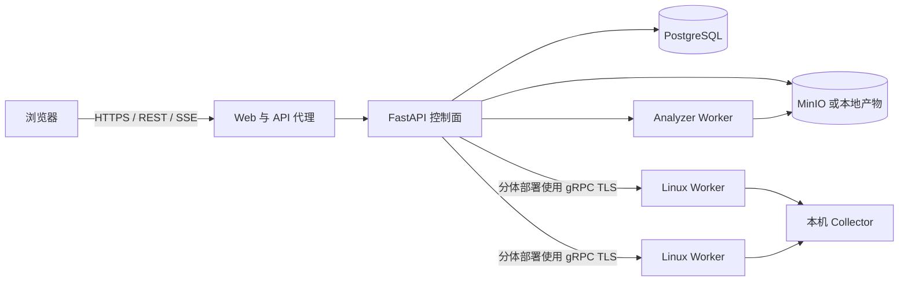

# Mini-Drop

Mini-Drop 是一个面向 Linux 进程的性能采集与 Evidence 调查工作台。它可以向已登记的
Worker 下发有边界的采集任务，保存和展示采集产物，并可选接入 AI Runtime，在服务端
限制的范围、权限和预算内辅助制定调查计划。

这个项目适合性能排查、诊断链路验证和受控恢复实验。
## 当前状态

仓库已经具备可运行的采集、产物分析、Case/Evidence 和受控诊断链路，但各部分的完成度
不同：

| 能力 | 当前情况 |
| --- | --- |
| Worker 登记、任务下发、取消、重试和产物持久化 | 已实现 |
| CPU Profiling、IO 延迟、进程、日志、运行时和资源采集 | 已实现；实际可用性取决于 Worker 的 Linux 工具和权限 |
| 火焰图、TopN、IO、内存和任务产物展示 | Web 已提供 |
| Case/Evidence 调查和受约束的 AI 工具调用 | 已实现；需要配置 Pi Runtime 和模型 Provider |
| 自然语言创建采集任务和结果摘要 | 可选；需要兼容的 AI Provider |
| 长期诊断目标 | 后端 API 已有；Web 创建页目前只登记服务、名称和环境 |
| 高严重度信号自动创建 Case | 后端 API 已有；默认没有内置告警连接器或定时信号生成器 |
| 长期目标的 Profiling 历史 | 后端 API 已有；当前需要通过 API 把完成的 `continuous_perf` 任务建立索引 |
| 恢复动作 | 已有动作策略和少量执行器；所有操作仍需经过范围、授权、预检和验证，不能视为通用自动修复 |

可选的浏览器自动会话只适合共享实验环境。正式部署应启用 HTTP API 与 gRPC 认证、TLS、
网络访问限制和明确的动作策略，再接入有实际价值的工作负载。

## 能做什么

```text
浏览器
  -> Control API / SSE
  -> 已登记的 Linux Worker
  -> 有边界的 Collector Task
  -> 产物存储与分析
  -> 任务结果或 Case/Evidence 调查
```

### 采集和分析

- 在已登记 Worker 上创建、取消、重试和查看采集任务。
- 区分采集状态与分析状态；`perf` 原始产物由独立 Analyzer Worker 异步处理。
- 在 Web 中查看 CPU 火焰图和 TopN、IO 延迟、内存数据、任务产物与 Worker 状态。
- 保存 Task Attempt、状态事件、产物元数据和审计记录，便于复查。

### AI 调查

- 创建包含服务、环境、Worker/PID 范围、依赖、完成条件和已有证据的 Case。
- 可选由 Pi Runtime 提出信息目标和采集建议；服务端在创建实际任务前检查工具 Schema、
  目标范围、Worker 能力、审批、幂等和预算。
- 保存假设、证据引用、用户修正、调查计划、模型调用元数据和 Case 时间线。
- 自然语言任务解析和任务摘要依赖 OpenAI-compatible Provider；未配置模型时，常规采集和
  产物查看仍然可以使用。

### Human-in-the-loop Evidence Governance（人在环证据治理）

专家可以审查“哪些 Evidence 可以进入推理、应按什么可信程度使用”，但不能直接修改根因
置信度。原始 Artifact、Projection、Hash、采集时间和来源保持不可变，审查以追加 Revision
保存。

- 生命周期（`ACTIVE / EXCLUDED / INVALID / SUPERSEDED`）、人工信任
  （`UNREVIEWED / TRUSTED / LOW_TRUST`）和 UI 隐藏/归档相互独立。
- 审查卡从目标身份、时间对齐、完整性、来源、范围、交叉佐证和新鲜度七个维度生成可解释
  的治理建议；覆盖建议必须说明原因。
- 排除、降信任和恢复前会返回影响预览，并用 Review Revision 与短时 impact token 防止基于
  过期页面提交。
- 推理准入变化会使旧分析失效、重验证结论、冻结依赖该 Evidence 的恢复方案，并通过事务
  Outbox 请求 Agent 重新调查；隐藏和归档只整理页面，不改变推理。

当前规则是确定性治理规则，不是模型概率，也不应被解释为自动证明某个根因正确。

### 长期诊断目标

长期目标表示“一个服务在一个环境中的诊断档案”，例如
`checkoutservice / production`。后端可以保存范围、基线、信号策略、历史信号、Profiling
窗口和关联 Case。唯一性按租户、环境和服务标识计算，因此生产、预发布和开发环境应分别
创建目标。

这部分目前还不是完整的长期监控产品。Web 创建弹窗生成的是空范围目标，不能在首次创建时
配置 Worker/PID、依赖关系、基线、信号策略或生命周期管理。信号写入和 Profiling 窗口
索引已经有 API，但仍需外部监控集成或人工操作流程。

## 环境的实际影响

`production`、`staging` 和 `development` 是数据与操作边界，不只是显示标签。

| 环境 | 适合场景 | 当前动作边界 |
| --- | --- | --- |
| `development` | 本地或可丢弃进程、采集器开发、诊断联调 | 大部分服务级动作会被拒绝；主要保留 Mini-Drop 自身的低风险缓存动作 |
| `staging` | 发布验证、压测、故障实验和恢复演练 | 可以评估已登记的服务动作，但仍要求 Dry-run、容量、回滚和策略检查 |
| `production` | 真实事故证据和谨慎恢复 | 与预发布一样受完整门禁约束；选择生产环境不会跳过审批或安全检查 |

实例环境和 Case 环境不一致时会被排除。服务变更也按服务和环境查询，避免把预发布变更当成
生产事故证据。通过长期目标创建 Case 时，服务端会强制继承目标的环境和范围。

## Collector

Worker 会在本机探测可用能力。Collector 出现在代码或目录中，不代表所有主机都能运行；
还要满足内核、工具、容器权限、运行时类型和目标进程身份要求。

| Collector | 主要产物 | 依赖或限制 |
| --- | --- | --- |
| `perf_cpu` | `perf.data`、火焰图、TopN | Linux `perf` 权限 |
| `continuous_perf` | 周期 Profiling 窗口和汇总 | Linux `perf`；窗口可以索引到长期目标 |
| `ebpf_io` | IO 延迟直方图和原始数据 | `bpftrace` 与支持 BPF 的 Linux 内核 |
| `pyspy` | Python 火焰图 | `py-spy` 与目标进程读取权限 |
| `java_async` | async-profiler 产物 | Java 进程与 Profiler 可用性 |
| `go_pprof` | pprof 原始数据和可选火焰图 | 可访问的 Go pprof 端点或受支持的进程配置 |
| `memory_smaps` | RSS 和内存映射 | 可读取 `/proc/<pid>/smaps` |
| `sys_metrics` | CPU、线程、FD、IO 和网络指标 | Linux procfs |
| `process_scan` | 进程候选 | 本机 procfs |
| `log_scan` | 有边界的日志模式 | 已配置且 Worker 可读取的日志路径 |
| `runtime_snapshot` | 运行时与进程进展快照 | 受支持的本机运行时信息 |
| `connection_probe` | 连接探测结果 | 可访问的目标端点 |
| `network_discovery` | 网络关系候选 | 可用的 procfs 或系统工具 |

`swarm_actuation` 与 Collector Catalog 分离。只有显式打开动作开关并通过独立策略检查后，
相关操作才可能进入执行链路。

## 快速开始

### 本地开发模式

适合开发 Web 和 API，使用 SQLite 与本地产物。

```bash
git clone https://github.com/jiangyulin1/mini-drop-ai-agent-v2.git mini-drop
cd mini-drop
python -m pip install uv==0.12.5
uv sync --locked --extra dev
uv run --locked python scripts/compile_proto.py
cp deploy/env/local-native.env.example .env

# 分别在不同终端启动
uv run --locked python dev.py server
uv run --locked python dev.py analyzer-worker
uv run --locked python dev.py agent
npm --prefix web ci
npm --prefix web run dev
```

浏览器打开 `http://127.0.0.1:5173`。

### Linux Compose 模式

完整栈包含 PostgreSQL、MinIO、Server、Analyzer、Agent 和 Web。需要 Linux 才能使用
依赖内核的 Collector。

```bash
cp .env.example .env
docker compose --env-file .env config --quiet
docker compose --env-file .env up -d --build
```

服务健康后可运行受控演示：

```bash
bash demo/demo.sh
```

不要把默认 Compose 直接暴露到公网。离开本机实验环境前，请先阅读
[部署模式](docs/deployment-profiles.md)。

## 部署结构



多台 Linux 主机建议使用分体部署：

```text
浏览器 -> HTTPS -> Control VM（Web、Server、PostgreSQL、MinIO、Analyzer）
Linux Worker -> 带认证的 gRPC -> Control VM
Linux Worker -> 对象存储端点 -> Control VM
```

从仓库模板开始，为每台 Worker 设置唯一身份，并针对实际 Control 地址生成证书。不要复制
旧实验环境目录作为新环境配置：

```bash
cp deploy/env/control.env.example deploy/env/control.env
bash deploy/scripts/generate-dev-certs.sh <control-host-or-ip>
docker compose --env-file deploy/env/control.env -f docker-compose.control.yml up -d --build

cp deploy/env/worker.env.example deploy/env/worker.env
docker compose --env-file deploy/env/worker.env -f docker-compose.worker.yml up -d --build
```

## AI 配置

AI 是可选能力。普通 Task 和 Artifact 链路不需要 AI Key。

服务端自然语言解析和任务摘要使用 OpenAI-compatible Chat Completion 接口：

```bash
MINI_DROP_AI_ENABLED=full
MINI_DROP_AI_PROVIDER=deepseek
MINI_DROP_AI_BASE_URL=https://api.deepseek.com
MINI_DROP_AI_API_KEY=<provider-key>
MINI_DROP_AI_MODEL=<model-name>
```

Case 对话使用独立 Pi Runtime，还需要 Runtime 地址、内部 Token 和对应 Provider 配置，详见
[环境准备](docs/environment-setup.md)。AI Runtime 不可用时应明确显示不可用，不能把规则结果
包装成 AI 结论。

## 安全和动作边界

- `.env`、证书、Provider Key 和服务器运行手册不得提交到 Git。
- 共享或远程部署应启用 `MINI_DROP_API_AUTH_ENABLED=1` 和 gRPC 认证。
- 非本机开发环境应使用 TLS 保护 Worker 通信。
- Worker 只应获得所需 Collector 的宿主机权限；`perf` 和 eBPF 通常需要较高内核权限。
- 恢复动作属于变更操作。环境白名单、目标数量、健康副本、Dry-run、回滚准备和变更冻结
  都会影响是否允许执行。
- 在生产环境依赖某个动作前，应验证它是否有真实执行器。动作注册项或恢复方案卡片本身不
  代表系统已经具备安全自动执行能力。

## 验证

```bash
make proto
make test
make lint
npm --prefix web test -- --run
npm --prefix web run build
```

测试覆盖单元和集成行为，但不能证明某个具体内核、云账号、生产拓扑或外部模型 Provider
一定可用。依赖 Collector 或恢复动作前，应在对应环境运行受控工作负载验证。

## 文档

- [AI 能力与设计边界](docs/ai-feature-capability-and-design.md)
- [环境准备](docs/environment-setup.md)
- [部署模式](docs/deployment-profiles.md)
- [Runtime Policy](docs/runtime-policy.md)
- [MCP 接入](docs/mcp_integration.md)
- [发布基线 Runbook](docs/release-baseline-runbook.md)
- [全部当前文档](docs/README.md)

## 仓库结构

```text
server/       FastAPI、gRPC、持久化、Case/Evidence、策略与 AI 集成
agent/        Linux Worker 与 Collector
analyzer/     产物分析和火焰图生成
web/          React Web 应用
proto/        Server 与 Worker 的通信契约
deploy/       Compose、Nginx、证书和 Worker 部署模板
tests/        单元与集成测试
docs/         运维和设计文档
```
