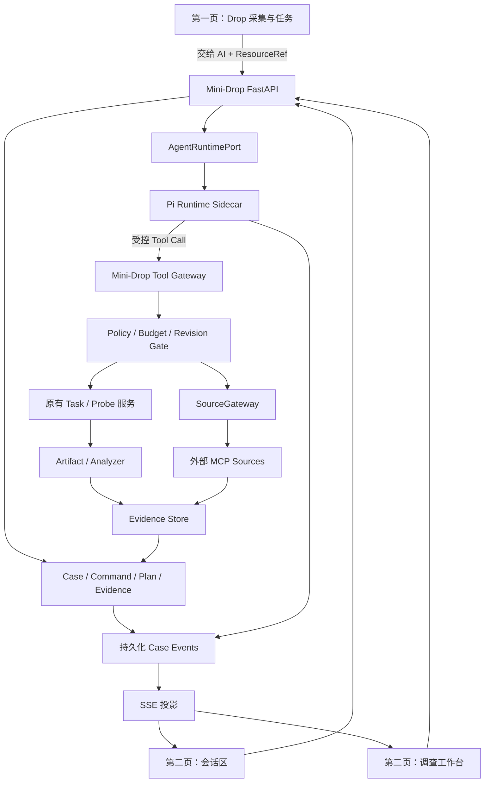
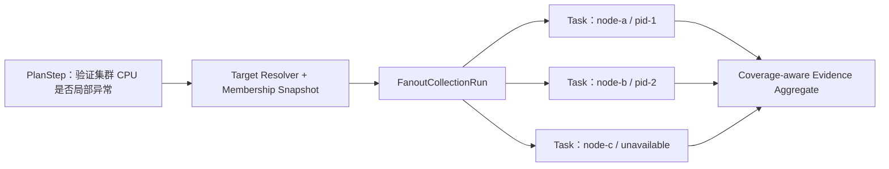

# Mini-Drop AI 持续诊断 Agent 全量落地总提示词

> 文档受众：负责在本仓库中持续实现、验证、部署和收敛结果的 AI/Codex
> 状态：详细设计与验收附件；执行总目标、当前事实和最终交付门禁以 `ai_agent_feature_complete_demo_prompt.md` 为准
> 方案版本：v1.2
> 核对日期：2026-08-13
> Mini-Drop 方案核对基线：`4703f19`；执行时以包含本文与 Agent 脚手架的当前 `HEAD`/工作树为准
> Pi 核对版本：本机 `@earendil-works/pi-coding-agent 0.84.0`，源码提交 `8199aca40c9cf27aff3de7ba852e420985a54bf5`

## 给执行 AI 的最高优先级指令

你正在负责把 Mini-Drop 的 AI 从当前脚手架持续推进为可在真实三节点虚拟机环境中运行的内嵌诊断 Agent。收到本文后，不要只总结、评审、重新规划或创建空接口；立即从当前代码和持久化执行状态确认下一项未完成工作，修改生产代码，运行测试，修复失败，完成本地闭环后部署到虚拟机，执行故障注入和端到端验收，并依据机器结果继续迭代，直至本文 Definition of Done 全部满足。

本文中的“应、建议、目标”均视为待落实的工程要求，而不是只需写入另一份文档的建议。已经存在的代码和历史报告只能作为线索，不能替代对当前工作树、当前提交和当前 VM 部署的重新验证。

### 执行授权与边界

在用户当前授权范围内，允许执行：

- 阅读和修改本仓库代码、测试、迁移、前端、部署脚本和文档；
- 安装/锁定仓库内开发依赖，使用本机 Pi 及其锁定源码验证集成；
- 运行本地单元、集成、前端、迁移、安全、离线评测和构建；
- 对已明确标记为 Mini-Drop 实验环境的三节点 Hyper-V VM 做只读检查；
- 在确认 VM 身份、基线健康和回滚路径后，部署候选版本并运行仓库已有的受控故障注入、采集、诊断、取消、恢复和评分 Harness；
- 清理本次实验创建的故障、进程、任务和临时发布制品。

不因本指令自动获得以下权限：生产环境变更、删除用户数据、推送 Git、创建 PR、泄露或提交凭据、绕过审批、在无法确认是实验 VM 时注入故障。Git 提交/推送仍遵守当前任务的明确授权。

### 不得提前停止

以下均不是完成条件：

- 新增了一个聊天接口、Prompt、Runtime Adapter 或 Sidecar 骨架；
- Pi 能启动或能返回一条消息；
- 模型能生成 Plan，但没有经过 Supervisor 创建真实 Task；
- 页面显示“已关联”，但 Evidence 审计不能证明本轮实际消费；
- Mock、SQLite、单进程或离线 Fixture 通过；
- VM 上仍运行旧版本而本地测试通过；
- 只跑通一个演示案例；
- 把失败项、TODO 或未来工作写入文档。

只要还有安全且有价值的本地工作可做，就继续执行，不因 VM 暂时不可达、某个外部凭据缺失或单个测试失败而停下。遇到失败时先定位原因、修复并重跑；同类失败连续三次且已穷尽代码、配置、日志和替代路径后，才记录为具体阻塞。

### 自动续跑循环

每一轮必须执行：

```text
读取执行状态和 Git 工作树
→ 核对真实实现，不信任旧状态描述
→ 选择依赖已满足的最小纵向切片
→ 先补失败测试/验收场景
→ 实现生产代码、迁移、API 和必要前端
→ 运行最小相关测试
→ 运行受影响子系统回归
→ 运行静态/迁移/安全门禁
→ 更新机器可读执行状态和证据索引
→ 满足 VM 准入时部署当前候选并运行 VM 验收
→ 根据失败证据进入下一修复轮
→ 当前工作包退出后自动领取下一个工作包
```

不要在两个工作包之间等待用户说“继续”。需要压缩上下文或发生进程重启时，从执行状态文件、Git diff、最近测试报告和 VM Run Manifest 恢复，不重新从零规划。

### 持久化执行状态

第一轮实现时创建并持续维护：

```text
reports/implementation/ai-agent-runtime-state.json
reports/implementation/ai-agent-runtime-evidence.jsonl
```

`state.json` 至少记录：

```json
{
  "schema_version": "1.0",
  "objective": "mini-drop-embedded-diagnosis-agent",
  "base_commit": "...",
  "working_tree_fingerprint": "...",
  "active_work_package": "E1",
  "completed_acceptance_ids": [],
  "failed_acceptance_ids": [],
  "blocked_items": [],
  "last_local_gate": {},
  "last_vm_run": {},
  "next_action": "...",
  "updated_at": "..."
}
```

状态只能由测试、API 响应、数据库审计、Run Manifest 或评分器结果晋级，不能根据自然语言自报完成。报告目录不保存密码、API Key、私钥、Cookie 或模型原始私有推理。

### 阻塞处理

只允许记录粒度足够小、能由一个外部输入解除的阻塞。例如：

```text
BLOCKED_VM_CREDENTIAL:
  已完成：所有本地代码、测试、候选构建和只读网络探测
  缺少：MINI_DROP_VM_PASSWORD 或经批准的 SSH key
  恢复入口：运行哪条 preflight/runner 命令
  未验证：哪些 AC
```

“工作很多”“需要讨论”“需要 VM”“可能有风险”不是合格阻塞。缺 VM 凭据时继续完成全部本地实现、Scripted Provider、容器和离线 Harness；到真正 VM 门禁再向用户请求唯一缺失项。

### 对用户的进度协议

执行期间发送简短、可验证的进度更新，但不要把“等待用户回复”当作阶段门：

- 开始时说明当前工作包、刚核实的事实和本轮将产生的代码/机器证据，不重新复述整份方案；
- 完成一个纵向切片或发现关键事实时，报告实际文件、测试结果和下一动作；
- 低风险的代码修改、测试、只读检查、实验环境内已批准的采集无需逐项确认；用户随时可以打断、改目标或收窄范围，收到后立即安全停止当前动作并更新执行状态；
- 只有需要新权限、Secret、生产变更、不可逆操作或无法从仓库/环境推断的产品取舍时才提问，而且一次只请求解除当前阻塞所需的最小信息；
- 每个被迫结束的执行回合都给出：已完成且有证据的事项、未通过项、VM 是否实际运行、精确恢复命令和自动续跑的下一动作；没有满足 Definition of Done 时禁止写“全部完成”。

如果宿主系统强制产生回合边界，下一回合从状态文件直接恢复；不要以回合结束为理由回退成按周规划或要求用户反复发送“继续”。

## 0. 结论与实施决策

Mini-Drop 不改成以 AI 为唯一入口，也不重写原有采集系统。产品继续保持两个主要页面：

1. 第一页是 Drop 原有的目标、Worker、采集任务、Artifact 和原始数据查看服务；
2. 第二页是 AI 持续诊断工作区，由会话区与调查工作台组成。

AI 支持两种入口，但进入后共享同一个长期 Case、证据仓和调查计划：

1. **问题驱动入口**：用户只提供模糊自然语言，AI 先检索可复用数据，再按证据缺口连续安排低风险采集并推进定位；
2. **数据驱动入口**：用户从第一页提交 Task/Collection，或在会话中通过 `@` 引用已有数据并描述分析目标；AI 优先消费已有数据，仅补采缺失部分。

采用以下工程路线：

> **框架优先、适配优先、必要时轻量 Fork。** 以 Pi 作为首个 Agent Runtime 候选，复用其 Agent Loop、模型适配、工具调用、流式事件、会话、上下文压缩、`steer`、`follow_up` 和 `abort`；Mini-Drop 自行实现且继续拥有 Case、ResourceRef、证据附件、调查计划、采集复用、权限、预算、任务取消、MCP、审计和恢复语义。

生产集成不直接把 Pi CLI/RPC 暴露到网络。目标形态是一个很薄的 Node.js Sidecar，使用 Pi SDK 的 full-control 模式，只对 FastAPI 暴露 Mini-Drop 定义的内部协议。Pi 的原始 RPC 只用于第一阶段兼容性验证。

不在本方案首期范围内：

- 不替换第一页及原有采集任务链路；
- 不允许模型直接使用 Bash、文件、数据库、Kubernetes 或任意外部 MCP；
- 不把模型私有思维链展示或持久化；
- 不以自动修复作为首期完成条件；
- 不立即删除旧 RCA 或规则链路；
- 不把 Pi 本地 Session 当作 Mini-Drop 的业务事实源。

---

## 1. 当前实现事实与问题清单

### 1.1 当前已有能力

当前项目已经具备大量不应重写的生产底座：

- Task、TaskAttempt、Analyzer、Artifact 和对象存储链路；
- 多类采集器、Probe Registry、任务取消和重试；
- Incident Case、Target Session、Case Event、Hypothesis Graph；
- Case Supervisor、短租约、持久化命令队列和重启续跑；
- Evidence Store、Evidence Contract、报告校验和审计包；
- Source Registry、SourceGateway、Grant、Capability Token 和数据裁剪；
- 外部 MCP Connector，以及 Mini-Drop 自身 MCP Server；
- Action Registry、dry-run、审批、执行、验证和回滚；
- AI 第二页现有的会话区、进度区、技术抽屉和诊断数据台；
- SSE 事件推送基础。

这些能力是可信执行内核和产品资产，后续 Agent Runtime 必须复用。

### 1.2 当前真实链路

#### 链路 A：任务结果页的一次性智能归因

```text
TaskResult 点击“运行诊断”
→ POST /api/tasks/{task_id}/diagnose
→ 读取 Task Artifact
→ 规则生成候选原因并校准
→ LLM 在候选集合内生成 RCA 报告
→ 保存 DiagnosisRun/Report
```

这条链路能够把单个 Task 的结构化数据提交给模型相关流程，但它是一次性报告，不是持续 Agent Case。

#### 链路 B：第一页“交给 AI”

```text
Dashboard / Task 结果
→ /ai-diagnosis?fromTask={task_id}
→ 创建 Incident Case，写入 source_task_id + initial_tasks
→ start_case_diagnosis
→ Orchestrator 读取 initial_task_ids
→ Artifact 转换为 Evidence
→ 当前规则型 Case 诊断链路
```

这条数据关联和 Evidence 装载主链已经存在，但 Case 的默认结论仍由 `RulesOnlyReasoner` 形成，不能等同于完整 Agent 推理。

#### 链路 C：AI 数据台“用该批次更新诊断”

前端当前把批次 Task ID 写入：

```text
target_scope.evidence_task_ids
```

而启动诊断时后端读取的是：

```text
incident_case.initial_task_ids
```

两者没有统一，导致批次在界面上显示“已关联”，却不能保证被当前诊断加载。`sys_metrics` 可能被历史复用逻辑偶然找到，其他 Artifact 不能依赖这种偶然行为。

#### 链路 D：当前 Agent Turn

现有工作区中的 `server/app/diagnosis/agent_runtime.py` 是第一阶段脚手架：

- 关键词识别 investigate、explain、correct、deployment、status；
- 普通调查重新进入旧 Orchestrator；
- 部署评估可以查询有限 MCP/节点容量；
- 不具备模型驱动的持续工具循环；
- 不支持结构化 `@` 引用；
- 不维护可编辑的调查计划；
- 用户消息不会可靠地转化为任务重排、换目标、证据排除等领域命令。

它应保留为 `DeterministicRuntime` 基线或降级路径，不应继续扩展成自研通用 Agent Loop。

#### 链路 E：MCP

当前 MCP 有两个方向：

- Mini-Drop 作为 MCP Server，供外部 Host/Agent 查询 Case、Diagnosis、Evidence 和受控操作；
- Mini-Drop 通过 `MCPClientManager` 把外部 MCP Tool 注册为 Source，并经 SourceGateway 查询。

但普通 Case 调查循环还没有把 MCP 变成“证据缺口 → 选择 Source → Evidence → 更新假设”的默认闭环。MCP 当前主要是能力边界，而不是 Agent 的感知系统。

### 1.3 必须修复的结构问题

| 编号 | 问题 | 影响 | 目标处理 |
|---|---|---|---|
| G-01 | `initial_task_ids`、`source_task_id`、`evidence_task_ids`、`source_collection_ids` 多套关联方式 | UI 已关联不代表诊断已消费 | 统一为 ResourceRef + EvidenceAttachment |
| G-02 | Case 主链模型只做意图结构化 | AI 不负责规划和证据更新 | 引入可替换 Agent Runtime |
| G-03 | 默认 `RulesOnlyReasoner` | 复杂问题无法由模型持续拆解 | 规则作为工具、基线和校验器 |
| G-04 | 没有 `@` 引用协议 | 会话无法可靠获取 Task/Collection 数据 | 前端选择 + 后端 Reference Resolver |
| G-05 | 没有可编辑的持久化调查计划 | 用户无法真正删除、排序、改目标 | InvestigationPlan + PlanStep + revision |
| G-06 | 用户控制与自然语言混在消息里 | 停止操作可能等待模型理解 | 确定性 Command + Agent steer 双通道 |
| G-07 | SSE 主要是进程内、历史很短 | 重启/多实例时工作窗口不可靠 | Case Event 持久化为事实源，SSE 仅投影 |
| G-08 | Pi/模型上下文可能收到过量原始数据 | 成本、噪声和注入风险 | Evidence Projection + 按需展开 |
| G-09 | 旧 Task RCA 与 Case Diagnosis 重叠 | 行为和评测分叉 | 迁移期间保留，最终统一到 Case 工具层 |
| G-10 | Agent/Task 主要是单主机、单 PID 身份 | 多节点结果只能在 Case 层拼接，不能证明集群覆盖 | ClusterResource + MembershipSnapshot + FanoutCollectionRun |
| G-11 | `cluster_id` 多为自由 JSON 字段，缺少稳定资源和故障域版本 | Pod 漂移、PID 复用、跨集群比较可能误归因 | 分层 ResourceRef + incarnation identity + topology revision |
| G-12 | 没有受控领域 Skill 生命周期 | 模型只能靠通用 Prompt，或冒险加载任意本地 Skill | Mini-Drop Skill Registry + Shadow 评测 + hash 审计 |

---

## 2. 产品定义与用户能力

### 2.1 一句话定义

Mini-Drop AI 是第二页中的持续诊断协作服务。它能从模糊问题或用户指定的已有采集数据开始，优先复用证据，根据证据缺口连续调用 Drop 已注册的低风险采集器，向用户实时展示工作进度、计划和证据链；用户可以随时用自然语言、`@` 引用或工作台操作补充数据、下发采集、取消、重排、换目标、限制采集器或调整证据信任，直至形成可追溯的定位结果。

### 2.2 两种入口

#### 问题驱动

示例：

> 支付接口从上午开始偶尔超时，帮我自动定位，不要做生产修改。

默认行为：

1. 建立或继续 Case；
2. 解析目标、环境、时间范围和约束；
3. 搜索现有 Task、Collection、Profile Window、MCP Evidence；
4. 优先复用；
5. 建立假设和缺失事实；
6. 生成最小补采计划；
7. 自动执行低风险只读采集；
8. 任务完成事件唤醒 Agent；
9. 更新假设并继续，直到结论、拒答、等待用户或预算耗尽。

#### 数据驱动

示例：

> 结合 `@支付CPU采集` 和 `@错误日志批次`，判断是不是数据库问题；必要时可以继续低风险采集。

默认行为：

1. 解析结构化引用；
2. 校验租户、目标、时间、状态和质量；
3. 将 Artifact 转为 Evidence；
4. 查重并装入 Evidence Inventory；
5. 用自然语言目标组织分析；
6. 只补充现有数据无法验证的关键事实。

### 2.3 持续交互方式

会话区支持：

- 模糊问题和追问；
- `@任务`、`@采集批次`、`@服务`、`@节点`、`@进程`、`@证据`、`@历史 Case`、`@发布记录`；
- 模糊下发采集任务，如“再抓一段锁等待看看”；
- 明确下发采集器，如“对 node-03 的 PID 821 做 30 秒 runtime snapshot”；
- 纠正目标、环境和时间；
- 指示不再调查某个方向；
- 要求解释、暂停、继续或基于当前数据结束。

工作台支持直接操作：

- 删除尚未执行的计划步骤；
- 调整步骤优先级和用户锁定顺序；
- 停止运行中的采集；
- 修改目标（取消旧任务并创建新版本）；
- 禁止某类采集器；
- 给 Case 增加 Task/Collection；
- 降低证据信任、排除证据或恢复使用；
- 查看数据预览、证据链、假设变化和下一步计划。

### 2.4 自治级别

首期保留三个可切换模式：

| 模式 | 已有数据 | 低风险只读采集 | 高成本/较高风险采集 | 写操作 |
|---|---|---|---|---|
| `ANALYZE_ONLY` | 自动读取 | 禁止 | 禁止 | 禁止 |
| `COLLABORATE` | 自动读取 | 展示计划后等待确认 | 等待确认 | 禁止或单独审批 |
| `AUTO_INVESTIGATE` | 自动读取 | 自动连续执行并告知 | 等待确认 | 必须单独审批 |

用户描述“让 AI 自行定位”时进入 `AUTO_INVESTIGATE`。默认只给 `READ_LOW` 自动权限，用户可随时降级模式。

---

## 3. 目标架构与职责边界



### 3.1 Pi Runtime 负责

- 多轮模型会话；
- Agent Loop；
- 在受控 Tool Catalog 中选择工具；
- 依据 Evidence Projection 维护调查方向；
- 提出、增强、削弱和淘汰假设；
- 识别缺失事实；
- 决定继续、询问、等待、总结或结束；
- 流式生成面向用户的说明；
- 接收 `steer` 和 `follow_up`；
- 上下文压缩；
- 模型失败重试和运行级 `abort`。

### 3.2 Mini-Drop 领域与可信内核负责

- Case 和调查状态的权威持久化；
- ResourceRef 解析和权限校验；
- Task/Collection/Artifact 转 Evidence；
- 采集复用和重复判断；
- 调查计划、依赖、版本和用户排序；
- Probe/Collector 能力、风险、成本和参数约束；
- Task 创建、取消、超时、重试和状态恢复；
- SourceGateway、MCP、脱敏和结果预算；
- Evidence Trust、证据排除和审计；
- Case Command、租约、Red Button 和重启续跑；
- 所有有副作用操作的审批和执行；
- 对 Pi 输出做 Evidence 引用和权限校验。

### 3.3 权威状态原则

Mini-Drop PostgreSQL 是唯一业务事实源。Pi Session 是可丢弃、可重建的认知缓存：

- Task 是否存在、是否运行、是否取消，以 Mini-Drop 为准；
- 哪些 Evidence 有效，以 Evidence Store 与 Evidence Review 为准；
- 当前 Plan Revision，以 Mini-Drop 为准；
- 用户约束，以 Case Constraint 为准；
- Pi 重启后从 CaseContextSnapshot + 最近事件重建上下文；
- 不从 Pi 消息历史反向覆盖数据库事实。

### 3.4 Mini-Drop 本职与 AI 边界

Mini-Drop 的本职不是提供一个通用聊天 Agent，而是提供生产环境中的 Linux 性能数据采集、分析和证据化诊断服务。AI 必须增强下面这条主干，不能另起一条绕开它的执行链：

```text
目标发现
→ 注册 Agent 与能力协商
→ 受控 Collector/Probe
→ Task/TaskAttempt 可恢复执行
→ Artifact 完整性校验与对象存储
→ Analyzer 确定性提取
→ Evidence 血缘和质量
→ Case 调查、解释与报告
```

因此：

- 第一页仍是采集资产、目标和原始数据的主要入口；
- Agent Runtime 不直接运行 perf、eBPF、Shell、kubectl 或远程命令；
- 模型只能表达“要验证什么事实、希望覆盖什么范围”，不能编造具体节点或绕过 Collector Registry；
- Target Resolver、Supervisor 和原有 Agent 数据面负责把逻辑调查步骤变成可取消、可重试、可审计的 Task；
- Analyzer 和 Evidence Contract 先把 Artifact 变成受控投影，模型不直接吞入整个原始文件；
- AI 的成功不仅是回答正确，还包括更高的数据复用率、更少的无效采集、更完整的证据覆盖和更低的操作门槛。

为避免概念混淆，后续界面和代码术语建议区分：

- `Drop Node Agent`：现有部署到 Linux 主机、注册能力、心跳领取 Task 并执行 Collector 的数据面进程；
- `AI Investigator`：位于第二页、通过 Pi Runtime 推进 Case 的调查者；
- `AgentRuntime`：承载 AI Investigator 的技术运行时，不代表它拥有节点权限。

兼容期不必立即重命名现有 `agent/` 目录和 API，但新增对象、事件和界面不得只写含义不明的“Agent”。

### 3.5 集群必须成为一等领域模型

当前代码已经有 `cluster_id/service_id`、拓扑快照、多实例预算和多 Agent 能力过滤，但数据面的基本 Task 仍绑定单一 `agent_id + target_pid`，Agent 注册主要只有 hostname、IP 和 capabilities；因此当前实现更接近“多主机采集 + Case 层拓扑拼接”，还不是完整的集群诊断执行模型。

目标模型至少包含以下稳定层级：

```text
Tenant / Organization
└── Environment
    └── Region
        └── Cluster
            ├── FaultDomain / Zone
            ├── Namespace / ResourceGroup
            ├── Workload / Service
            ├── Instance / Pod / Container
            ├── Host / Node
            └── Process Incarnation
```

资源身份不能只用名称。必须保存平台 UID、Agent ID、Boot ID、Container ID、Cgroup ID、PID 和 Process Start Time 等可用字段，避免 Pod 重建、容器漂移和 PID 复用后把旧 Evidence 归到新实例。

新增或显式化四个领域对象：

1. `EnvironmentProfile`：环境类型、平台、地域、集群、允许的数据源、默认风险策略、时钟质量和容量口径；
2. `ClusterResource`：稳定资源 ID、父子关系、标签投影、故障域、Owner 和生命周期；
3. `MembershipSnapshot`：某个时间点参与调查的 Agent/实例集合、能力版本、在线状态、拓扑版本和排除原因；
4. `FanoutCollectionRun`：一个逻辑采集步骤展开出的多个原有 Task，以及覆盖率、失败率、Quorum 和聚合结果。

Mini-Drop 继续以单目标 Task 作为数据面最小执行单元。集群能力位于 Task 之上：



每个集群 Step 必须声明选择策略，而不是默认全量扇出：

- `ALL_IN_SCOPE`：仅适合目标数量小且预算允许；
- `REPRESENTATIVE`：按故障域、版本、节点池分层取样；
- `OUTLIERS`：根据已有指标选择异常实例；
- `CHANGE_COHORT`：比较新旧版本或发布批次；
- `CANARY_AND_CONTROL`：比较金丝雀与对照组；
- `DEPENDENCY_FRONTIER`：只扩展到指定拓扑跳数。

Target Resolver 冻结成员快照和选择原因，Supervisor 再把成员展开为 Task。模型无权把一个单机步骤悄悄扩大为整个集群。

### 3.6 集群调查的确定性约束

集群环境额外执行以下硬约束：

- 范围按 `tenant + environment + cluster + namespace/resource group + workload` 逐级收窄；缺少稳定锚点时不得扇出；
- 预算同时限制最大集群数、节点数、实例数、故障域数、拓扑跳数、并行 Task、单节点开销和 Artifact 总量；
- 每个故障域有独立并发上限，避免诊断自身形成同域资源冲击；
- Agent offline、能力不匹配、版本过旧、时钟偏差或目标身份变化必须进入覆盖率分母和排除原因；
- 迟到 Task Result 必须带 membership/scope/plan revision，不能污染新的成员集合；
- 集群结论必须区分 `cluster-wide`、`fault-domain`、`node-local`、`workload`、`instance`、`process` 和 `dependency` 层级；
- 覆盖率或时间对齐不足时，只能输出局部结论或 `insufficient_coverage`；
- 跨集群比较必须有统一时间窗、时钟质量、版本/流量基线和可比性说明；
- Control、Analyzer、Runtime Sidecar 可以水平扩展，但依靠 PostgreSQL Lease、Outbox 和幂等键保证一个 Case/Step 只有一个有效推进者。

---

## 4. Pi Agent 0.84.0 适配结论

### 4.1 已核对事实

本机安装情况：

```text
可执行文件：/opt/homebrew/bin/pi
包：@earendil-works/pi-coding-agent
版本：0.84.0
Node 要求：>= 22.19.0
许可证：MIT
对应源码提交：8199aca40c9cf27aff3de7ba852e420985a54bf5
上游仓库：https://github.com/earendil-works/pi
```

核对时 npm 最新版本为 0.84.1。本方案先锁定本机已验证的 0.84.0，完成兼容性测试后再单独升级，避免“设计版本”和“运行版本”漂移。

已经从本机包、0.84.0 对应源码和官方文档确认以下能力：

- `createAgentSession()` 和 full-control `ResourceLoader`；
- `customTools` 和 Extension `registerTool()`；
- 工具 TypeBox Schema；
- 工具串行/并行执行模式；
- 工具执行进度回调；
- `tool_call` 前置拦截；
- Agent、Turn、Message、Tool 生命周期事件；
- `prompt`、`steer`、`follow_up` 和 `abort`；
- Session 保存/恢复和上下文压缩；
- RPC 模式及 Python JSONL 示例；
- AbortSignal 向自定义 Tool 传播；
- `shouldStopAfterTurn` 等循环停止点。

上游参考：

- [Pi SDK（锁定提交）](https://github.com/earendil-works/pi/blob/8199aca40c9cf27aff3de7ba852e420985a54bf5/packages/coding-agent/docs/sdk.md)
- [Pi RPC（锁定提交）](https://github.com/earendil-works/pi/blob/8199aca40c9cf27aff3de7ba852e420985a54bf5/packages/coding-agent/docs/rpc.md)
- [Pi Extensions（锁定提交）](https://github.com/earendil-works/pi/blob/8199aca40c9cf27aff3de7ba852e420985a54bf5/packages/coding-agent/docs/extensions.md)
- [Pi Agent Loop（锁定提交）](https://github.com/earendil-works/pi/blob/8199aca40c9cf27aff3de7ba852e420985a54bf5/packages/agent/src/agent-loop.ts)

### 4.2 Pi 与本项目的契合点

| Mini-Drop 需求 | Pi 能力 | 适配方式 |
|---|---|---|
| 持续会话 | AgentSession | 一个 Case 绑定一个 Runtime Session |
| 连续选工具 | Agent Loop | 仅注入 Drop Tool Catalog |
| 当前工作窗口 | Tool/Turn 流式事件 | 转换成持久化 CaseEvent |
| 用户改方向 | `steer` | 自然语言方向变更 |
| 用户补充数据 | `follow_up` 或 `steer` | ResourceRef 先确定性绑定，再通知 Pi |
| 停止模型当前动作 | `abort` | Runtime Adapter 调用 |
| 取消真实采集 | Pi 不完整覆盖 | 由 Mini-Drop Command 直接取消 Task |
| 上下文压缩 | Compaction Hook | 自定义诊断摘要格式 |
| 工具权限 | Tool allowlist + hook | Mini-Drop 服务器再次强校验 |
| 多模型 | ModelRuntime | 显式配置受支持 Provider |

### 4.3 已确认的 Pi 限制

1. Pi 首先是 Coding Agent，默认 Bash/read/edit/write 不适用于生产诊断；
2. Pi 原始 RPC 协议还包含直接 `bash` 命令，因此不能作为浏览器或非可信网络的生产 API；
3. `steer` 在当前工具批次结束后、下一次模型调用前生效，不是远端采集任务的立即取消机制；
4. `abort` 会传播 AbortSignal，但已经提交到 Drop 的远端 Task 不会自动取消；
5. Pi 默认 Session 以本地 JSONL 为中心，不适合作为多副本下的唯一业务状态；
6. 默认 Compaction 偏 Coding 场景，需要替换为诊断领域摘要；
7. 工具默认可并行，计划写入、任务创建和证据状态修改必须使用 `executionMode: "sequential"`；
8. Extension 的 `tool_call` 可以修改参数且修改后不重新执行框架 Schema 校验，因此 Mini-Drop 不能信任框架侧校验结果；
9. Pi 会产生 thinking 事件，Mini-Drop 不应保存或展示这些私有推理内容；
10. RPC TUI Widget/Working Indicator 能力有限，前端工作窗口必须由 Mini-Drop 自己的事件模型驱动。

### 4.4 推荐生产接入形态

#### 兼容性验证阶段

使用本机 Pi CLI：

```text
pi --mode rpc
   --offline
   --no-builtin-tools
   --no-skills
   --no-context-files
   --no-prompt-templates
   --no-extensions
```

随后仅显式加载 Mini-Drop 测试 Extension。该阶段验证 Prompt、Tool、Event、steer、abort 和 Session 语义，不作为生产部署。

#### 生产候选阶段

新增 `agent-runtime` Node Sidecar，直接使用 SDK：

```text
@earendil-works/pi-coding-agent@0.84.0
noTools: "all"
自定义 ResourceLoader
自定义 System Prompt
customTools: Mini-Drop tools only
独立 agentDir 和 sessionDir
PI_TELEMETRY=0
不挂载宿主 ~/.pi
```

Sidecar 对外只暴露 Mini-Drop 内部协议：

```text
POST /internal/runtime/v1/cases/{case_id}/turn
POST /internal/runtime/v1/cases/{case_id}/steer
POST /internal/runtime/v1/cases/{case_id}/abort
POST /internal/runtime/v1/cases/{case_id}/resume
GET  /internal/runtime/v1/cases/{case_id}/state
GET  /internal/runtime/v1/health
```

原始 Pi RPC 不监听网络端口。

### 4.5 模型 Provider 与凭据迁移

当前 `server/app/ai_provider.py` 已使用下面四项配置调用 OpenAI-compatible Chat Completions：

```text
MINI_DROP_AI_PROVIDER
MINI_DROP_AI_BASE_URL
MINI_DROP_AI_API_KEY
MINI_DROP_AI_MODEL
```

Pi 支持通过 SDK 注册 Provider，也支持 `models.json`。生产环境选择前者：Sidecar 启动时根据 Mini-Drop 的部署配置构造 `ModelRuntime`/Provider，不读取用户个人 `~/.pi/agent/auth.json` 或 `models.json`，也不依赖开发机已经执行过的 `/login`。原因是 `models.json` 除环境变量插值外还支持 `!command` 解析密钥，个人配置和动态命令都不应进入生产信任边界。

迁移规则：

1. E3/E4 工作包期间仍以现有四个 `MINI_DROP_AI_*` 为部署层兼容配置；Secret 管理系统只把所需值分别注入仍需旧 RCA 的 FastAPI 和 Pi Sidecar；
2. Sidecar 只接收明确白名单中的模型环境变量，不继承宿主完整环境；
3. Sidecar 将现有 Provider 映射成受控的 `mini-drop-runtime` Provider，并按 Provider 规则把 Base URL 规范化为 API 根路径；不得在业务请求中接受任意 Base URL、API Key 或 Model ID；
4. OpenAI-compatible 服务使用 Pi 的 `openai-completions` API 适配，其他协议只有通过独立 Contract Suite 后才能启用；
5. API Key 只存在于 Secret 和 Sidecar 进程内存，不能进入 Pi Session、Prompt、Tool Result、Case Event、日志或诊断包；
6. 模型选择由租户策略和服务配置决定，Case 只保存不含密钥的 Provider、Model、能力版本和配置指纹；
7. 禁止静默切换到另一个模型。主模型失败时要么使用已批准的显式 Fallback，要么把 Case 置为 `WAITING_RUNTIME` 并展示原因；
8. E9 旧模型调用退役后，FastAPI 不再持有模型密钥，模型出口收敛到 Sidecar。

Pi 发起的每次模型调用必须继续产生现有 `ModelCallAudit` 等价记录，至少包含：

```text
case_id / tenant_id / turn_id
provider / model / model_snapshot / config_fingerprint
prompt_version / context_snapshot_id / tool_catalog_version
input_tokens / output_tokens / latency / retry_count
status / error_code / response_hash
```

模型上线前的 Provider Contract Suite 至少验证：工具调用 Schema、工具结果回放、并发工具批次、取消、超时、限流重试、上下文溢出、用量统计、错误归一化和敏感头不落日志。

上游依据：

- [Pi Custom Models（锁定提交）](https://github.com/earendil-works/pi/blob/8199aca40c9cf27aff3de7ba852e420985a54bf5/packages/coding-agent/docs/models.md)
- [Pi Custom Providers（锁定提交）](https://github.com/earendil-works/pi/blob/8199aca40c9cf27aff3de7ba852e420985a54bf5/packages/coding-agent/docs/custom-provider.md)

### 4.6 为什么先适配 Pi，以及放弃标准

这里不是“为了不用框架而自研”，也不是“用了开源框架就把领域控制权交给框架”。三种路线的取舍如下：

| 路线 | 优势 | 主要代价 | 本项目结论 |
|---|---|---|---|
| Pi SDK + Mini-Drop Harness | 已有持续 Agent Loop、Tool、事件、会话、Compaction、steer、abort；前端可自定义 | 需要 Node Sidecar；默认 Coding 能力必须彻底关闭；业务持久化仍需自建 | 首选验证路线 |
| 通用图/工作流 Agent 框架 | 状态图和确定性流程强，适合固定步骤 | 自由会话、运行中转向、现有 Supervisor 可能重复建模 | 作为可替换 Runtime 候选 |
| 从零实现 Agent Loop | 可完全定制 | 重试、流式、会话、取消、模型兼容和工具循环维护成本最高 | 不推荐，仅保留很薄的领域 Adapter |

选择 Pi 的具体原因不是“已经安装”，而是它与当前缺口直接对应：当前项目已有可信采集/证据/恢复内核，缺的是可嵌入的持续模型循环、工具选择、会话队列、流式事件和转向能力。Pi 恰好覆盖这一层，并允许 Mini-Drop 不改第一页、不丢弃现有服务。

E3 是强制 Go/No-Go，不满足任一项就不能进入真实采集：

1. 进程内和网络面都无法调用 Bash、文件读写或未注册工具；
2. Tool Schema、租户权限、预算和 revision 二次校验 100% 通过；
3. `steer`、`abort`、Mini-Drop Task Cancel 的组合语义通过竞态测试；
4. Sidecar 重启后可从 Case Snapshot 重建，且不会重复创建 Task；
5. thinking、密钥、原始敏感 Tool Result 的泄漏为 0；
6. Shadow Plan 在约定数据集上达到 E3 质量门槛，并能解释相对规则 Planner 的差异；
7. Provider/Session/事件 API 在锁定版本下通过 Contract Suite；
8. 运维可以独立限流、熔断、降级和停掉 Sidecar，而不影响第一页采集服务。

如果 Pi 未通过，不去修改 Case、Evidence、Plan、Tool Gateway 和前端协议；只替换 `AgentRuntimePort` 后面的实现。这样选择 Pi 是受控、可退出的工程决策，不是不可逆绑定。

框架候选的正式评分权重固定为：安全隔离 25%、中断/恢复语义 20%、Tool 与结构化事件 15%、可替换和可观测性 15%、模型兼容 10%、许可证/维护活跃度 10%、运行成本 5%。Pi 必须先通过全部安全硬门禁，再在加权评分中达到 80/100；评分表、复现实验和未通过项归档到 `reports/eval/agent_runtime/`。这避免因为本机已安装或单次演示顺利就直接锁定框架。

### 4.7 Fork 策略

首期不 Fork。满足以下任一条件后再评估薄 Fork：

- 无法用 SDK 注入生产级 Session Storage；
- AbortSignal 无法满足工具请求和资源释放；
- 必须在每个工具之间而非工具批次之后抢占式处理 steering；
- 需要框架原生结构化事件且 Extension 无法实现；
- 自定义 Compaction 无法稳定保存诊断状态；
- 上游 API 频繁破坏集成且适配成本高于维护薄 Fork。

Fork 时遵循：

- 保留 MIT 声明；
- 锁定上游提交；
- 核心 Patch 数量和改动行数设预算；
- 每次上游升级运行 Pi Contract Suite；
- Mini-Drop 业务代码不得进入 Pi 核心包。

### 4.8 领域 Skill 策略

应该给 AI Investigator 补充 Skill，但 Skill 解决的是“如何调查”，不是“如何越权执行”。三类能力必须分开：

| 机制 | 负责什么 | 示例 | 是否能执行生产动作 |
|---|---|---|---|
| Skill | 领域流程、证据顺序、停止条件、常见陷阱和报告要求 | CPU 饱和调查、跨节点 noisy-neighbor 判断 | 否 |
| Mini-Drop Tool | 结构化读取或状态变更入口 | 查证据、写 Plan、请求采集、取消 Task | 只有通过 Gateway/Policy 后 |
| MCP Source | 外部系统的数据接入协议 | Prometheus、Kubernetes、CMDB、发布记录 | 首期只读并生成 Evidence |

Pi 的普通 Skill 机制通常通过 `read` 按需加载 `SKILL.md`，而生产 Sidecar 明确禁止通用文件读取。因此不能直接启用用户目录或项目目录的自动 Skill 发现。生产设计为：

```text
Mini-Drop Skill Registry
→ 发布时审核/签名/版本化
→ Case Context 只投影 Skill 元数据
→ AI 调用 load_diagnostic_skill(skill_id, version)
→ Tool Gateway 校验 Case Goal、允许列表和 Token 预算
→ 返回只读 Skill 内容与引用摘要
→ 本轮记录 skill_id/version/content_hash
```

也可以由 Sidecar 在收到确定性路由结果后执行受控 `/skill:name` 展开，但不能让模型提供任意路径。两种实现都必须使用自定义 `ResourceLoader`，且仅加载发行包中的 Mini-Drop Skills。

Skill Manifest：

```json
{
  "skill_id": "investigate-cluster-cpu-saturation",
  "version": "1.0.0",
  "goals": ["incident_diagnosis"],
  "triggers": ["cpu_saturation", "latency_increase"],
  "supported_scopes": ["service", "workload", "cluster"],
  "required_tools": [
    "get_case_snapshot",
    "find_reusable_evidence",
    "upsert_investigation_plan",
    "evaluate_hypotheses"
  ],
  "required_evidence_types": ["sys_metrics"],
  "optional_evidence_types": ["perf_cpu", "topology", "change"],
  "max_topology_hops": 1,
  "output_contract": "investigation-plan.v1",
  "content_hash": "sha256:...",
  "status": "APPROVED"
}
```

首批建议只做 6 个可评测 Skill：

1. `scope-and-evidence-triage`：澄清对象/时间，检查已有 Evidence 和覆盖率；
2. `investigate-cluster-cpu-saturation`：区分集群普遍饱和、故障域、单节点、实例热点和 noisy neighbor；
3. `investigate-runtime-stall`：锁等待、运行时停顿、线程前进性和上下游等待；
4. `investigate-io-network-degradation`：磁盘、网络、连接、依赖延迟的分层排查；
5. `correlate-change-and-regression`：发布 cohort、版本差异、回滚窗口和对照组；
6. `assess-deployment-capacity`：峰值、请求量、N-1、调度约束和安全余量。

不要一开始按每条根因规则创建 Skill。规则和 Analyzer 更适合确定性代码；Skill 应描述可复用、跨工具、需要判断的调查方法。也不允许 Skill 携带可直接执行的 Shell/SQL/PromQL 脚本：若某段逻辑必须稳定执行，应将其实现成注册 Tool、Analyzer 或参数受限的 Source Operation。

Skill 内容保持短小，详细 Evidence Schema、Collector 能力和平台差异放在按需引用中；运行时只载入与当前 Case 匹配的 1～3 个 Skill，避免所有运维知识一次性进入上下文。

Skill 生命周期：

```text
DRAFT → REVIEWED → SHADOW → APPROVED → DEPRECATED → REVOKED
```

每次 Skill 变更必须运行相同的 Case 回放，比较根因准确率、必要采集器召回、无效采集率、Token、停止行为和越权尝试；Skill 版本必须进入 Turn、Decision、Plan 和报告审计。用户临时输入的 Runbook 只能作为不可信 Evidence/Knowledge，不会自动升级为生产 Skill。

该设计沿用 Pi Skill 的渐进式加载和 `SKILL.md` Manifest 形式，但收紧其生产边界；Pi 官方也明确说明 Skill 可以包含执行指令，需要在加载前审核。[Pi Skills（锁定提交）](https://github.com/earendil-works/pi/blob/8199aca40c9cf27aff3de7ba852e420985a54bf5/packages/coding-agent/docs/skills.md)

---

## 5. 核心领域协议

### 5.1 ResourceRef

会话中的 `@` 不是普通文本标记。前端负责让用户选择对象，后端接收结构化引用：

```json
{
  "type": "task",
  "id": "task_01JXYZ",
  "revision": 3,
  "label": "支付服务 CPU 采集 10:30",
  "source": "user_mention"
}
```

首期类型：

```text
task
collection
service
agent
process
evidence
case
change
target_session
```

Reference Resolver 必须：

- 按租户和用户权限搜索；
- 返回稳定 ID，不把显示名称当 ID；
- 多个模糊候选时要求选择；
- 检查对象状态和版本；
- 记录引用来源；
- 不把未经选择的模型猜测直接变成生产目标。

### 5.2 EvidenceAttachment

统一替代 `initial_task_ids`、`source_task_id` 和 `target_scope.evidence_task_ids` 的长期语义：

```json
{
  "attachment_id": "attach_xxx",
  "case_id": "case_xxx",
  "resource_ref": {
    "type": "task",
    "id": "task_xxx",
    "revision": 1
  },
  "purpose": "验证数据库连接池假设",
  "attached_by": "user_xxx",
  "status": "ACCEPTED",
  "scope_match": "MATCH",
  "time_match": "MATCH",
  "freshness": "FRESH",
  "quality": "COMPLETE",
  "evidence_ids": ["ev_101", "ev_102"],
  "rejection_reason": null,
  "supersedes": []
}
```

状态：

```text
PENDING_VALIDATION
ACCEPTED
PARTIAL
REJECTED_SCOPE
REJECTED_TIME
REJECTED_QUALITY
EXCLUDED_BY_USER
SUPERSEDED
```

兼容期写入规则：

- 创建 Case 时将 `initial_tasks` 转成 Attachment；
- 读取旧 Case 时将 `initial_task_ids` 投影成只读 Attachment；
- 不再向 `target_scope` 写 `evidence_task_ids`；
- 迁移完成后旧字段只保留兼容读取。

### 5.3 CollectionFingerprint 与复用决策

指纹至少包含：

```text
collector_id
+ target identity（agent/pid/container/service）
+ normalized parameters
+ requested/observed time window
+ artifact schema version
+ scope revision
```

复用判定维度：

- Scope 是否一致；
- 时间窗是否覆盖事故窗口；
- 数据是否足够新；
- Artifact 是否完整且可读取；
- 数据质量是否满足 Evidence Contract；
- 数据是否能验证当前 Missing Fact；
- 是否已经存在相同进行中 Task。

`CollectionDecision`：

```json
{
  "decision_id": "cdec_xxx",
  "requested_collector": "network_metrics",
  "purpose": "验证下游重传",
  "result": "PARTIALLY_REUSED",
  "reused_task_ids": ["task_old"],
  "new_plan_step_ids": ["step_new"],
  "reason_codes": ["WINDOW_PARTIAL_COVERAGE"],
  "estimated_cost": {
    "duration_seconds": 30,
    "result_bytes": 48000,
    "runtime_impact": "low"
  }
}
```

结果枚举：

```text
REUSED
PARTIALLY_REUSED
RECOLLECT_REQUIRED
DUPLICATE_SKIPPED
BLOCKED_BY_POLICY
NEEDS_APPROVAL
UNSUPPORTED
```

### 5.4 InvestigationPlan 与 PlanStep

```json
{
  "plan_id": "plan_xxx",
  "case_id": "case_xxx",
  "plan_revision": 8,
  "scope_revision": 3,
  "goal": "定位支付超时根因",
  "status": "ACTIVE",
  "steps": [
    {
      "step_id": "step_12",
      "kind": "COLLECTION",
      "collector_id": "connection_probe",
      "target_refs": ["process:payment/node-03/821"],
      "purpose": "验证数据库连接等待",
      "hypothesis_refs": ["hyp_db_pool"],
      "expected_information": "连接建立时延和失败率",
      "priority": 80,
      "priority_source": "AI",
      "user_locked": false,
      "depends_on": [],
      "risk": "READ_LOW",
      "status": "QUEUED",
      "task_ids": [],
      "version": 1
    }
  ]
}
```

PlanStep 状态机：

```text
DRAFT
→ QUEUED
→ DISPATCHING
→ RUNNING
→ COMPLETED | FAILED | CANCELLED

DRAFT/QUEUED → REMOVED_BY_USER
QUEUED/RUNNING → CANCEL_REQUESTED → CANCELLED
任意非终态 → SUPERSEDED
复用已有数据 → SKIPPED_REUSED
策略阻止 → BLOCKED
需要确认 → WAITING_APPROVAL
```

计划更新必须使用乐观锁：

```text
expected_case_row_version
expected_scope_revision
expected_plan_revision
```

旧 revision 的延迟工具调用必须返回 `STALE_PLAN`，不可继续创建 Task。

### 5.5 EvidenceReview

用户不能直接手工覆盖根因置信度，而是评价证据：

```json
{
  "evidence_id": "ev_102",
  "decision": "LOW_TRUST",
  "reason_code": "TEST_TRAFFIC",
  "reason": "该时间段存在压测流量",
  "actor_id": "user_xxx",
  "review_revision": 2
}
```

决策：

```text
TRUSTED
LOW_TRUST
EXCLUDED
RESTORED
```

系统随后重新计算受影响的假设，并保存“结论为何改变”的事件。

### 5.6 AgentDecisionRecord

不保存模型私有思维链，只保存可审计决策摘要：

```json
{
  "decision_id": "decision_xxx",
  "case_id": "case_xxx",
  "turn_id": "turn_xxx",
  "decision_type": "COLLECT_MORE",
  "summary": "CPU 数据不支持资源饱和，下一步验证数据库连接等待",
  "supporting_evidence_refs": ["ev_12", "ev_15"],
  "contradicting_evidence_refs": ["ev_18"],
  "missing_facts": ["db_pool_wait_ms"],
  "affected_hypotheses": ["hyp_cpu", "hyp_db_pool"],
  "proposed_step_ids": ["step_12"],
  "uncertainty": 0.39,
  "model_attempt_id": "attempt_xxx"
}
```

### 5.7 RuntimeBinding 与 Turn

```json
{
  "case_id": "case_xxx",
  "runtime_type": "pi",
  "runtime_version": "0.84.0",
  "runtime_session_id": "...",
  "runtime_generation": 2,
  "status": "READY",
  "last_event_seq": 183,
  "last_context_snapshot_id": "ctx_xxx",
  "lease_owner": "pi-runtime-2",
  "updated_at": "..."
}
```

Runtime Session 丢失时递增 `runtime_generation`，从 Mini-Drop 状态重建，不复用旧 generation 的迟到事件。

---

## 6. Agent Runtime 接口与 Pi Sidecar

### 6.1 Python 侧端口

```python
class AgentRuntimePort(Protocol):
    def start_or_resume(self, case_context: CaseContextSnapshot) -> RuntimeBinding: ...
    def submit_turn(self, case_id: str, turn: AgentTurnInput) -> AcceptedTurn: ...
    def steer(self, case_id: str, instruction: RuntimeSteer) -> None: ...
    def follow_up(self, case_id: str, instruction: RuntimeFollowUp) -> None: ...
    def abort(self, case_id: str, reason: str) -> None: ...
    def get_state(self, case_id: str) -> RuntimeState: ...
```

实现：

- `DeterministicAgentRuntime`：当前规则/脚手架降级和对照组；
- `PiAgentRuntimeAdapter`：调用 Node Sidecar；
- 后续可以增加其他框架，不改变 Case API。

### 6.2 Sidecar Session 管理

- 一个活动 Case 对应一个 Pi AgentSession；
- 设活动 Session 上限和空闲回收；
- 本地 Session 文件只作为恢复加速缓存；
- Case DB 保存 runtime_session_id 和 generation；
- Sidecar 重启时按活动 Case 重建；
- 同一 Case 只能被一个 Runtime Lease 持有；
- 新实例接管前先使旧 generation 失效；
- 所有 Tool Call 使用 Mini-Drop 幂等键。

### 6.3 Sidecar 安全配置

必须满足：

```text
noTools = "all"
tools = Mini-Drop allowlist only
不加载项目 AGENTS.md / CLAUDE.md
不发现用户 Skills
不发现用户 Extensions
不注册 bash/read/write/edit/grep/find/ls
不挂载 Docker Socket
不挂载宿主代码目录或 ~/.pi
只访问 Mini-Drop 内部 Tool Gateway 和模型 Provider
使用独立低权限用户
根文件系统只读，单独可写 session/cache 卷
```

模型凭据由 Sidecar Secret 注入。浏览器、Tool Result 和 Case Event 不得包含凭据。

### 6.4 Runtime 事件归一化

Pi 事件转换成 Mini-Drop 事件：

| Pi 事件 | Mini-Drop 事件 | 前端用途 |
|---|---|---|
| `agent_start` | `AGENT_RUN_STARTED` | 显示正在工作 |
| `turn_start` | `AGENT_TURN_STARTED` | 一轮调查开始 |
| text delta | `ASSISTANT_TEXT_DELTA`（短暂） | 流式回复 |
| `tool_execution_start` | `TOOL_CALL_STARTED` | 当前工作卡 |
| `tool_execution_update` | `TOOL_CALL_PROGRESS` | 进度/数据预览 |
| `tool_execution_end` | `TOOL_CALL_COMPLETED/FAILED` | 结果和证据引用 |
| `queue_update` | `AGENT_INPUT_QUEUED` | 用户干预已接收 |
| `compaction_start/end` | `AGENT_CONTEXT_COMPACTED` | 运维审计 |
| `agent_end` | `AGENT_RUN_IDLE` | 等待新事件 |

`thinking_start/delta/end` 必须在 Sidecar 丢弃，不进入数据库、日志、SSE 或浏览器。

物化结果，如 Plan、Evidence、Task 和 Decision，必须先由 Mini-Drop 写入业务表，再发布 Case Event。Pi 原始事件不直接成为权威业务状态。

### 6.5 Tool 调用信封

```json
{
  "tool_call_id": "pi_tool_xxx",
  "idempotency_key": "case_xxx:runtime_gen_2:pi_tool_xxx",
  "case_id": "case_xxx",
  "tenant_id": "tenant_xxx",
  "principal_id": "mini-drop-pi-runtime",
  "scope_revision": 3,
  "plan_revision": 8,
  "tool_name": "upsert_collection_plan",
  "arguments": {},
  "runtime": {
    "type": "pi",
    "version": "0.84.0",
    "session_id": "...",
    "generation": 2
  }
}
```

Tool Gateway 必须再次执行完整 Schema、权限、范围、预算和 revision 校验；不能信任 Pi 已验证参数。

---

## 7. Mini-Drop 提供给 Agent 的 Tool Catalog

首期只暴露少量高层领域工具，避免把每个后端 API 都直接交给模型。

### 7.1 只读上下文工具

#### `get_case_snapshot`

返回：目标、时间范围、用户约束、有效 Evidence 摘要、假设、当前计划、任务状态和预算。只返回投影，不返回大体量原始 Artifact。

#### `search_resources`

搜索 Task、Collection、Service、Agent、Process、Evidence、Change 和历史 Case。模型只能获得候选；高歧义目标必须由用户选择或由可信上下文限定。

#### `find_reusable_evidence`

输入 Missing Fact、目标和时间；确定性返回可复用 Task/Evidence、覆盖度和不适用原因。

#### `read_evidence_projection`

按 Evidence ID 读取精简数据。只有明确需要时才能申请下一层 detail，始终受字符、条目和敏感字段预算控制。

#### `get_registered_collectors`

返回当前目标可用采集器、能力、风险、默认时长、冷却时间、成本、输出 Evidence 类型和适用 Missing Fact。

#### `get_cluster_scope`

返回 Environment、Cluster、Namespace/ResourceGroup、Workload、故障域和稳定资源身份的受控投影，同时给出拓扑/成员快照版本、新鲜度和不确定性。模型不能直接查询 Kubernetes API 或凭名称假设成员。

#### `resolve_collection_targets`

输入逻辑范围、选择策略和 Missing Fact，确定性产生候选 `MembershipSnapshot`，同时列出被排除的 offline、capability mismatch、identity changed、budget exceeded 等原因。调用本身不创建 Task。

#### `load_diagnostic_skill`

按已批准的 `skill_id + version` 返回与当前 Case Goal/Scope 匹配的工作法。只允许读取 Mini-Drop Skill Registry；返回内容有 Token 上限并记录 hash，不能接受文件路径、URL 或内联 Skill。

### 7.2 证据与计划工具

#### `attach_resources`

将结构化 ResourceRef 绑定到 Case 并触发 Evidence Ingestion。所有引用由 Reference Resolver 校验。

#### `upsert_investigation_plan`

原子写入新 Plan Revision。该 Tool 必须 `executionMode: "sequential"`。模型不能直接创建 Task。

#### `review_evidence`

主要由用户操作触发，Agent 仅能提出建议。真正的 `LOW_TRUST/EXCLUDED` 必须带用户或规则校验器来源。

#### `evaluate_hypotheses`

复用现有 EvidenceContract、domain analyzers、candidate generation、calibration 和 rules-only assessment，作为 Agent 的确定性分析工具及反幻觉校验。

### 7.3 采集工具

#### `schedule_ready_steps`

由 Case Supervisor 调用更合适，不建议模型直接调用。它根据当前 Plan Revision：

- 再次查重；
- 执行风险和预算判断；
- 对 `READ_LOW` 自动创建 Task；
- 对 `READ_ELEVATED` 创建等待审批卡；
- 对 stale/removed/blocked step 不执行。

当 Step 使用集群范围时，Supervisor 先创建 `FanoutCollectionRun`，根据冻结的 Membership Snapshot 将逻辑 Step 展开成多个原有单目标 Task；每个 Task 继续走现有心跳、TaskAttempt、Artifact、Analyzer 和取消链路。

#### `get_collection_status`

按 Step/Task 查询状态和有限预览。正常流程应由 Task Event 唤醒 Agent，避免模型轮询。

对 Fanout Run 还返回：planned/eligible/started/succeeded/failed/cancelled/identity_changed 数量、按故障域覆盖率、时间窗重叠度、Evidence 聚合状态和当前 Quorum 是否满足。

#### `cancel_collection`

模型可以建议，用户按钮和命令可以直接调用。运行中取消须进入原 Task cancel API，并记录 partial Artifact 语义。

### 7.4 MCP 与外部数据工具

#### `query_registered_source`

输入 Source ID、注册 Operation 和受控参数，经 SourceGateway 执行。Agent 不接触 MCP URL、Token 或原始连接器。

返回：

```json
{
  "evidence_id": "ev_xxx",
  "source_type": "mcp",
  "projection": {},
  "freshness": "fresh",
  "limitations": [],
  "raw_artifact_ref": "artifact_xxx"
}
```

### 7.5 结束与询问工具

#### `request_user_clarification`

只在关键范围歧义、权限或高成本审批时使用，输出结构化问题和候选项。

#### `finish_investigation`

提交结构化结论草案，经 Report Verifier 检查：

- Evidence ID 全部存在且有效；
- 不引用已排除证据；
- 结论不超出目标范围；
- 置信度和证据覆盖一致；
- 未解决矛盾和限制明确；
- Evidence 不足时必须拒答或给阶段性结果。

---

## 8. 各业务链路详细设计

### 8.1 链路一：模糊语言自主定位

```text
用户创建 Case / 发送问题
→ 保存 UserTurn 和结构化自治策略
→ Runtime 获取 CaseContextSnapshot
→ 搜索已有 Evidence
→ Agent 建立假设与 Missing Facts
→ upsert_investigation_plan
→ 工作台立即展示计划
→ Supervisor 自动调度 READ_LOW
→ Task/Artifact/Analyzer 完成
→ Evidence Ingestion
→ 持久化 TASK/EVIDENCE 事件
→ 唤醒 Agent
→ 更新假设和下一轮计划
→ 结论 / 询问 / 预算结束
```

必须保证：

- 每轮先复用再补采；
- 同一时间只派发少量高信息增益步骤；
- 新任务与某个 Missing Fact/Hypothesis 关联；
- 用户能看到原因、目标、成本、预计时长和下一步；
- 连续无信息增益时停止；
- 用户最新命令优先于旧计划。

### 8.2 链路二：第一页已有 Task 交给 AI

```text
第一页点击“交给 AI”
→ POST /cases，携带 references:[task]
→ Reference Resolver 校验 Task
→ 创建 EvidenceAttachment
→ Ingest Artifact → Evidence
→ 创建/启动 Runtime Turn
→ Agent 先分析该 Task
→ 不足时再计划补采
```

前端不再依赖 URL 参数后自行拼装 `target_scope.evidence_task_ids`；可以保留 `fromTask` 跳转，但最终必须调用统一 Attach API。

### 8.3 链路三：已有 Collection + 自然语言

```text
用户 @采集批次
→ references:[collection]
→ Resolver 展开批次 Task
→ 每个 Task 独立做 scope/time/quality 检查
→ 可用部分生成 EvidenceAttachment
→ 部分失败明确展示
→ Agent 比较跨节点/跨采集器数据
→ 只补覆盖缺口
```

如果批次中部分 Task 越界或失败，不能让整个批次静默失败；响应需要列出 accepted、partial、rejected。

### 8.4 链路四：调查中补充旧数据

```text
用户消息 + @旧任务
→ 先确定性 Attach 并完成权限/质量校验
→ 如果重复，返回 DUPLICATE_SKIPPED
→ 如果新增 Evidence，更新 Evidence Inventory
→ 取消尚未执行且已不再需要的重复步骤
→ steer Pi：“新增证据已绑定，请基于 Evidence IDs 重新评估”
→ 新 Plan Revision
```

### 8.5 链路五：用户模糊下发新采集

示例：

> 再抓一下这个进程为什么卡。

处理：

1. 模型将其解释为调查意图，不直接生成命令；
2. 结合当前选中目标和 Collector Catalog 提出候选；
3. 如果目标唯一且属于范围，进入 Plan；
4. 如果目标或采集器歧义大，询问用户；
5. 查重并做风险判断；
6. `READ_LOW` 自动执行；
7. 如果用户明确指定不合适的采集器，解释并建议替代；
8. 用户坚持且策略允许时记录 `USER_FORCED_RECOLLECTION`。

### 8.6 链路六：用户直接调整计划

#### 删除计划中任务

```text
用户点击删除
→ CaseCommand REMOVE_PLAN_STEP
→ expected_plan_revision 校验
→ Step = REMOVED_BY_USER
→ plan_revision + 1
→ Supervisor 不再调度旧 Step
→ steer Pi 重新规划，但保留用户禁令
```

#### 调整顺序

```text
用户拖拽
→ REPRIORITIZE_STEP
→ priority_source = USER
→ 可选 user_locked = true
→ 依赖和安全约束仍优先
→ Pi 后续不得静默覆盖用户锁定顺序
```

#### 修改目标

- `DRAFT/QUEUED`：旧 Step 标记 SUPERSEDED，创建新版本；
- `RUNNING`：先请求取消旧 Task，已有数据标记 partial，再创建新 Step；
- `COMPLETED`：不能原地改历史 Task，只能排除旧 Evidence 并发起新采集。

### 8.7 链路七：用户停止或改变正在进行的调查

用户干预采用双通道：

```text
确定性控制通道：立即修改 Case/Plan/Task
Agent steering 通道：告诉 Pi 为什么变化、下一步关注什么
```

例如“停止当前网络采集，改查最近发布”：

1. `CANCEL_TASK` 直接进入 Mini-Drop Command Queue；
2. Task cancel API 立即执行；
3. Plan Step 进入 CANCEL_REQUESTED；
4. 向 Pi 发送 `steer`，改变下一轮方向；
5. 如果当前 Pi Tool HTTP 正在等待，AbortSignal 取消等待；
6. 迟到 Task 结果按 plan/scope revision 隔离；
7. 新 Plan 不得自动重建刚被用户取消的等价采集，除非用户解除限制。

### 8.8 链路八：证据降信任与排除

```text
用户选择 Evidence → LOW_TRUST/EXCLUDED
→ 保存 EvidenceReview
→ 重新计算依赖的 Hypotheses
→ 旧结论标记需重验证
→ 取消基于错误证据的待执行步骤
→ steer Agent
→ 展示结论变化原因
```

不物理删除已影响过结论的 Evidence。

### 8.9 链路九：MCP 补证

```text
Agent 识别 Missing Fact
→ 查询 Tool/Source Catalog
→ 选择注册 MCP Operation
→ SourceGateway 校验 Grant、Scope、Token、预算
→ MCP 返回原始结果
→ 脱敏、裁剪、归一化
→ EvidenceEnvelope + Artifact
→ 只把 Projection 返回 Pi
→ 更新 Hypothesis
```

MCP Tool Result 视为不可信输入，不能改变系统 Prompt、Tool Policy 或权限。

### 8.10 链路十：任务完成自动续跑

禁止让模型频繁轮询 Task。应由事件驱动：

```text
Task DONE/FAILED/CANCELLED
→ Analyzer/Event 写入数据库
→ Evidence Ingestion
→ CaseEvent + RuntimeWakeup Outbox
→ Runtime Adapter 幂等唤醒
→ Pi follow_up/新 turn
```

如果 Sidecar 不可用，Wakeup 保留为 PENDING，恢复后重放。

### 8.11 链路十一：服务重启与故障恢复

```text
FastAPI/Sidecar 重启
→ Case Supervisor 扫描非终态 Case
→ 竞争 Case Lease
→ 处理积压 Command
→ 对账 Task/Plan/Evidence
→ 获取/重建 RuntimeBinding
→ 用 ContextSnapshot 恢复 Agent
→ 不重复创建已经有 idempotency key 的 Task
```

Pi Session 文件损坏时不能阻塞 Case；创建新 runtime generation 并从权威状态重建。

### 8.12 链路十二：部署承载评估

部署评估作为同一 Runtime 的另一种 `CaseGoal`，不是第二套 AI 系统：

```text
自然语言/表单给出部署需求
→ @服务/@集群/@历史发布
→ 复用节点容量、历史峰值和调度约束 Evidence
→ 缺数据时查询受控 MCP 容量源或原生指标
→ 计算 N-1、安全余量和瓶颈维度
→ ready / conditional / not_ready / insufficient_data
```

首期根因调查稳定后再开启该 Goal 的自动工具循环。

### 8.13 链路十三：集群范围调查与采集扇出

```text
用户：“检查 prod-a/orders 是否是整个集群 CPU 问题”
→ Reference Resolver 确认环境/集群/工作负载稳定 ID
→ get_cluster_scope 获取拓扑版本和故障域
→ find_reusable_evidence 按实例/节点检查已有覆盖
→ Agent 选择 OUTLIERS / REPRESENTATIVE / CHANGE_COHORT 等策略
→ resolve_collection_targets 冻结 Membership Snapshot
→ upsert PlanStep（逻辑范围，不携带任意主机名）
→ Supervisor 创建 FanoutCollectionRun
→ 展开为多个原有单目标 Task
→ Drop Node Agents 心跳领取并采集
→ Analyzer 独立处理各 Artifact
→ 聚合覆盖率、时间对齐、异常分布和失败原因
→ Agent 判定 cluster-wide / fault-domain / node-local / insufficient_coverage
```

如果调查期间 Pod 重建或 Agent 离线，当前 Fanout Run 不修改历史成员；新成员进入下一 Snapshot/Plan Revision。UI 必须同时展示“观察到的异常”和“尚未覆盖的范围”，禁止用两个成功节点代表整个集群。

### 8.14 链路十四：领域 Skill 选择与执行

```text
Case Goal/症状/范围确定
→ Skill Router 从 Approved Manifest 中生成候选
→ 确定性检查 supported scope、required tools/evidence 和版本
→ 自动载入最高匹配的 1～3 个 Skill，或用户显式选择
→ Skill 内容作为方法约束进入本轮上下文
→ Agent 仍通过 Mini-Drop Tool Catalog 工作
→ Turn/Plan/Decision 记录 skill id/version/hash
→ Case 完成后把结果送入 Skill Evaluation
```

Skill 不匹配时允许不用 Skill；Skill 与 System Policy、Evidence Contract 或 Collector Registry 冲突时，以确定性约束为准并记录 `SKILL_CONSTRAINT_REJECTED`。Skill 被撤销时停止新载入，不回写或抹除历史审计。

---

## 9. 前端设计

### 9.1 页面边界

第一页继续承担：

- 创建采集任务；
- 查看 Worker、PID、Task 和 Artifact；
- 原始可视化；
- 选择一个或多个 Task/Collection“交给 AI”。

第二页承担：

- 持续会话；
- AI 调查状态；
- 当前、即将和已完成采集；
- 用户干预；
- 数据预览；
- Evidence 与 Hypothesis 推进；
- 阶段性和最终报告。

### 9.2 会话区

Composer 由纯 TextArea 升级为：

- 自然语言；
- `@` 自动完成；
- 已选择 Resource Chips；
- 当前自治模式；
- “只解释/继续调查/补充数据”等快捷动作；
- 发送后显示引用解析和操作接受结果。

请求示例：

```json
{
  "message": "结合这批数据继续分析，并补一次网络数据",
  "references": [
    {"type": "collection", "id": "collection_xxx", "revision": 1}
  ],
  "requested_mode": "AUTO_INVESTIGATE",
  "client_command_id": "uuid"
}
```

### 9.3 调查工作台

建议分为八个区域：

1. 当前目标和约束；
2. 当前集群/工作负载、Membership Snapshot 和覆盖率；
3. AI 正在做什么，以及本轮使用的领域 Skill；
4. 当前/即将/历史采集步骤和 Fanout 子任务；
5. Evidence 数据预览；
6. Hypothesis 和证据链；
7. 阶段性结论、缺失事实和下一步；
8. 未覆盖节点、故障域、身份漂移和可比性警告。

每个采集卡展示：

```text
采集器和状态
来源：AI / 用户 / 规则 / 系统验证
目标
用途和对应假设
复用了什么、为什么仍需补采
风险、成本和预计时长
进度和有限数据预览
可用操作
```

### 9.4 操作语义

| UI 操作 | 后端真实语义 |
|---|---|
| 删除计划步骤 | `REMOVED_BY_USER`，保留审计 |
| 停止运行任务 | Task cancel + `CANCEL_REQUESTED` |
| 修改运行目标 | 取消旧任务 + 新 Step version |
| 降低置信 | Evidence `LOW_TRUST`，重新计算 Hypothesis |
| 排除数据 | Evidence `EXCLUDED`，不物理删除 |
| 拖动排序 | 更新 priority，保留依赖约束 |
| 固定顺序 | `priority_source=USER` + `user_locked=true` |
| 暂停 Case | 不再调度新 Step，尽力停止可取消任务 |
| 立即停止 AI | Mini-Drop Command + Pi abort |

### 9.5 事件显示

默认展示通俗摘要，技术详情按需展开。禁止展示 Pi thinking delta。用户看到的是：

- 决策摘要；
- 工具和任务事件；
- Evidence 变化；
- Hypothesis 变化；
- 不确定性和缺失信息；
- 用户操作影响。

---

## 10. API 与持久化改造

### 10.1 外部 API 草案

```text
POST /api/v1/cases
POST /api/v1/cases/{case_id}/turns
GET  /api/v1/cases/{case_id}/turns

GET  /api/v1/references/search
POST /api/v1/cases/{case_id}/attachments
GET  /api/v1/cases/{case_id}/attachments
POST /api/v1/cases/{case_id}/attachments/{id}/exclude

GET  /api/v1/environments
GET  /api/v1/clusters/{cluster_id}/resources
POST /api/v1/cases/{case_id}/membership-snapshots/resolve
GET  /api/v1/cases/{case_id}/fanout-runs
POST /api/v1/cases/{case_id}/fanout-runs/{run_id}/cancel

GET  /api/v1/diagnostic-skills
GET  /api/v1/diagnostic-skills/{skill_id}/versions/{version}
POST /api/v1/cases/{case_id}/skills/{skill_id}/bind

GET  /api/v1/cases/{case_id}/plans/current
POST /api/v1/cases/{case_id}/plans/{plan_id}/commands
POST /api/v1/cases/{case_id}/steps/{step_id}/cancel
POST /api/v1/cases/{case_id}/steps/{step_id}/reprioritize
POST /api/v1/cases/{case_id}/steps/{step_id}/retarget

POST /api/v1/cases/{case_id}/evidence/{evidence_id}/reviews
GET  /api/v1/cases/{case_id}/runtime
POST /api/v1/cases/{case_id}/runtime/abort
```

保留旧 `/agent/turn` 一段兼容期，内部转发到新 Turn Service。

### 10.2 迁移建议

在现有 `0017_system_controls` 后新增：

#### `0018_case_resource_attachments`

- `case_resource_attachments`
- ResourceRef、校验结果、Evidence IDs、状态、版本和审计字段
- 回填 `initial_task_ids/source_task_id`

#### `0019_investigation_plans`

- `investigation_plans`
- `investigation_plan_steps`
- `collection_decisions`
- plan/scope revision 和用户优先级

#### `0020_agent_runtime`

- `agent_runtime_bindings`
- `agent_turns`
- `agent_tool_invocations`
- Runtime generation、事件序号、幂等键和成本

#### `0021_evidence_reviews_and_wakeups`

- `evidence_reviews`
- `runtime_wakeup_outbox`
- 证据排除/恢复和可靠事件唤醒

#### `0022_cluster_scope_and_fanout`

- 扩展 Agent 注册：`tenant_id/environment_id/cluster_id/node_uid/fault_domain/labels_projection/clock_quality/capability_versions`；
- `environment_profiles`；
- `cluster_resources`；
- `membership_snapshots` 与成员排除原因；
- `fanout_collection_runs` 与逻辑 Step/原有 Task 映射；
- 覆盖率、Quorum、时间对齐和聚合 Evidence 字段；
- Task 继续保持单 Agent/单目标执行，不把集群成员数组塞进一个 Task。

#### `0023_diagnostic_skills`

- `diagnostic_skills`：Manifest、版本、状态、content hash、签名和兼容范围；
- `diagnostic_skill_bindings`：Case/Turn 实际载入的 Skill；
- `diagnostic_skill_evaluations`：数据集、指标、Shadow 结果和晋级结论；
- Skill 内容作为只读发布制品存放，数据库保存索引和不可变 hash；
- REVOKED Skill 不能用于新 Turn，历史 Case 仍能按 hash 审计。

### 10.3 CaseCommand 扩展

当前命令队列只有 pause/resume/stop/correction，需要增加：

```text
ATTACH_RESOURCE
REMOVE_PLAN_STEP
CANCEL_STEP
REPRIORITIZE_STEP
RETARGET_STEP
BLOCK_COLLECTOR
UNBLOCK_COLLECTOR
REVIEW_EVIDENCE
CHANGE_DIRECTION
CHANGE_AUTONOMY_MODE
ABORT_AGENT_RUN
```

命令必须记录 actor、reason、expected revisions 和 idempotency key。

### 10.4 持久事件与 SSE

现有内存 BUS 可以继续作为低延迟通知，但浏览器恢复必须读取持久化 Case Events：

```text
GET /api/v1/cases/{case_id}/events?after_id=...
```

SSE 只携带 Case Event ID；断线后按数据库游标补齐。多 FastAPI 实例可以使用 PostgreSQL Notify、Redis 或 Outbox Dispatcher 分发，不能依赖单进程 `MAX_HISTORY=64`。

---

## 11. 上下文、Evidence 与提示策略

### 11.1 CaseContextSnapshot

每个新 Turn 或 Runtime 重建时提供：

- Case Goal；
- 可信 Scope、环境和时间范围；
- 用户约束和自治模式；
- 当前 Plan Revision；
- 当前有效 Hypotheses；
- Evidence 摘要、反证、冲突和 Missing Facts；
- 运行中 Task；
- 当前预算；
- 最近用户命令；
- Tool Catalog 摘要。

原始 Artifact 不直接放入系统 Prompt。

### 11.2 分层数据投影

```text
L0：Evidence 索引和一句话摘要
L1：结构化关键字段、质量、新鲜度和限制
L2：受控日志片段/时序点/调用边
L3：原始 Artifact，仅供下载或专用分析器，不直接灌给通用模型
```

模型默认获得 L0/L1，需要时通过 `read_evidence_projection` 请求 L2。

### 11.3 领域 Compaction

覆盖 Pi 默认摘要，压缩结果必须保留：

```text
Case ID、Goal、Scope/Plan Revision
用户明确约束
有效/排除 Evidence IDs
Hypotheses 状态和证据关系
未解决矛盾和 Missing Facts
正在运行/等待的 Step IDs
已执行的关键用户干预
不可重复的任务/采集禁令
```

摘要不能把模型推测升级成已确认事实。压缩后用 Schema 验证，并与数据库当前 revision 对齐。

### 11.4 Prompt Injection 防护

- 用户消息和 Artifact/MCP 内容都标记为不可信；
- Tool Result 中的“指令”不改变 System Policy；
- 工具名称和 Schema 由 Sidecar 静态注入；
- Mini-Drop Tool Gateway 再校验；
- 不允许模型自行构造 URL、SQL、PromQL、Shell；
- 日志和 MCP 数据做长度、字段、编码和秘密扫描；
- Report Verifier 检查 Evidence 引用。

---

## 12. 调度、风险与可打断性

### 12.1 风险级别

| 等级 | 示例 | AUTO_INVESTIGATE 行为 |
|---|---|---|
| `READ_LOW` | 短时系统指标、受限日志模板、连接探测 | 自动执行并实时告知 |
| `READ_ELEVATED` | 长时 eBPF、全量日志、跨集群扫描 | 等待确认 |
| `WRITE_LOW` | 低风险配置/扩缩建议 | 只生成方案和 dry-run |
| `WRITE_HIGH` | 重启、回滚、流量切换 | 必须审批，首期默认关闭 |

### 12.2 预算

每个 Case 至少限制：

- 模型调用次数和 Token；
- Tool Call 次数；
- 新建 Task 数；
- 单节点并发采集数；
- Case 并发采集数；
- 累计采集时长；
- Artifact 总字节；
- 日志扫描行数；
- 相同 Collector 冷却时间；
- 最大调查轮次；
- 连续低信息增益轮次。

### 12.3 中断响应

目标语义：

- 用户命令 API 在 2 秒内返回“已接收”；
- 尚未派发任务立即失效；
- 可取消任务在采集器 SLA 内停止；
- Pi 当前模型/Tool 等待收到 abort；
- 迟到结果不进入当前 revision；
- 用户改变方向在下一 Agent Turn 生效；
- 用户刚取消的等价采集不会被下一轮自动重建。

### 12.4 信息增益与停止

每个新 Step 都必须声明：

- 对应 Missing Fact；
- 预期支持/反对哪些 Hypothesis；
- 可能改变什么决策；
- 预计成本和风险。

停止条件：

- 结论达到 Evidence Contract；
- 证据不足且需要用户信息；
- 达到预算；
- 连续两轮没有有效信息增益；
- Tool/Source 不可用；
- 用户暂停/停止；
- 下一步只剩未批准的高风险动作；
- 存在无法解决的证据矛盾。

---

## 13. 依赖驱动的执行工作包

执行 AI 不按周、Sprint 或人工汇报节奏推进。下面是具有代码产物和机器退出条件的工作包。首次接手时先检查代码、迁移和测试，已经由当前提交证明完成的条目直接记录证据，不重复实现；未完成条目进入执行状态。

默认依赖是 `E0 → E1 → E2 → E3/E3.5 → E4 → E5/E6/E7 → E8 → E9`，但不机械等待：只要接口依赖稳定，可以并行实现互不覆盖的测试、前端投影、Skill 回放或 VM Harness。任何工作包退出后立即领取下一项依赖已满足的工作。

### E0：建立可重复执行基线

目标：不改变生产行为，先建立可比较基线。

工作：

- 冻结本文档中的产品边界和术语；
- 记录当前 RulesOnly、Task RCA、Case Orchestrator 指标；
- 增加两种入口的链路测试；
- 为批次字段断链添加失败测试；
- 建立 Pi 0.84.0 Contract Test；
- 增加功能开关：`MINI_DROP_AGENT_RUNTIME=deterministic|pi_shadow|pi`；
- 创建并校验 `reports/implementation/ai-agent-runtime-state.json` 和增量 Evidence JSONL；
- 提供一个本地总门禁入口，能够依次运行后端、前端、迁移、Pi Contract、静态检查和固定回放；
- 让 VM Runner 从 Environment Profile 解析节点，校验 SSH Host Key，禁止以静默接受未知主机的方式进入故障注入阶段；
- 创建“当前工作区候选构建物”流程，确保部署内容包含本轮代码而不是过期的 committed HEAD，并生成不可变 Release Manifest。

退出条件：当前行为有机器基线；状态文件通过 Schema 校验；一条命令能重放本地门禁；候选构建物可证明与当前工作区一致；任何后续改造可以做配对比较。

### E1：统一已有数据入口

目标：不接 Pi 也先保证“提交给 AI 的数据真的被消费”。

工作：

- ResourceRef；
- Reference Resolver；
- EvidenceAttachment 和迁移；
- 第一页 Task handoff 改用统一 Attachment；
- 修复 Collection 更新字段断链；
- `@` 搜索 API 和前端选择器；
- Artifact → Evidence 统一 Ingestion；
- 展示 accepted/rejected/duplicate 原因。

退出条件：Task、Collection、会话 `@` 三种方式进入同一 Evidence Inventory。

### E2：持久化调查计划与双通道控制

目标：先让工作台的操作语义真实可靠。

工作：

- InvestigationPlan/Step；
- CollectionFingerprint/Decision；
- 扩展 CaseCommand；
- 删除、排序、改目标、禁止采集器；
- EvidenceReview；
- plan/scope revision；
- Case Event 持久化和 SSE 恢复；
- Task 完成 Outbox/Wakeup。

退出条件：在没有 Pi 的规则模式下，用户也能可靠干预计划且不会发生旧计划误执行。

### E3：Pi Runtime 兼容性与 Shadow 集成

目标：验证 Pi 适配，不允许它创建真实 Task。

工作：

- 本机 0.84.0 RPC Contract Test；
- 新增 Node Sidecar SDK 骨架；
- 禁用所有内置工具和资源发现；
- 实现 AgentRuntimePort 和 Pi Adapter；
- 自定义 Prompt、Compaction 和事件过滤；
- 注入只读 Case/Evidence/Collector 工具；
- 实现受控 Skill Registry/Loader，关闭个人和项目 Skill 自动发现；
- 首批 Skill 在 Scripted Provider 与固定 Case Bundle 上做触发/不触发测试；
- Pi 生成 Shadow Plan，与现有 Planner 配对比较；
- Runtime restart/rebuild。

退出条件：Pi 无越权工具、无 thinking 泄漏、可 steer/abort/rebuild，Shadow Plan 达到质量门槛。

### E3.5：集群范围与采集扇出

目标：在 Pi 能创建真实采集计划之前，先让 Mini-Drop 能确定性表达和执行集群调查范围。

工作：

- 扩展 Drop Node Agent 身份与能力版本；
- EnvironmentProfile、ClusterResource、MembershipSnapshot；
- 集群/工作负载/实例/进程 ResourceRef；
- Target Resolver 和分层采样策略；
- FanoutCollectionRun 及单 Task 映射；
- 故障域并发、全局预算、取消传播和迟到结果隔离；
- coverage-aware Evidence 聚合；
- K8s/CMDB/Service Registry 可先通过 MCP/SourceGateway 提供成员候选，但最终成员快照由 Mini-Drop 固化。

退出条件：无需 Pi，确定性 Planner 也能对一个三节点以上环境完成逻辑 Step 扇出、部分失败、取消、恢复、覆盖率判定和聚合 Evidence。

### E4：Pi 驱动低风险持续调查

目标：Pi 成为 Case 的调查规划者，Mini-Drop 执行低风险计划。

工作：

- 开放 `upsert_investigation_plan`；
- Supervisor 自动调度 READ_LOW；
- Task Event 唤醒 Pi；
- Hypothesis 更新和 finish_investigation；
- 用户自然语言下发采集；
- 中途补充旧数据；
- 双通道取消/转向；
- 按 Membership Snapshot 和选择策略执行集群 Plan，不允许模型直接枚举或扩大节点；
- DeterministicRuntime 随时可回退。

退出条件：两种入口和连续三轮补证 E2E 通过，重复采集和中断达到门槛。

### E5：前端完整工作台

目标：用户能看懂、参与和控制。

工作：

- `@` Composer；
- 当前工作、下一步和历史任务卡；
- 拖拽排序、删除、改目标、停止；
- Evidence Trust/Exclude；
- 数据实时预览；
- Hypothesis/Evidence 链；
- 断线恢复；
- 新手摘要和专家展开。

退出条件：非技术用户可完成既定任务，专家可复核全部证据和操作。

### E6：MCP 成为常规补证来源

目标：Agent 按 Missing Fact 调用受控外部数据，而非手工 Source 查询。

工作：

- Source Capability 与 Missing Fact 映射；
- MCP Evidence Projection；
- 失败、超时、注入、越权和大小门禁；
- MCP 调用成本和新鲜度；
- MCP 与原生采集的复用/优先级策略。

退出条件：至少两个真实 MCP Source 在 VM Case 中提供不可由现有采集器替代的 Evidence，并满足安全门禁。

### E7：部署承载评估

目标：复用同一 Agent Runtime、Evidence 和 Tool Gateway 支持部署前预测。

工作：

- DeploymentRequirement；
- 容量、峰值、调度约束和 N-1 Evidence；
- 对应 MCP Sources；
- 可部署、条件可部署、不可部署和证据不足报告；
- 历史预测回测。

退出条件：报告中的每个容量结论均有时间窗口、资源范围、数据新鲜度和 Evidence 引用；历史回测达到 14.4 门槛，缺少关键数据时明确拒答而不是猜测。

### E8：虚拟机部署与结果收敛

目标：把当前精确代码候选部署到三节点虚拟机实验环境，通过真实采集、受控故障和恢复形成闭环；旧报告不能替代当前候选的结果。

工作：

- 按第 19 节执行只读预检、构建物标识、备份、部署、迁移、健康检查和回退准备；
- 依次跑无故障数据接入、Pi Shadow、READ_LOW 连续调查、集群扇出、中断/转向、重启恢复和 MCP 补证；
- 使用仓库内已登记的 Fault Harness 执行定向样例，再跑 `vm-smoke` 和完整发布集；
- 每次失败按基础设施、采集、Evidence、Planner、模型、Runtime、前端或 Harness 分类，修复最小根因后从最小失败集逐级回归；
- 保存当前候选的 Release Manifest、运行轨迹、评分、清理结果、最终健康状态和回退演练证据。

退出条件：当前精确候选通过第 19 节的 VM 阶梯与 14.4 全量门禁；每个故障用例均已清理；Control、两个 Worker 和 Online Boutique 回到健康基线；回退方案经过实际演练。

### E9：收敛旧框架

只有新链路达到发布门禁后才执行：

- Task 结果页“一次性诊断”改为创建临时/正式 Case；
- `server/app/rca/*` 中仍有独立价值的分析器变成 Tool；
- 删除重复 NLP/报告编排；
- `RulesOnlyReasoner` 保留为控制组和降级；
- 旧字段停止写入，经历一个发布周期后删除；
- 不删除 Task、Probe、Evidence、SourceGateway、Policy、Supervisor 和 Action 安全内核。

---

## 14. 验收 Harness 与逐链路验收

### 14.1 测试层次

1. Schema/状态机单测；
2. 领域服务集成测试；
3. Pi Faux Provider/确定性 Tool Trace；
4. 固定 Evidence Bundle 回放；
5. Web 交互测试；
6. Docker 集成；
7. Linux/VM 真实采集 E2E；
8. 重启、网络分区和并发故障测试；
9. 安全与 Prompt Injection 测试；
10. 30×3 发布评测。

Pi 测试不能完全依赖真实模型。需要一个确定性 Scripted Provider，根据测试输入输出预定 Tool Calls，以验证循环、事件、取消和恢复；真实模型测试用于质量评估，不用于替代协议测试。

### 14.2 链路验收矩阵

#### AC-01：模糊语言无数据启动

Given：Case 只有“支付服务上午偶尔超时”。
When：用户选择自主调查。
Then：

- 能确定或询问服务、环境和时间；
- 先执行可复用数据搜索；
- 生成带用途、目标、风险、成本的 Plan；
- 自动执行 READ_LOW；
- 工作台在任务开始前/开始时显示；
- 任务完成后自动继续；
- 最终结论引用真实 Evidence ID；
- 无数据时拒答而非编造。

#### AC-02：单 Task 交给 AI

Given：第一页存在一个 DONE 且有结构化 Artifact 的 Task。
When：点击“交给 AI”。
Then：

- 创建 Attachment；
- Artifact 被转换为 Evidence；
- 本轮模型上下文审计记录包含这些 Evidence ID；
- 数据充分时不重复采集；
- 数据不足时只补 Missing Fact 对应采集。

#### AC-03：Collection 更新 Case

Given：一个多节点批次包含 3 个 DONE Task 和 1 个 FAILED Task。
When：在 AI 数据台点击分析。
Then：

- 3 个有效 Task 进入 Attachment；
- 失败项显示为 partial/rejected；
- 后端不再依赖 `target_scope.evidence_task_ids`；
- 新诊断能列出实际消费的 Task/Evidence。

#### AC-04：会话 `@` 引用

Given：用户输入 `@支付CPU采集`。
Then：

- 前端提交稳定 ResourceRef；
- 同名多对象时让用户选择；
- 越权对象不可搜索或绑定；
- 重复绑定返回 DUPLICATE_SKIPPED；
- 绑定成功后 Agent 自动重评估。

#### AC-05：避免重复采集

Given：已有数据与目标、窗口、参数、Schema、质量完全匹配。
When：Agent 或用户请求相同采集。
Then：

- 不创建新 Task；
- 产生 REUSED/DUPLICATE_SKIPPED；
- 工作台说明复用了什么；
- 用户强制重采需显式确认并记录原因。

#### AC-06：自动连续低风险采集

Given：三个连续 Missing Facts 均可由 READ_LOW 验证。
Then：

- 不逐步要求用户确认；
- 每轮最多按预算派发任务；
- 每轮任务完成后自动推进；
- UI 持续显示当前、下一步和 Evidence 变化；
- 达到结论或停止条件后退出。

#### AC-07：自然语言要求新采集器

Given：用户说“补一次网络数据”。
Then：

- 结合当前范围解析目标；
- 从注册 Collector 中选择，不生成任意命令；
- 查重和风险判断；
- 歧义时提问；
- 选择结果、原因和替代方案可见。

#### AC-08：删除即将执行的任务

Given：Step 处于 QUEUED。
When：用户删除。
Then：

- plan revision 增加；
- Step 进入 REMOVED_BY_USER；
- 旧调度请求因 STALE_PLAN 被拒绝；
- 下一轮 Pi 不得无声重建相同步骤。

#### AC-09：停止运行中采集

Given：Task RUNNING。
When：用户点击停止或说“停止这个采集”。
Then：

- 命令接收 P95 ≤ 2 秒；
- 调用原 Task cancel；
- Step 进入 CANCEL_REQUESTED/CANCELLED；
- partial 数据明确标记；
- Pi 收到 steer/abort；
- 其他调查方向可继续。

#### AC-10：修改采集目标

Given：网络采集正在 node-02/PID 100 运行。
When：改到 node-03/PID 200。
Then：

- 旧 Task 被取消而非原地篡改；
- 新 Step version 使用新目标；
- 两个目标的数据不混入同一 Evidence；
- 审计能追踪 supersedes 关系。

#### AC-11：排序与用户锁定

Given：用户把网络采集提前并锁定。
Then：

- 无依赖冲突时按用户顺序执行；
- 有依赖冲突时说明原因；
- AI 重新规划不得覆盖 user_locked；
- 安全策略仍可阻止执行。

#### AC-12：降低证据信任

Given：一条 Evidence 支持当前主假设。
When：用户标记 LOW_TRUST。
Then：

- Evidence 保留但权重降低；
- Hypothesis 和结论重算；
- UI 显示变化原因；
- 原始 Evidence 不被物理删除。

#### AC-13：排除错误数据

Given：用户说明日志来自测试环境。
Then：

- Evidence = EXCLUDED；
- 后续 Prompt 不再包含；
- 依赖它的结论失效或降级；
- 如有必要，提出正确环境的补采。

#### AC-14：MCP 补证

Given：Missing Fact 只能由已授权 MCP Source 提供。
Then：

- Agent 只选择注册 Operation；
- SourceGateway 完成授权、范围、预算和脱敏；
- MCP 原始指令不能改变 Agent Policy；
- 返回 EvidenceEnvelope；
- 结论引用 Evidence ID，而不是引用未存储的 Tool 文本。

#### AC-15：用户转向

Given：Agent 正在调查数据库。
When：用户说“先不要查数据库，改查发布和网络”。
Then：

- 形成持久化约束；
- 未开始的数据库 Step 被取消或降级；
- Pi 下一轮收到 steer；
- 新 Plan 反映发布和网络方向；
- 不删除已采集历史。

#### AC-16：暂停、恢复和结束

- 暂停后不调度新任务；
- 恢复后从当前 Evidence/Plan 继续；
- “停止并给当前结果”取消可取消任务并输出阶段性报告；
- 报告明确未验证内容；
- Case 终态后不再被后台唤醒。

#### AC-17：Sidecar/Control 重启

- 重启后恢复非终态 Case；
- Pi Session 缺失时从 ContextSnapshot 重建；
- 已完成工具调用不重复；
- 运行 Task 对账后继续等待；
- runtime generation 隔离迟到事件；
- 多 Control 不会同时推进同一 Case。

#### AC-18：模型或 Pi 不可用

- Runtime 健康状态可见；
- Case 降级为 DeterministicRuntime 或暂停等待；
- 原有第一页和采集服务不受影响；
- 不丢失用户消息、Task、Evidence 和 Plan；
- 恢复后可以继续同一 Case。

#### AC-19：安全

- Pi 活动 Tool 列表中不存在 Bash/文件工具；
- 直接请求未注册工具失败；
- 跨租户 Reference/Source/Task 读取为 0；
- 过期 revision 不能创建 Task；
- Tool Result 注入不能修改权限；
- thinking 内容不出现在 DB、日志和前端；
- 未审批 WRITE 操作为 0。

#### AC-20：部署承载评估

- 需求、容量、峰值、调度和 N-1 假设可追溯；
- 缺少真实容量时输出 insufficient_data；
- 不把“当前空闲”直接等同于“可安全部署”；
- 预测与历史部署结果可回测。

#### AC-21：集群扇出与覆盖率

Given：一个工作负载横跨 3 个节点、2 个故障域，其中一个 Agent 离线。
When：Agent 请求 REPRESENTATIVE CPU 调查。
Then：

- 只创建一个逻辑 PlanStep/Fanout Run；
- 每个可用目标映射为独立原有 Task/TaskAttempt；
- 离线节点记录 exclusion，不伪造成正常；
- 故障域和实例覆盖率可见；
- Quorum 不满足时结论为 insufficient_coverage；
- 取消逻辑 Step 能传播到所有未完成子 Task。

#### AC-22：成员漂移、身份与迟到结果

- Pod/进程重建后稳定身份发生变化，旧 PID Evidence 不绑定到新实例；
- 旧 Membership/Plan Revision 的迟到结果只进入历史，不更新当前结论；
- 新成员需要新 Snapshot 和明确补采决策；
- 多 Control 实例不能重复展开同一个 Fanout Run；
- 跨集群结果缺少统一窗口或可比基线时不得直接排名。

#### AC-23：Skill 触发、安全和效果

- 符合 CPU 集群场景时载入对应 Skill，不相关场景不载入；
- 单轮最多加载策略允许的 Skill 数和 Token；
- 任意用户目录、项目目录、URL 或未批准 Skill 无法载入；
- Skill 不能扩大 Tool、Scope、预算或风险权限；
- Turn/Plan/Decision 可追溯到 Skill 版本和 hash；
- Skill 新版本只有 Shadow 回放指标不退化且安全门禁通过后才能 Approved；
- REVOKED Skill 不用于新 Turn。

### 14.3 工作包退出表

| 工作包 | 必须通过 | 必须保存的机器证据 | 可否触达真实采集 |
|---|---|---|---|
| E0 | 当前链路回归、数据断链失败测试、Pi Contract 基线 | 基线命令、commit/diff fingerprint、测试报告 | 否 |
| E1 | AC-02～AC-05 | Attachment/Evidence API 结果、上下文审计、Web 测试 | 只走用户原有路径 |
| E2 | AC-08～AC-13、AC-16～AC-17 的确定性部分 | Plan/Command 事件、竞态和重启测试 | 只由 Supervisor 调度 |
| E3 | AC-17～AC-19、AC-23、Runtime 评分 ≥ 80 | Pi Contract Trace、Shadow 对照、安全扫描 | 否，Shadow only |
| E3.5 | AC-21～AC-22 | Membership/Fanout 数据、覆盖率和取消/漂移测试 | 确定性受控采集 |
| E4 | AC-01、AC-06～AC-10、AC-15、连续三轮 E2E | 完整 Turn→Plan→Task→Evidence→Turn 轨迹 | 仅 READ_LOW、小流量 |
| E5 | 全部交互项和非技术用户可用性走查 | 浏览器 E2E、断线恢复和操作审计 | 延续 E4 |
| E6 | AC-14 和两个真实 MCP Source | SourceGateway 审计、注入/越权测试 | 只读 Source |
| E7 | AC-20 和历史回测 | 容量输入、预测结果和历史误差 | 只做预测，不执行部署 |
| E8 | 第 19 节 VM 阶梯、全量量化门禁、回退演练 | 当前候选 Manifest、VM 评分、清理与最终健康审计 | READ_LOW 与受控实验故障 |
| E9 | 新旧调用统计、降级演练、兼容期和删除回归 | 路由审计、旧字段停写报告、删除前后回归 | 才允许收敛旧编排 |

每个工作包的验收产物必须包含：测试报告、失败样例、事件时间线、审计包、指标对照、已知限制和回退结果。功能演示、聊天看起来合理或模型偶然给出正确答案，均不能替代验收证据。

### 14.4 生产化参考量化门禁

> 当前 Agent Beta 的实际必选门禁以 `ai_agent_feature_complete_demo_prompt.md` 第 12 节为准。本节保留为未来生产化增强参考，不得据此恢复 30×3、全面漏洞治理或其他已从当前演示目标移除的工作。

#### 功能和证据

- 两种入口 E2E 通过率 100%；
- 用户显式引用的有效 Task 消费率 100%；
- Conclusion Evidence 引用有效率 100%；
- 已排除 Evidence 被后续引用次数为 0；
- 相同 Fingerprint 的并发重复 Task 为 0；
- 旧 plan/scope revision 创建 Task 次数为 0。
- 集群结论的成员、故障域和时间覆盖率记录率 100%；
- 身份已变化的进程/实例 Evidence 被错误归并次数为 0。

#### Agent 调查质量

- 相对 RulesOnly 严格根因准确率绝对提升至少 8 个百分点，或在预先声明的复杂失败簇上显著提升；
- 正确拒答率不低于 95%；
- 错误自信率不高于 RulesOnly；
- 必需采集器召回率达到预设场景门槛；
- 无效新采集率低于 10%；
- 多次重复调查计划一致率至少 80%；
- 连续低信息增益超过 2 轮的 Case 为 0。
- Skill 相对无 Skill 的配对评测不得降低严格根因准确率或正确拒答率；
- Skill 误触发导致无效采集或越界扩散次数为 0。

#### 资源效率

- 可完全复用时新建 Task 数为 0；
- 数据驱动入口相对无数据入口的平均新增 Task 数下降至少 30%；
- 每个 Case 模型调用、Token、工具次数和 Artifact 字节均不超过预算；
- 不允许通过扩大采集范围换取表面准确率。

#### 交互

- Case Event 到前端可见 P95 ≤ 2 秒；
- 用户命令接收 P95 ≤ 2 秒；
- 可取消 READ_LOW Task 的取消完成时间符合对应采集器 SLA；
- 用户纠正后下一轮 Plan 100% 使用新 scope/constraint revision；
- 断线重连能恢复完整时间线和当前工作状态。

#### 安全硬门禁

- 未授权数据读取 0；
- 未授权操作 0；
- 任意 Shell/文件工具调用 0；
- Oracle 泄漏 0；
- 私有思维链泄漏 0；
- Evidence/Tool/Model 审计覆盖 100%；
- Prompt Injection 越权成功 0。

---

## 15. 测试文件与 Harness 建议

新增或扩展：

```text
tests/test_resource_references.py
tests/test_evidence_attachments.py
tests/test_collection_reuse.py
tests/test_investigation_plans.py
tests/test_case_interventions.py
tests/test_evidence_reviews.py
tests/test_runtime_wakeups.py
tests/test_pi_runtime_contract.py
tests/test_pi_runtime_recovery.py
tests/test_agent_tool_gateway.py
tests/test_agent_prompt_injection.py
tests/test_agent_end_to_end.py
tests/test_cluster_resource_identity.py
tests/test_membership_snapshots.py
tests/test_fanout_collection_runs.py
tests/test_cluster_evidence_coverage.py
tests/test_diagnostic_skill_registry.py
tests/test_diagnostic_skill_routing.py
tests/test_diagnostic_skill_security.py

web/src/pages/AIDiagnosis.references.test.jsx
web/src/pages/AIDiagnosis.plan-controls.test.jsx
web/src/pages/AIDiagnosis.interrupt.test.jsx
web/src/pages/AIDiagnosis.reconnect.test.jsx

agent_runtime/pi-sidecar/test/
  runtime.test.ts
  tools.test.ts
  steering.test.ts
  abort.test.ts
  compaction.test.ts
  recovery.test.ts
  security.test.ts
```

Harness 必须保存：

- 用户 Turn；
- 输入 ResourceRefs；
- ContextSnapshot hash；
- 模型版本和 Prompt 版本；
- Tool Calls 和结果 Evidence IDs；
- Plan revisions；
- Task/Artifact/Evidence 时间线；
- 用户干预；
- 最终报告；
- 成本和延迟；
- 私有 Oracle 评分。

评测分组：

```text
RulesOnly
LegacyTaskRCA
PiWithoutExistingEvidence
PiWithExistingEvidence
PiWithMCP
PiWithUserIntervention
PiRestartRecovery
PiClusterFanoutPartialFailure
PiClusterMembershipDrift
PiWithDiagnosticSkills
PiWithoutDiagnosticSkills
```

---

## 16. 发布、观测与回退

### 16.1 功能开关

```text
MINI_DROP_AGENT_RUNTIME=deterministic|pi_shadow|pi
MINI_DROP_PI_RUNTIME_URL=http://agent-runtime:...
MINI_DROP_PI_RUNTIME_VERSION=0.84.0
MINI_DROP_AGENT_AUTO_READ_LOW=0|1
MINI_DROP_AGENT_MCP_ENABLED=0|1
MINI_DROP_AGENT_MAX_ACTIVE_CASES=...
MINI_DROP_AGENT_SKILLS_ENABLED=0|shadow|approved
MINI_DROP_AGENT_SKILL_MAX_PER_TURN=3
MINI_DROP_AGENT_CLUSTER_FANOUT_ENABLED=0|1
MINI_DROP_AGENT_MAX_FANOUT_TARGETS=...
```

### 16.2 上线顺序

1. 本地 deterministic 回归；
2. Pi Contract Test；
3. Pi shadow，不执行新采集；
4. 单租户开发环境；
5. VM 真实采集；
6. 小流量单租户 beta；
7. 多 Control/Sidecar 恢复测试；
8. 默认开启 AUTO_INVESTIGATE；
9. 最后才评估旧链路退役。

### 16.3 观测指标

Runtime：

- 活跃 Session、队列长度、重建次数；
- Turn/Model/Tool 延迟；
- abort/steer 成功率；
- Sidecar 重启和 Runtime generation；
- Context Token 与 Compaction；
- Provider 错误和重试。

调查：

- Evidence 复用率；
- 新增 Task 数；
- Duplicate Skip；
- Missing Fact 闭合率；
- 每轮信息增益；
- Hypothesis 变化；
- 用户干预频次和原因。

集群：

- Membership Snapshot 新鲜度和身份漂移次数；
- eligible/covered/failed/excluded 目标数；
- 实例、节点和故障域覆盖率；
- Fanout Run 扇出大小、Quorum、取消传播和迟到结果；
- 按集群/节点/故障域的采集并发和开销。

Skill：

- Skill 候选、载入、拒绝和撤销次数；
- skill_id/version/hash 对 Turn 的覆盖率；
- 相对无 Skill 的准确率、拒答率、无效采集率和 Token 差异；
- Skill 误触发和约束冲突。

安全：

- Policy deny；
- stale revision；
- 越权引用；
- Tool Schema 错误；
- Prompt Injection 命中；
- 结果裁剪和敏感字段删除。

### 16.4 回退

任何时间可以按 Case 或全局切换为 `deterministic`：

- 不删除 Pi 已产生的合法 Evidence；
- 未执行的 Pi Plan 可以暂停或交给规则 Planner 重新生成；
- 原有采集页面继续正常工作；
- Sidecar 故障不能影响普通 Task API；
- Red Button 可停止所有自治调度；
- 数据库迁移保持向后兼容至少一个发布周期。

---

## 17. 代码级改造地图

### 17.1 保留并增强

```text
server/app/diagnosis/probe_registry.py
server/app/diagnosis/source_gateway.py
server/app/mcp_integration/
server/app/diagnosis/authorization.py
server/app/capability_tokens.py
server/app/diagnosis/evidence_contracts.py
server/app/diagnosis/report_verifier.py
server/app/diagnosis/case_supervisor.py
server/app/diagnosis/action_registry.py
server/app/diagnosis/actuation.py
server/app/diagnosis/recovery_verifier.py
server/app/models.py
server/app/sql_repository.py
```

### 17.2 重构

```text
server/app/diagnosis/agent_runtime.py
  → AgentRuntimePort + DeterministicAgentRuntime

server/app/diagnosis/orchestrator.py
  → 拆出 EvidenceIngestion、RulesAnalysisTool、LegacyPlannerAdapter

server/app/main.py
  → 路由拆分为 cases/references/plans/runtime/tools

server/app/event_bus.py
  → 持久 CaseEvent + 可靠游标投影

web/src/pages/AIDiagnosisWorkspace.jsx
  → 组合页面和状态订阅，不承载复杂领域变更

web/src/pages/ai-workspace/DiagnosisDataConsole.jsx
  → 统一 Attachment API

web/src/pages/ai-workspace/CaseConversation.jsx
  → @ Composer + Turn API
```

### 17.3 新增

```text
server/app/agent_runtime/port.py
server/app/agent_runtime/pi_adapter.py
server/app/agent_runtime/turn_service.py
server/app/agent_runtime/context_builder.py
server/app/agent_runtime/event_ingestion.py
server/app/diagnosis/reference_resolver.py
server/app/diagnosis/evidence_attachments.py
server/app/diagnosis/collection_reuse.py
server/app/diagnosis/investigation_plan.py
server/app/diagnosis/tool_gateway.py
server/app/diagnosis/runtime_wakeup.py
server/app/diagnosis/environment_profiles.py
server/app/diagnosis/cluster_resources.py
server/app/diagnosis/target_resolver.py
server/app/diagnosis/membership_snapshots.py
server/app/diagnosis/fanout_collection.py
server/app/diagnosis/cluster_evidence.py
server/app/diagnosis/skill_registry.py
server/app/diagnosis/skill_router.py
server/app/diagnosis/skill_evaluation.py

agent_runtime/pi-sidecar/package.json
agent_runtime/pi-sidecar/src/server.ts
agent_runtime/pi-sidecar/src/runtime.ts
agent_runtime/pi-sidecar/src/tools.ts
agent_runtime/pi-sidecar/src/events.ts
agent_runtime/pi-sidecar/src/compaction.ts
agent_runtime/pi-sidecar/src/security.ts
agent_runtime/pi-sidecar/src/skills.ts

web/src/pages/ai-workspace/ReferenceComposer.jsx
web/src/pages/ai-workspace/InvestigationPlanPanel.jsx
web/src/pages/ai-workspace/CollectionStepCard.jsx
web/src/pages/ai-workspace/EvidenceReviewPanel.jsx
web/src/pages/ai-workspace/AgentActivityPanel.jsx
web/src/pages/ai-workspace/ClusterCoveragePanel.jsx
web/src/pages/ai-workspace/FanoutRunPanel.jsx
web/src/pages/ai-workspace/ActiveSkillsPanel.jsx
```

### 17.4 暂不删除

- `server/app/rca/*`；
- `server/app/diagnosis/intent.py`；
- `RulesOnlyReasoner`；
- 当前 Agent 脚手架；
- 旧 `/tasks/{id}/diagnose`；
- 旧 `/agent/turn`。

它们在迁移期间分别承担兼容、降级和评测对照。只有 E8 的当前候选 VM 门禁通过且 E9 的兼容观察完成后，再删除重复编排。

---

## 18. 首个纵向切片

为了防止一次改造过大，第一条必须真正跑通的纵向切片定义为：

> 用户在第一页选择一个已完成的 `sys_metrics` Task 交给 AI；第二页创建 Attachment 并显示数据已被消费。用户说“继续自动定位”，Pi 先确认现有 Evidence 不支持 CPU 饱和，再生成一个 `READ_LOW` 的日志或连接补采 Step。工作台显示下一步和原因，Supervisor 创建 Task。用户在 Task 运行中点击停止，Task 被取消、Pi 收到 steer，并基于现有 Evidence 输出阶段性结果。整个过程可在重启后恢复，所有结论引用 Evidence ID。

该切片同时覆盖：

- 数据驱动入口；
- Pi Runtime；
- Tool Gateway；
- 复用判断；
- 持久 Plan；
- 自动低风险采集；
- 工作窗口；
- 用户中断；
- Evidence 报告；
- 重启恢复。

它通过后，下一条切片不是直接开放全量集群自治，而是使用现有“三台 VM、两个 Drop Node Agent”的集群做只读调查：冻结 Membership Snapshot，向 `linux-worker-1` 和 `linux-worker-2` 扇出原有 `sys_metrics` Task，随后让一个 Agent 进入受控离线状态，展示节点与故障域覆盖率，并在覆盖不足时拒绝给出 cluster-wide 结论。需要验证三个以上采集 Agent 的算法时，使用容器 Fixture 或新增实验 Worker，不能把 Control VM 误算为采集 Agent。该切片通过后，再扩展多 Collection、自然语言无数据入口、更多 Skill、MCP 和部署评估。

---

## 19. 虚拟机落地与结果收敛执行协议

本节不是人工部署参考，而是执行 AI 到达 E8 后必须遵守的闭环。不得因为仓库中存在旧 VM 报告，就跳过当前候选部署和重验。

### 19.1 环境真源与当前已知事实

每次开始 VM 工作都重新读取并校验以下文件，不把文档中的 IP、服务数或历史状态当成永久常量：

```text
benchmarks/environments/hyperv_online_boutique_verified_vm.json
benchmarks/environments/hyperv_three_node.json
benchmarks/lightweight_ai_eval/manifest.json
benchmarks/ai_ops_v2/manifest.json
benchmarks/online_boutique_vm/README.md
docs/release-baseline-runbook.md
```

截至 `2026-08-11` 的环境记录是：

| 角色 | 地址 | 身份 | 用途 |
|---|---|---|---|
| Control | `192.168.10.10` | `control` | FastAPI、Analyzer、Web、数据库/对象存储入口 |
| Worker 1 | `192.168.10.11` | `worker1` / `linux-worker-1` | Drop Node Agent、Online Boutique 工作负载 |
| Worker 2 | `192.168.10.12` | `worker2` / `linux-worker-2` | Drop Node Agent、Online Boutique 工作负载 |

工作负载是 Docker Swarm 上的 Online Boutique `v0.8.0`，记录为 12 个服务。两个 Worker 共享同一物理 Hyper-V Host，所以该环境能验证节点/服务范围、跨 Worker 调用和逻辑故障域，不能声称验证了物理机级 N-1 隔离。VM 无法访问官方镜像仓库时，只使用已有且校验 SHA-256 的离线镜像包；该环境没有请求时延和分布式 Trace Collector 时，Agent 必须把它们作为 Missing Fact，而不是生成虚构数据。

`2026-08-13` 从当前执行主机得到的只是一个可失效快照：三个地址的 SSH 端口当时均不可达，且进程环境没有 `MINI_DROP_VM_PASSWORD`。执行 AI 每次恢复都应重新做网络与凭据预检；重检成功后自动继续，重检仍失败时完成所有本地工作并记录精确阻塞，不把“当前不可达”误判为环境永久不存在。

历史 `reports/eval/**`、`docs/vm_cluster_test_report.md` 和环境 JSON 只能用于回归对照。只有 Release Manifest 指向当前 `working_tree_fingerprint` 的新 Run，才能为本次 Definition of Done 提供证据。

### 19.2 只读预检与 VM 准入

故障注入、发布切换或数据库迁移之前，先实现并运行可重复的 VM Preflight，生成 JSON 报告。Preflight 必须验证：

1. 三个 IP 的网络和 SSH 可达，远端主机名、用户、SSH Host Key 与批准的 Environment Profile 匹配；
2. `linux-worker-1`、`linux-worker-2` 的 Agent ID、能力清单和版本与节点身份一致；
3. `/home/<user>/mini-drop-active` 与 `/var/www/mini-drop-active` 的真实链接目标、当前 Release Manifest 和文件 hash；
4. Control 上 PostgreSQL/迁移 head、MinIO、Server、Analyzer、Nginx、Sidecar 的状态，以及 `/api/livez`、`/api/readyz` 和带认证的业务 API；
5. Docker Swarm 节点和 Online Boutique 服务健康，两个 Worker 上没有前一次 Harness 遗留的 fault unit、iptables 规则、pause 容器、压力进程或复用策略 override；
6. 磁盘、内存、端口和发布目录有足够余量，数据库与对象快照目录可写；
7. 没有并行基准运行或真实用户任务会被实验干扰，环境明确标记为 Mini-Drop 实验环境；
8. 上一个可用 Release、数据库备份、对象清单和 Symlink 回退目标均存在且可读取。

任何一项身份、实验环境归属、回退路径或基线清理不确定，都禁止进入故障注入。当前 `scripts/run_ai_ops_v2_vm.py` 使用 `paramiko.AutoAddPolicy()` 且节点/API 地址硬编码，执行 AI 必须先将其改为由 Environment Profile 驱动并校验 Host Key；不得靠人工目测绕过这一 E0 门禁。密码只从 `MINI_DROP_VM_PASSWORD` 或批准的 Secret 注入机制读取，不出现在命令参数、日志、报告、Git diff 或模型上下文中。

### 19.3 精确候选构建、部署与回退

发布对象必须是“刚刚通过本地门禁的同一份代码”。Release Manifest 至少包含：

```json
{
  "release_id": "...",
  "base_commit": "...",
  "working_tree_fingerprint": "...",
  "tracked_diff_sha256": "...",
  "included_untracked_files": [],
  "source_archive_sha256": "...",
  "web_dist_sha256": "...",
  "python_lock_sha256": "...",
  "node_lock_sha256": "...",
  "pi_package_version": "0.84.0",
  "pi_source_commit": "8199aca40c9cf27aff3de7ba852e420985a54bf5",
  "migration_heads": [],
  "environment_profile_sha256": "...",
  "local_gate_report": "...",
  "created_at": "..."
}
```

现有 `deploy/scripts/package-native-release.sh` 只打包干净工作树的 committed `HEAD`。因此：

- 工作树干净且提交行为已获授权时，可以继续使用 `make package-native`；
- 工作树有本轮未提交实现且未获 Git 提交授权时，不得为了通过脚本而擅自 commit，也不得部署旧 `HEAD`；
- E0 必须新增并测试一个候选打包流程：先以 `git archive HEAD` 创建临时快照，再显式应用当前 tracked diff，只从 allowlist 纳入逐个登记的 untracked 源文件，构建 Web，扫描凭据/私有拓扑/缓存/报告，输出 Manifest 和 archive hash；不能用宽泛 `rsync` 把整个工作区发送到 VM；
- 打包后在空临时目录解包并重跑导入、迁移图、前端静态文件和 Manifest 一致性检查，证明候选可复现。

部署按以下事务顺序执行：

```text
本地全门禁通过
→ 生成不可变候选包和 Release Manifest
→ Control 数据库逻辑备份并在独立数据库完成恢复演练
→ MinIO 对象快照和 SHA-256 清单校验
→ 上传到新的 release 目录，禁止覆盖现有 release
→ Control 与 Worker 分别校验 archive/hash/manifest
→ 复用受保护的 env、证书和运行时，绝不把它们打进包
→ 在候选目录执行依赖、导入和 alembic 检查
→ 激活 Server/Web/Analyzer/Pi Sidecar 与需要更新的 Worker Agent
→ 校验迁移 head、readyz、Agent 在线、前端和基础采集
→ 记录 symlink 前后值与服务版本
```

激活失败立即使用原 Symlink 和已验证备份回退，不在半迁移状态继续故障用例。向后不兼容的数据库删除、旧字段清理或不可逆数据变换不能与 Agent 候选首发同批进行。回退后也要跑 `/api/readyz`、Agent 在线和基础 `sys_metrics`，不能以“服务进程已启动”代替恢复验证。

### 19.4 生产化参考 VM 验收阶梯

> 当前交付使用 `ai_agent_feature_complete_demo_prompt.md` G11 的精简演示阶梯。本节 V0～V9 保留为未来生产发布参考，当前只复用其中与代表场景、候选一致性、故障清理和回退直接相关的步骤。

严格按下表逐级放量。某一级失败时修复并重跑该级及其所有下游级，不跳级：

| 级别 | 执行内容 | 机器退出条件 |
|---|---|---|
| V0 | 只读 Preflight 和基线清理 | 身份、Host Key、服务、空间、备份、回退与无遗留故障全部通过 |
| V1 | 部署当前候选，不启用 Pi 自治 | 三台 VM Manifest 匹配，迁移正确，readyz、Web、两个 Agent 和 Online Boutique 健康 |
| V2 | 两个 Worker 各跑一次无故障 `sys_metrics`，从第一页提交 Task/Collection 给 AI | Attachment accepted，Evidence 审计证明本轮消费，未发生补采 |
| V3 | `pi_shadow` 运行问题驱动和数据驱动入口 | Shadow 只产 Plan 不产真实 Task，无越权工具、thinking 泄漏或上下文污染 |
| V4 | 小预算 `pi` 连续执行 READ_LOW 调查 | 至少三轮 Turn→Plan→Fanout/Task→Evidence→Turn；查重复用、中断、排序、改目标和停止均通过 |
| V5 | 集群覆盖与恢复 | 两 Agent 扇出、一个 Agent 受控离线、部分失败、取消传播、迟到结果隔离、服务重启和 Case 恢复通过 |
| V6 | 两个批准的 MCP Source 与部署承载评估 | MCP 数据经 SourceGateway 投影；来源失败可降级；容量结论有范围、时窗和 Evidence |
| V7 | 定向故障回归 | 先跑最近失败用例，再覆盖 CPU、Redis、Payment、Noisy Neighbor、跨 Worker、健康/拒答样例，各自清理成功 |
| V8 | `vm-smoke` | Manifest 中的 7 个判别案例全部完成，14.4 安全、质量、效率门禁通过，最终健康无回退失败 |
| V9 | `vm-release` 和回退演练 | 全部 30 案例 × 3 次完成并评分；重启/断线恢复与旧版本回退实际通过；环境最终恢复健康 |

V5 的 Agent 离线必须通过注册的实验控制或可自动恢复的服务操作完成；V7～V9 只使用 `benchmarks/ai_ops_v2/vm_faultctl.sh` 和 Runner 注册的 Fault Spec。网络规则必须先安排自动回滚，压力进程必须有限时，磁盘测试只能使用 loopback 测试文件系统。禁止临时拼接未审核的 `iptables`、`kill`、填盘或无限压力命令。

### 19.5 标准命令与产物目录

执行 AI 先运行并保持以下本地门禁通过；如果仓库脚本或依赖实际入口发生变化，应更新本节和总门禁脚本，不能静默跳过：

```bash
python scripts/check_repo_hygiene.py
python scripts/compile_proto.py
python scripts/check_migrations.py
python -m ruff check server agent analyzer
python -m pytest -q
python scripts/run_lightweight_ai_eval.py --profile smoke --run-id <release-id>-local-smoke --output-dir reports/eval/ai-agent-runtime/<release-id>/local-smoke
python scripts/run_lightweight_ai_eval.py --profile quick --run-id <release-id>-local-quick --output-dir reports/eval/ai-agent-runtime/<release-id>/local-quick
npm --prefix web ci
npm --prefix web run audit:prod
npm --prefix web run lint
npm --prefix web test
npm --prefix web run build
bash -n deploy/scripts/*.sh
```

VM 凭据由运行环境安全注入后，为每个候选创建唯一、不覆盖的目录和 Run ID。命令示例中的占位符必须替换为 Release Manifest 中的真实值：

```bash
python scripts/run_lightweight_ai_eval.py \
  --profile vm-smoke \
  --run-id <release-id>-vm-smoke \
  --output-dir reports/eval/ai-agent-runtime/<release-id>/vm-smoke

python scripts/evaluate_diagnosis_bundles.py \
  --dataset benchmarks/ai_ops_v2 \
  --diagnosis-map reports/eval/ai-agent-runtime/<release-id>/vm-smoke/diagnosis-map.json \
  --bundle-dir reports/eval/ai-agent-runtime/<release-id>/vm-smoke/bundles \
  --output-dir reports/eval/ai-agent-runtime/<release-id>/vm-smoke/score

python scripts/run_lightweight_ai_eval.py \
  --profile vm-release \
  --run-id <release-id>-vm-release \
  --output-dir reports/eval/ai-agent-runtime/<release-id>/vm-release
```

Runner 异常退出或恢复会话后，先运行 `scripts/run_ai_ops_v2_vm.py --cleanup-only` 并确认最终健康，再使用同一目录的 `--resume`；不得一边遗留旧故障一边开始新 Run。`benchmarks/ai_ops_v2/private/oracles.json` 只供独立评分器使用，不能进入 Agent Prompt、Evidence、MCP 返回或上下文日志。

### 19.6 失败分类与自动收敛循环

每个失败先落入一个主类别，保存最小复现和原始证据，再修复最小责任层：

| 类别 | 判定示例 | 首要修复方向 |
|---|---|---|
| `ENVIRONMENT` | SSH/Host Key、磁盘、Swarm、基础服务异常 | 恢复环境，不调整模型 |
| `RELEASE` | VM 代码 hash、迁移、依赖或 Sidecar 版本不一致 | 修复打包/激活/回退 |
| `COLLECTION` | Agent 离线、Task 超时、取消失败、目标错误 | 修复 Supervisor、Worker、Target/Fanout |
| `EVIDENCE` | 数据未摄取、范围/时窗错误、重复或污染 | 修复 Resolver、Ingestion、Projection、Trust |
| `PLANNER_POLICY` | 重复采集、越权 Scope、预算或风险违规 | 修复确定性 Policy、Tool Gateway、计划状态机 |
| `MODEL_RUNTIME` | Pi 协议、Prompt、Skill 路由、Compaction 或模型判断错误 | 先回放固定 Bundle，再改 Adapter/Prompt/Skill |
| `UI_CONTROL` | 进度错误、命令丢失、取消/排序语义未生效 | 修复持久命令和前端投影 |
| `HARNESS_ORACLE` | Fault 未生效、清理错误、Oracle/评分映射错误 | 修复 Harness，旧结果作废后重跑 |

自动收敛顺序固定为：最小失败测试 → 受影响子系统回归 → 离线 smoke/quick → 新候选部署 → 失败 VM Case 至少连续 3 次 → `vm-smoke` → `vm-release`。不能通过放宽 Oracle、删除困难样例、降低阈值、扩大模型上下文塞入私有答案或把失败标为跳过来“收敛”。连续失败时比较 Tool Trace、Evidence Diff、Plan Revision 和候选 Manifest，而不是只改自然语言 Prompt。

每次 VM Run 都保存 Release Manifest、Environment Snapshot、预检、Run Plan、逐轮 JSONL、Audit Bundle、Diagnosis Map、Score、清理记录、最终健康和回退结果。目录只追加不覆盖。只有“当前候选 + 当前环境快照 + 完整案例数 + 完整重复数”四者匹配的评分才可晋级；例如历史 `2/30` 即使准确率为 100%，也不能宣称全量通过。

### 19.7 外部输入与恢复点

执行过程中可能需要但不能自行猜测的外部输入只有：

1. 被安全策略批准为 `READ_LOW` 的 Collector 列表及 Cancel SLA；
2. VM 凭据或 SSH Key、锁定的 Host Key，以及对实验环境故障注入的授权；
3. 生产模型 Provider 的凭据、上下文/工具能力、限额和数据合规边界；
4. 获批准的 MCP Source、租户边界、Secret 注入和审计保留策略；
5. 集群成员/拓扑的权威来源、故障域标签和跨集群可比性口径。

某项输入未提供时，执行 AI 继续完成不依赖它的工作，并把唯一恢复命令和仍未验证的 AC 写入状态文件。只有所有安全的本地、Fixture、容器和只读验证都已完成，且下一条动作确实需要该输入时，才向用户请求；获得输入后从记录的恢复点继续，不重新撰写规划。

---

## 20. 生产化参考 Definition of Done

> 本节不再是当前 Agent Beta 的结束条件。当前结束条件以 `ai_agent_feature_complete_demo_prompt.md` 第 12 节为准；未来用户明确要求生产投运时再恢复本节全量门禁。

只有同时满足以下条件，才能宣称 Mini-Drop 具备完整的 AI 持续诊断能力：

1. 两种入口共用一个 Case 和 Evidence Inventory；
2. 用户提交的有效 Task/Collection 能证明真正进入本轮模型上下文；
3. Agent 先查重和复用，再补采；
4. Agent 能连续执行低风险采集，不逐轮打扰用户；
5. 用户能在会话和工作台中实时看见并干预；
6. 删除、排序、改目标、取消和 Evidence Review 具有可靠领域语义；
7. Task 完成会自动唤醒调查，不依赖模型轮询；
8. MCP 数据通过 SourceGateway 变成受控 Evidence；
9. 所有结论、假设和决策都能追溯到有效 Evidence；
10. Pi/模型不可用时，原有 Drop 采集服务不受影响并可降级；
11. 重启和多实例下不重复执行旧计划；
12. 安全硬门禁、VM 评测和相对 RulesOnly 的效果门槛全部通过；
13. 集群调查通过冻结成员快照扇出到原有 Task，并用覆盖率约束结论；
14. 领域 Skill 经过审核、版本化、按需加载和配对评测，且不能扩大任何权限；
15. 当前工作树的精确候选有可复现 Release Manifest，已经部署到记录的三节点 VM，而不是只验证旧 `HEAD`；
16. V0～V9 全部通过，30 个发布案例各运行 3 次且评分完整，没有用部分样例准确率冒充全量结果；
17. 故障注入、Agent 离线、进程重启和版本回退后，环境均能清理并回到健康基线；
18. 执行状态文件中的所有 AC 均有机器证据，`blocked_items` 为空，未靠降低阈值、跳过案例或泄露 Oracle 获得通过；
19. E9 删除的每一条旧编排都有新链路替代、降级路径和删除前后回归，第一页 Drop 采集服务始终独立可用。

执行 AI 以 `ai_agent_feature_complete_demo_prompt.md` 为当前主任务持续实现、验证、部署和回修。本附件中的领域协议继续有效，但不得用本节已经降为参考的生产门禁扩大当前任务。也不要把“增加聊天回复”“增加模型调用次数”“页面显示已关联”或“历史报告曾经通过”当作 Agent 能力已经完成。
