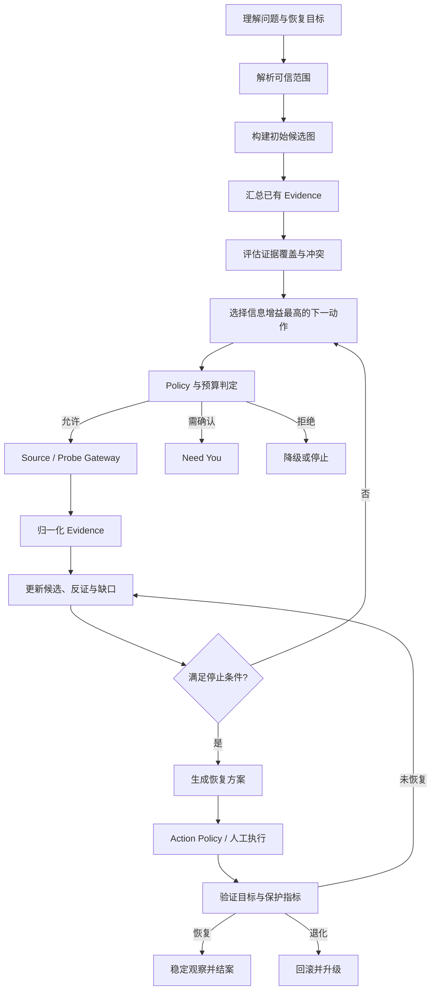

# Mini-Drop AI 功能设计 v3：生产级 Case Agent

> 状态：目标功能规格与开发分解（2026-08-05）  
> 依赖：[`ai_authorization_and_tooling.md`](ai_authorization_and_tooling.md)、
> [`ai_production_architecture_and_governance.md`](ai_production_architecture_and_governance.md)  
> 产品边界：面向多租户、多集群生产环境；当前三节点仅是一个测试 `EnvironmentProfile`。

> 实现进度：F1 Case 协作层和 F2 Context/模型审计已落地，包括租户绑定的
> `IncidentCase`、Web 工作台、不可变时间线、五块摘要、消息、修正、Pause/Resume/Stop、
> 乐观并发控制、关联 DiagnosisSession 控制、`case-context.v1`、模型调用元数据与响应哈希。
> F3 的 Case 级候选图、开放集 `OTHER_UNKNOWN`、调查迭代和确定性信息增益排序也已落地。
> F4—F7 涉及外部生产信息源与受控执行，仍按本文目标推进；当前不宣称自动修复已完成。

## 1. 产品定义

Mini-Drop AI 的核心产品不是“聊天框 + 性能报告”，而是一个持续推进的故障 Case
Agent。它围绕明确恢复目标工作，自动组织信息、维护候选原因、选择下一步、请求授权、
验证处理结果，并把无法判断的部分诚实地交还用户。

一次 Case 必须回答：

1. 现在发生了什么，影响范围是什么；
2. 哪些事实已经确认，哪些只是候选解释；
3. 下一步最值得获取什么证据，为什么；
4. 当前缺什么权限、数据或用户信息；
5. 哪个处理方案风险最低、可验证且可回滚；
6. 执行后是否真正恢复，是否产生新退化；
7. 本次调查能沉淀什么可复用知识。

## 2. 三级运行模式

三级模式共用 Case、Evidence、Policy、Context 和审计模型，只改变自动推进范围。

| 模式 | AI 能做什么 | 适用阶段 |
|---|---|---|
| `ASSIST` 辅助 | 读取已附加证据、解释、生成调查和处理建议 | 初始上线、敏感业务 |
| `COLLABORATE` 协作 | 在 Grant 内读取 Source、执行低风险 Probe；越界时请求一次授权 | 生产值班主模式 |
| `AUTHORIZED_AUTONOMY` 授权自治 | 在预授权包络内持续调查，并执行已晋级的低风险可逆 Action | 安全评测达标后的窄场景 |

模式不是风险等级。即使处于授权自治，I3/I4 动作、故障域不确定、数据不足或保护指标
异常也必须暂停并升级人工处理。

## 3. 用户侧功能地图

### 3.1 创建 Case

用户可以从告警、服务页、已有 Task、工单或自然语言创建 Case。创建页只要求：

- 问题描述；
- 目标服务或资源；
- 时间范围；
- 环境；
- 恢复目标；
- 希望使用的运行模式。

系统自动补充租户、集群、服务 Owner、当前发布、告警和可用信息源。目标或时间不明确
时进入 `NEEDS_SCOPE_CONFIRMATION`，不能猜测并扩散采集。

### 3.2 Case 首页

默认页面只展示五块：

1. `Impact`：影响、开始时间、服务和 SLO；
2. `Current Finding`：当前最可信判断及 Evidence；
3. `What AI Is Doing`：正在读取、采集、等待或验证什么；
4. `Need You`：唯一最重要的待确认事项；
5. `Recovery`：恢复目标、当前状态和稳定观察进度。

候选图、完整 Source 查询、Probe 参数、PolicyDecision、模型调用和调试字段放在“调查
详情”，避免把内部流水线直接暴露成用户操作负担。

### 3.3 时间线与接管

时间线统一展示用户消息、系统事实、候选变化、Source/Probe、授权、人工动作、AI 动作、
验证和回滚。用户可以随时：

- 修正目标、时间、拓扑或恢复标准；
- 暂停新调查动作；
- 停止整个 Case；
- 撤销 Grant；
- 手工完成 AI 建议并回填结果；
- 将某个结论标为正确、错误、部分正确或未知；
- 请求“解释为什么”“展示反证”“比较其他候选”。

用户事件优先于后台结果。收到修正后，旧范围下尚未执行的计划必须失效并重新规划。

## 4. AI Case 智能循环



每一轮必须生成结构化 `InvestigationIteration`，包括输入 Evidence、候选变化、选择动作、
PolicyDecision、成本、执行结果和停止判断。模型回答本身不能推动状态机，只有经过 Schema
和 Verifier 的结构化结果才能进入下一状态。

## 5. 逻辑角色设计

以下是逻辑职责，不要求启动多个模型进程。初期可由同一个模型使用不同 Schema 和 Prompt
承担，只有在评测证明收益后才拆成独立模型调用。

| 角色 | 输入 | 输出 | 关键限制 |
|---|---|---|---|
| Intent Interpreter | 用户问题、可信请求上下文 | 意图、症状、目标、时间、歧义 | 不判断根因 |
| Scope Resolver | CMDB/拓扑、身份、时间 | 冻结 Scope 与完整度 | 不补造实例/PID |
| Investigator | 候选图、证据覆盖、预算 | 下一 Source/Probe 计划 | 只能选 Registry 工具 |
| Correlation Reasoner | 时间对齐 Evidence、拓扑子图 | 支持/反证、传播路径 | 相关性不等于因果 |
| Evidence Critic | Claim、Evidence、质量 | 冲突、缺口、不可判断 | 可否决结论 |
| Knowledge Retriever | 结构化候选、环境、版本 | 可引用 Knowledge 条目 | 不让文档指令控制工具 |
| Recovery Planner | 根因候选、Action Registry | 分阶段恢复计划 | 不决定授权 |
| Safety Reviewer | 计划、Policy 上限、上下文 | 降级、审批或拒绝建议 | 只能收紧权限 |
| Communicator | 已验证 Case 状态 | 用户摘要、问题和解释 | 不新增事实 |

### 5.1 模型调用最小化

以下工作优先使用程序而不是模型：

- 时间解析后的边界校验；
- 拓扑过滤和资源权限；
- 指标统计、异常区间和趋势；
- 日志模板聚类和去重；
- Trace 关键路径聚合；
- Evidence 血缘和哈希；
- Policy、预算、幂等和状态机；
- 已知规则、阈值和报告 Schema 校验。

LLM 主要用于自然语言歧义、候选扩展、跨源语义关联和用户解释。

## 6. 候选解释图

根因分析不能只维护一个答案和一个置信度。Case 使用 `HypothesisGraph`：

```json
{
  "hypothesis_id": "hyp_downstream_db_lock",
  "statement": "checkout 延迟由下游 order-db 锁等待传播",
  "root_entity": "order-db",
  "mechanism": "database_lock_wait",
  "affected_entities": ["checkout"],
  "status": "ACTIVE",
  "supporting_evidence_refs": ["ev_trace_1", "ev_db_2"],
  "contradicting_evidence_refs": ["ev_baseline_3"],
  "missing_evidence": ["锁持有者与发布变更的时间关联"],
  "alternatives": ["hyp_checkout_cpu", "OTHER_UNKNOWN"],
  "score_components": {
    "rule_support": "high",
    "evidence_quality": "medium",
    "temporal_alignment": "high",
    "cross_source_agreement": "medium"
  }
}
```

候选状态为 `PROPOSED / ACTIVE / WEAKENED / RULED_OUT / CONFIRMED / UNKNOWN`。`CONFIRMED`
只表示满足当前 Case 的工程验收标准，不代表科学意义上的绝对因果。`OTHER_UNKNOWN` 永久
保留，避免模型在封闭候选集中被迫选错。

### 6.1 候选重建条件

满足任一条件时重新生成候选集合：

- 所有业务候选均被排除；
- 新 Evidence 无法被当前候选解释；
- 多个高质量 Source 相互冲突；
- 连续两轮动作信息增益低于阈值；
- Scope 或拓扑被用户纠正；
- 出现新的故障域或传播路径。

## 7. 下一动作规划

候选动作先由确定性程序生成可行集合，再由 Planner 排序：

```text
utility =
  expected_information_gain
  * source_reliability
  * probability_of_success
  * hypothesis_discrimination
  / (latency + resource_cost + monetary_cost + risk + approval_wait)
```

硬约束先于 utility：权限、Registry、Scope、预算、时间窗、环境、数据分类和并发上限任何
一项不满足，动作都不能进入候选集合。Planner 每轮默认只执行最小充分动作，避免一次性
发散调用多个昂贵 Source。

### 7.1 停止条件

调查必须在以下条件停止或暂停：

- 达到恢复或诊断验收标准；
- Evidence 足以排除高风险方向且下一动作价值很低；
- 预算或截止时间耗尽；
- 所需 Source/Probe 被拒绝；
- Scope 不完整；
- 用户暂停或停止；
- 模型、Connector 或控制面降级；
- 连续两轮没有有效信息增益；
- 只能通过不可接受风险的动作继续。

终止结果必须区分 `RESOLVED`、`INSUFFICIENT_EVIDENCE`、`BUDGET_EXHAUSTED`、
`AUTHORIZATION_BLOCKED`、`DATA_SOURCE_UNAVAILABLE` 和 `STOPPED`。

## 8. Context Packet 设计

模型不接收完整数据库对象或原始日志，而接收版本化 `ContextPacket`：

```json
{
  "schema_version": "case-context.v1",
  "case_goal": {},
  "scope": {},
  "current_iteration": 4,
  "active_hypotheses": [],
  "evidence_manifest": [],
  "signal_projection": {},
  "contradictions": [],
  "missing_evidence": [],
  "knowledge_refs": [],
  "recent_decisions": [],
  "policy_capabilities": [],
  "budget_remaining": {},
  "required_output_schema": "next-investigation-action.v1"
}
```

建议上下文预算：

| 区域 | 比例 | 内容 |
|---|---:|---|
| Case 目标与 Scope | 10% | 问题、时间、环境、恢复标准 |
| 候选与缺口 | 20% | 活跃候选、反证、待区分问题 |
| Evidence 信号 | 45% | 指标趋势、日志簇、Trace 路径、变更 |
| Knowledge | 10% | 版本化 Runbook 和历史案例摘要 |
| 最近决策 | 10% | 最近两到三轮，不发送完整历史 |
| Policy 与输出约束 | 5% | 可用工具摘要、预算和 Schema |

预算不是固定切片。Evidence 不足时把空间让给缺口和 Source 能力；复杂 Trace 场景增加
信号区；用户追问解释时增加决策历史。始终保留 Case 目标、Scope、Evidence ID 和输出
Schema，不能为容纳更多日志而裁掉安全约束。

### 8.1 复杂数据程序化处理

- Metrics：时间对齐、异常区间、min/max/avg/p95/last/slope、基线差异；
- Logs：模板聚类、数量、首次/最后出现、频率突变、代表样本；
- Traces：关键路径、错误边、分段耗时、跨服务传播顺序；
- Profiles：Top-N、调用栈合并、版本与符号完整度；
- Topology：目标中心子图、故障域、Owner、版本与置信度；
- Changes：发布/配置/Flag 与异常窗口的前后关系；
- Knowledge：按环境、版本、根因机制和适用条件检索。

程序投影必须输出丢弃数量、脱敏数量、原始/投影大小、版本和哈希。原始 Evidence 不因
Context 压缩而改变。

## 9. 知识与记忆

### 9.1 四级记忆

| 层级 | 生命周期 | 内容 |
|---|---|---|
| Turn Memory | 单次模型调用 | 当前任务所需最小 ContextPacket |
| Case Memory | Case 生命周期 | Evidence、候选、决策、授权和执行轨迹 |
| Service Memory | 版本化、可失效 | 服务基线、依赖、已知问题、Owner、Runbook |
| Organization Knowledge | 审核发布 | 通用规则、事故模式、合规和变更政策 |

### 9.2 知识晋升

AI 不能把一次模型输出直接写成组织知识。知识晋升流程：

```text
Case 结案候选
 -> 脱敏与事实提取
 -> Evidence/版本/适用环境绑定
 -> Owner 审核
 -> 回放测试
 -> 发布 KnowledgeVersion
 -> 到期复核或自动失效
```

历史 Case 只用于检索相似机制和建议下一证据，不能覆盖当前 Evidence。生产版本、依赖或
环境不匹配时降低知识权重。

## 10. 模型路由与降级

Model Gateway 根据任务路由，而不是所有步骤都调用最大模型：

| 任务 | 默认实现 | 模型策略 |
|---|---|---|
| 指标聚合、阈值、时间对齐 | 程序 | 不调用模型 |
| 意图结构化 | 小模型或规则 | 低温度、严格 Function Schema |
| 候选扩展 | 推理模型 | 只读取 ContextPacket，不接触凭据 |
| 下一动作排序 | 程序初筛 + 模型排序 | 输出 Registry ID，不输出命令 |
| 报告解释 | 通用模型 | 只能引用已验证 Claim |
| Safety Review | 独立规则优先 | 模型只能收紧 Policy |

模型不可用时：已有 Evidence 分析、规则 Finding、Policy、下载和 Case 状态继续工作；新
模型任务进入可重试状态，不能重复 Source、Probe 或 Action。

模型升级必须保存 `provider/model/snapshot/prompt/context-builder/schema` 版本，通过固定回放
集、影子 Case 和 Canary 后发布。

## 11. 恢复方案设计

恢复计划不是一条命令，而是阶段化 `RecoveryPlan`：

```text
Mitigate   先降低用户影响
Stabilize  恢复容量、隔离故障域
Correct    修复配置、版本或资源根因
Verify     重放负载并检查目标与保护指标
Observe    连续稳定窗口
Close      结案并生成知识候选
```

每个步骤包含 ActionDefinition、目标、理由、Evidence、影响等级、授权决定、前置条件、
dry-run、幂等键、成功指标、保护指标、观察时间、回滚和人工接管点。

### 11.1 No-Regression 判定

动作成功必须同时满足：

- 用户恢复目标达到；
- 原告警或症状改善；
- 错误率、延迟、容量等保护指标未退化；
- 下游和同故障域没有出现新异常；
- 连续稳定窗口达到要求；
- 没有新的高严重级告警；
- Evidence 时间窗覆盖动作后正式测量期。

否则进入 `ROLLBACK` 或人工升级，不能把“命令返回成功”当成恢复成功。

## 12. 核心领域对象

下一阶段建议新增或扩展：

- `IncidentCase`：恢复目标、影响、协作状态和当前摘要；
- `InvestigationIteration`：每轮计划、输入、结果、成本和停止判断；
- `HypothesisNode/Edge`：候选、传播和替代关系；
- `EvidenceEnvelope`：来源、时间、目标、质量、哈希和模型投影；
- `ContextPacket`：一次模型调用的可审计输入；
- `ModelAttempt`：模型、Prompt、Schema、Token、延迟和结果；
- `PolicyDecision`：完整策略输入、决定和原因；
- `AuthorizationGrant/CapabilityUse`：授权和实际使用；
- `RecoveryPlan/ActionAttempt`：处理、验证和回滚；
- `KnowledgeCandidate/KnowledgeVersion`：知识晋升与失效。

所有对象必须携带 `tenant_id`、`case_id`、版本、创建者和时间。任何跨租户外键都必须在
Repository 和数据库约束两层阻断。

## 13. API 演进

在现有接口上增加：

```text
POST /api/v1/cases
GET  /api/v1/cases/{case_id}
POST /api/v1/cases/{case_id}/messages
POST /api/v1/cases/{case_id}/corrections
POST /api/v1/cases/{case_id}/pause
POST /api/v1/cases/{case_id}/resume
POST /api/v1/cases/{case_id}/stop

GET  /api/v1/cases/{case_id}/hypotheses
GET  /api/v1/cases/{case_id}/iterations
GET  /api/v1/cases/{case_id}/context-packets
GET  /api/v1/cases/{case_id}/policy-decisions

POST /api/v1/cases/{case_id}/recovery-plans
POST /api/v1/cases/{case_id}/manual-actions
POST /api/v1/cases/{case_id}/verification

POST /api/v1/knowledge-candidates/{id}/approve
POST /api/v1/knowledge-candidates/{id}/reject
```

`DiagnosisSession` 在迁移期仍是底层对象，`IncidentCase` 作为用户协作聚合层引用它，避免
一次性破坏现有 API。

### 13.1 SSE 事件

新增稳定事件：

```text
case_summary_updated
scope_confirmation_required
hypothesis_added
hypothesis_weakened
hypothesis_ruled_out
source_access_requested
source_evidence_added
user_action_required
recovery_plan_updated
action_preflight_completed
verification_started
recovery_stability_updated
case_resolved
case_stopped
```

事件只携带摘要和对象 ID，大型 Evidence 通过受权 API 获取。

## 14. 功能评测

### 14.1 用户结果指标

- Case Resolution Rate；
- Time to First Useful Finding；
- Time to Verified Recovery；
- 用户接管次数和接管后复用率；
- “Need You”问题有效率；
- 用户对解释可理解性和可信度的评分。

### 14.2 调查质量

- Root Cause Top-1/Top-3；
- 关键 Evidence 召回和引用准确率；
- 反证覆盖率；
- 开放集正确拒答率；
- 下一动作正确率与信息增益；
- 无效 Source/Probe 调用率；
- 平均调查成本、时间和机器范围。

### 14.3 安全与恢复

- 未授权 Source 返回次数必须为 0；
- Secret 进入模型次数必须为 0；
- Scope 扩大次数必须为 0；
- 未授权 Action 次数必须为 0；
- 错误自动批准率；
- 自动修复成功率、错误结案率和回滚成功率；
- No-Regression 违反次数；
- Pause、Stop、Grant 撤销和 Red Button 生效延迟。

## 15. 开发拆分

### F1：Case 协作层

- [x] `IncidentCase`、消息、修正、暂停、恢复、停止；
- [x] 用户首页五块信息和稳定 SSE；
- [x] 复用当前 DiagnosisSession，并保证 Pause/Resume/Stop 控制一致。

### F2：ContextPacket 与模型调用审计

- [x] 实现 `case-context.v1`，压缩时保留全部契约字段并执行敏感键脱敏；
- [x] 保存 Case 模型调用的 Context 投影、模型/快照、Prompt、输出 Schema、Token、耗时和响应哈希；
- [x] 增加按 Source/候选分配预算、截断统计和投影质量报告。

### F3：候选图与迭代规划

- [x] 持久化租户级 HypothesisNode/Edge，并永久保留 `OTHER_UNKNOWN`；
- [x] 支持支持证据、反证、缺口、范围修正失效和候选重建条件；
- [x] 实现 InvestigationIteration、硬约束先行的信息增益排序和类型化停止结果。

### F4：真实只读信息源

- OIDC/委托身份；
- Prometheus、CMDB/Kubernetes、发布记录；
- 再扩展日志和 Trace；
- Source Contract 与故障降级测试。

### F5：恢复协作

- RecoveryPlan 和人工动作回填；
- 统一验证窗口和 No-Regression；
- Action 仍只评估，不自动执行。

### F6：首个受控 Action

- Action Grant、JTI 防重放、Actuation Gateway；
- 选择 Mini-Drop 自身可逆动作；
- 单次人工批准、自动预检、执行、验证和回滚。

### F7：授权自治

- 只对固定、统计显著达标的 Action 晋级；
- 按租户、服务、环境和时段授权；
- Canary、全局熔断和持续安全评测。

## 16. 当前优先级结论

下一开发周期不应继续增加更多自由文本 Prompt，也不应直接开放自动修复。优先顺序是：

1. Case 协作对象和用户可控状态；
2. ContextPacket 与模型调用审计；
3. 持久化候选图和 InvestigationIteration；
4. 接入真实 Prometheus、Topology 和发布信息；
5. RecoveryPlan、人工动作回填和验证闭环；
6. 最后实现一个 Mini-Drop 自身的受控可逆 Action。

这条路径会把当前“十二步诊断流水线”逐步演进为可持续调查、可接管、可验证、可治理的
生产级 Case Agent，同时保留现有确定性采集、Evidence 和安全执行边界。
