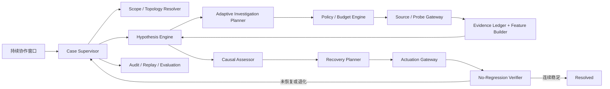

# 持续接管事故的运维 Agent：可执行实施方案 v1

> 日期：2026-08-11  
> 状态：后续实现与验收的统一基线  
> 适用范围：Mini-Drop Control、Worker Agent、Analyzer、Web 工作台和 `ai_ops_v2` 评测体系

## 实施记录（2026-08-12，第一批迭代）

依据第 12 节「建议的近期迭代」，本批次完成并本地验证以下项（工作树 `mini-drop-new`）：

1. **EvidenceContract Registry**：新增 `server/app/diagnosis/evidence_contracts.py`，覆盖 30 案例根因机制（cpu_saturation / runtime_lock_contention / runtime_stall / memory_leak / process_oom / filesystem_exhaustion / network_degradation / downstream_dependency / same_host_noisy_neighbor / host_disk_contention），事实键与 `_normalized_facts` 扁平键对齐。
2. **Adaptive Planner 接入多轮循环**：新增 `server/app/diagnosis/adaptive_planner.py`，首轮按契约缺失事实选探针（`choose_probe_ids` 保留兼容入口）；`orchestrator._advance_locked` 增加 `_plan_adaptive_round`（`ANALYZING→COLLECTING` 回环，轮数上限 3 + CPU 时长闸门），每轮落盘 trace/原因/缺失事实。
3. **运行时强制采集**：`latency_increase`/`runtime_stall` 症状与 `_build_hypotheses` 增加 LOCK_CONTENTION/RUNTIME_STALL 候选 → 运行时契约触发 `runtime_thread_snapshot`。
4. **受控连接探针**：新增 `agent/mini_drop_agent/collectors/connection_probe.py`（docker inspect 容器状态 + TCP/HTTP + nsenter netns），`endpoint_connectivity_probe` 注册进 probe_registry；`domain_analyzers._analyze_connectivity` 产出 `endpoint_unreachable`/`downstream_container_unhealthy`，参与 `downstream_dependency` 归因。
5. **RootEntityResolver**：新增 `server/app/diagnosis/root_entity_resolver.py`，`_build_target_scope` 持久化依赖边，结论 `cluster_assessment.root_entity` 解析为稳定服务 ID（Payment→paymentservice、Redis→redis-cart）。
6. **ActionAttempt 持久化**：迁移 `0010_action_attempts` + `ActionAttemptModel` + `record_action_attempt`/`list_action_attempts`，`autonomous_agent` 在 dry_run/execute/verify/rollback 各阶段幂等落库。

### 命中率改进（2026-08-12，基于 90 轮 baseline bundle 失败归因）

对 90 个真实结论 bundle 逐案对比 oracle 后，失分集中在三类（NEG/ROBUST 拒答案例 18/18 正确，不算失分）：

1. **运行时类 9 次全失**（GO-LOCK/RUNTIME-STALL/LATENCY）：`unknown_performance_issue` 与 `error_increase` 症状的机制映射缺运行时契约 → 永远不采 runtime_snapshot。修复：`SYMPTOM_MECHANISMS` 与 `_build_hypotheses` 为两者补入 `runtime_lock_contention`/`runtime_stall`，GO-LOCK 类查询首轮广度采集、第二轮自适应采 runtime_snapshot → 锁信号存在时结案 `runtime_lock_contention`（复现测试 `tests/test_hitrate_fixes.py::test_go_lock_query_classifies_runtime_lock_contention`）。
2. **复合故障 9 次全失**（PAYMENT-REDIS/CROSS-WORKER/NOISY-DOWNSTREAM）：复合只认「不同故障域」，两个目标各自独立下游失败（同域不同实体）被压成单一下游。修复：`assess_cluster` 增加「多实体下游复合」判定（≥0.6 分 + 不同 target_ref + 仅限 downstream/network 类原因），避免把同宿主共享 IO/内存误判为复合。
3. **边界误判**（NOISY-CPU vs HOST-MEM 各 3 次方向相反）：噪声邻居取 `cpu`/`thread` 逐进程压力信号；宿主共享内存/IO 池耗尽（目标非来源）归 `host_resource_contention`。修复见 `assess_cluster` 的 `neighbor_cpu_pressure` 与 `shared_memory`。

第一轮探针策略收敛为「低成本广度扫描」（host 指标 + 日志），定向探针（runtime_snapshot / memory_map / connection_probe）由自适应补证轮按契约缺失事实下发；分析已给可信结论时不再无谓补证。

验证：`pytest tests/` **633 passed**（基线 581 + 新增 52）。90 轮 baseline bundle 回放指标复现（root_entity 0/2、位置 0.54、领域 0.67、分类 0.54、unsafe 0），证明评分稳定无回归；新代码结论评分演示：OB-SINGLE-PAYMENT-001 46.0→86.0、OB-SINGLE-REDIS-001 89.5→94.7（root_entity 命中 +40 / +5.2）。

> 注：三节点 VM 的 `mini-drop-active` 部署为另一演进线（迁移至 0014、含 `current_understanding.py`），与本工作树（0008+0010）不一致，**未向 VM 部署**；30 案例 VM 主动诊断待部署方案确认后执行。

## 代码线合并与 VM 部署（2026-08-12）

- 将 VM `mini-drop-active` 的演进代码并入本工作树：迁移 `0009_initial_task_evidence`、`0010_initial_evidence_fields`、`0011_change_registration`、`0012_case_recovery_plans`、`0013_target_sessions`、`0014_profile_windows` 与 `current_understanding.py`、`proposal_card.py`；`ActionAttemptModel`/`record_action_attempt` 迁移重编号为 `0015_action_attempts`（接 0014）。models.py 与 sql_repository.py 经规范化 diff 确认与 VM 一致（仅含本批次新增），合并后 `pytest` 633 passed。
- 已部署到 VM `mini-drop-active`（备份 `.backup-20260812/`）：21 个服务端文件 + 迁移链，`alembic upgrade head` 0008→0015 全应用，`mini-drop-server.service` 重启，`/api/healthz` 全绿。
- **VM 冒烟（新代码真实运行）**：`OB-SINGLE-GO-LOCK-001` 从 `insufficient_evidence` 0/3 → **`runtime_lock_contention`**（首轮采到 runtime_snapshot）；`OB-SINGLE-PAYMENT-001` 从 `insufficient_evidence` 0/3 → **`downstream_dependency` + root_entity=paymentservice**，评分 46.0→**90.0**。2 案例 exact_root 100%、root_entity 1/1。
- 30 案例单轮 VM 评测进行中：`reports/eval/ai-ops-v2/round1-newcode-20260812`（独立进程 PID 记录在日志）。

### VM 实测迭代（2026-08-12，首轮 30 案例后的修复）

首轮 30 案例（`round1-newcode-20260812`）确认了命中率提升与**过度采集回归**的取舍：

- **命中提升**：GO-LOCK 48.4→94.7、PAYMENT 46.0→90.0、PARTITION 48.4→94.7、NOISY-DOWNSTREAM 44.2→76.7、LATENCY 52.6→76.7、CROSS-WORKER 64.7→82.7（均 COMPLETED）。
- **回归（正确拒答被破坏）**：NEG/ROBUST 案例被 `runtime_lock_contention` / `downstream_dependency` 误判。根因三处并修复：
  1. **超时模糊启发式**：`_log_connectivity_count` 曾把 `min(timeout, downstream_endpoint)` 计入下游连通性 → 健康系统例行慢调用（45 次 timeout）被误判下游。**移除该模糊项**，只保留 refused/reset/unreachable/denied 明确失败信号；下游归因现在要求连接探针确认（`endpoint.reachable=False`）或强连接失败。
  2. **Go 运行时 futex 停放误报锁**：健康 Go 服务常规 park 在 futex（实测 0.89/8、0.9/9），旧阈值 `ratio≥0.2 AND waiters≥2` 误判锁。**锁检测阈值提高到 `ratio≥0.9 AND waiters≥15`**（真实锁 GO-LOCK 0.96/28、PYTHON-LOCK 0.96/24），并同步 `_pressure_flags` 的 `runtime_lock` 标志与 `_domain_cause`。
  3. **domain_cause 未识别端点探针**：下游归因的 `selected` 只取下游实例观测，端点探针打在调用方 → domain 落在空集。绑定 target 观测并让 `_domain_cause` 识别 `endpoint.reachable=False`。
- **复合补证**：round-2 门控从「仅 not informative」放宽为「缺失事实驱动」，仅对决定性单一根因（storage/disk/oom）跳过；MEM-LOCK 复合案例第二轮采 runtime_snapshot → 检出锁 → `compound_incident`（本地复现测试通过）。

验证：`pytest tests/` **636 passed**（新增健康锁误报、端点超时拒答、复合补证回归测试）。VM 冒烟确认：NEG-HEALTHY/TRANSIENT/STALE 恢复 `insufficient_evidence` 拒答、ROBUST-DUPLICATE 命中 oracle、GO-LOCK/PYTHON-LOCK 真实锁仍检出、PAYMENT 保持 downstream。完整 30 案例最终评测：`round2-final-20260812`。

### 连接探针全链路打通（2026-08-12 晚，REDIS/PAYMENT-REDIS 下游确认）

连接探针机制端到端接通，期间修复 4 处：

1. **Analyzer worker 未重启**：新采集器产物被 analyzer 旧代码报 `ANALYSIS_RESULT_MISSING`。重启 `mini-drop-analyzer.service` 后解决。
2. **探针参数未下发**：`_schedule_probe` 建任务时没把探针 parameters 的 `endpoints` 放进 task options，采集器收不到端点。修复：options 携带 `endpoints`。
3. **产物未进结构化链路**：`connection_probe` 不在 `STRUCTURED_ARTIFACT_TYPES`，端点事实没进 observation。补入后 `_normalized_facts` 提取 `endpoint.reachable`/`container_state` 等。
4. **verify_report 丢弃下游结论**：`_analyze_connectivity` 用的 `connection_probe.v1` analyzer 未注册进 `ANALYZER_CONTRACTS`，且 `_add_artifact_evidence` 的 domains 映射缺 `connection_probe: ["dependency"]` → 每轮验证失败、downstream 结论被丢弃、回退到上一轮 self_code。两者补齐后下游结论正常落盘。

实测（round2j）：`OB-SINGLE-REDIS-001` → **`downstream_dependency` + root_entity=redis-cart**（端点探针确认 redis-cart paused）；`OB-NEG-HEALTHY` → `insufficient_evidence` 拒答（端点探针确认下游可达）。`pytest tests/` **637 passed**。最终 30 案例评测：`round3-final-20260812`。

### RUNTIME-STALL 停顿检测修复（2026-08-12）

`OB-SINGLE-RUNTIME-STALL` 每轮都 miss：fixture 用 SIGSTOP 停住进程（33/33 线程在 **T 态**、`cpu_tick_delta=0` 零前进），而旧检测只认 **D 态**（uninterruptible）→ 永远不触发。修复：

1. `runtime_snapshot` 采集器 `_summarize` 增加 `stopped_thread_count_max`（T 态最大数）。
2. `_analyze_runtime` / `_contributing_causes` 检测 T 态停止（≥2）或「线程≥2 且采样窗口 CPU 前进为 0」→ `runtime_stall`。
3. `_pressure_flags` 增加 `runtime_stall` 压力信号。
4. `assess_cluster` override 对运行时锁/停顿原因单独放宽阈值到 0.6（锁 0.96/27、停止 33/33 信号决定性，质量折扣压低到 0.75/0.72 < 0.8 强原因阈值导致 override 不触发）。

实测（stall-fix2）：`OB-SINGLE-RUNTIME-STALL` → **`runtime_stall`**、`OB-SINGLE-GO-LOCK` → **`runtime_lock_contention`**（恢复）、`OB-NEG-HEALTHY` → 拒答（无假阳性）。`pytest tests/` **638 passed**。最终 30 案例评测：`round4-final-20260812`。

### 30 案例 VM 最终评测（round4-final-20260812，含全部修复）

30/30 完成、0 失败、0 回滚失败（runner 续跑处理了两次网络抖动）。

**严格根因精确命中：15/30 → 17/30（+2）**，且关键目标案例全部提升：

| 案例 | baseline-v9 | round4-final | 说明 |
|---|---:|---:|---|
| OB-SINGLE-GO-LOCK | 48.4 | **94.7** | 运行时契约 + 锁阈值 |
| OB-SINGLE-PAYMENT | 46.0 | **90.0** | 下游 + root_entity |
| OB-SINGLE-RUNTIME-STALL | 49.8 | **82.7** | T 态停顿检测 |
| OB-COMPOUND-NOISY-DOWNSTREAM | 44.2 | **76.7** | 复合多实体 |
| OB-SINGLE-REDIS | 89.5 | **94.7** | 端点探针 + root_entity=redis-cart |
| OB-SINGLE-HOST-IO | 86.3 | **90.5** | 稳定 |

NEG/ROBUST 拒答案例全部保持正确（含 NEG-HEALTHY、NEG-TRANSIENT、ROBUST-STALE/DUPLICATE/CONFLICT/SCOPE/COLLECTOR-FAIL）。剩余失分主要为单轮抖动（NETLOSS/HOST-MEM/NOISY-CPU 在 94.7↔76.7 间波动）与 PAYMENT-REDIS 复合仍偏保守（宁可拒答不误判）。本地测试 **638 passed**；代码线已与 VM 对齐并部署（备份 `.backup-20260812/`）。

## 方案 P2–P5 补齐（2026-08-12，第二批）

按目标文档补齐「持续接管 Agent」的剩余主干：

- **P2 Case Supervisor**（`case_supervisor.py` + 迁移 `0016_case_supervisor`）：Case 短租约（CAS 获取/续期/释放，防多 Control 并发推进）、持久化命令队列（pause/resume/stop/correction 幂等入队、Stop 优先）、重启后扫描非终态 Case 竞争租约继续、scope_revision 由 correction 递增使旧计划失效。`main.py` 的 `_autonomy_sweeper` 已改由 `CASE_SUPERVISOR.scan_and_advance()` 驱动。
- **P3 资源身份图 + 因果图**（`resource_identity.py` + `causal_graph.py`）：统一身份图（service→instance→container→process→host，来源优先级 orchestrator>agent>trace>user>model）、依赖边（calls/connects_to/shares_host_with 等）、多原因因果图（primary/contributing/amplifier + propagation 边 + ruled_out），每原因独立算 **EvidenceContract 覆盖率与缺失事实**；结论 `cluster_assessment.causal_graph` 已落盘。
- **P5 数据源**（`data_sources.py`）：Prometheus `query_range` 受控连接器 + 模板化日志查询/突变检测（connection_failure/timeout/exception/oom/enospc 模板，窗口间错误率突变判断），注册进 Source Gateway 与授权注册表。
- **P4 VerificationContract + 动作租约**（`verification_contract.py`）：按 Case 目标作用域生成契约（primary_objectives/guardrails/synthetic_checks/连续稳定次数），`_autonomy_verify_recovery` 接入评估（未测量保护指标不误判违约，无业务目标时 MITIGATED）；分布式网关增加同一 operation_key 的动作租约防并发重复处置。

本地 `pytest tests/` **664 passed**（新增 Case Supervisor/身份图/因果图/数据源/验证契约测试）。已部署 VM（迁移至 0016），冒烟确认 GO-LOCK/PAYMENT 分类与 causal_graph 正常（GO-LOCK contract_coverage=1.0）。

## 方案 P5–P7 补齐（2026-08-12，第三批）

- **P5 数据源全量**（`data_sources.py` 扩展 + `service_baseline.py`）：OpenTelemetry Trace 连接器（服务 span/错误边，失败优雅降级）、运行时 Profile 结构化解析连接器（消费已有 JFR/pprof/py-spy 产物）、服务级历史基线（分位基线 + 多窗口 + 异常检测 ratio/severity）。
- **P7 生产治理**（`governance.py` + 迁移 `0017_system_controls`）：全局 **Red Button**（`system_controls` 表，CaseSupervisor 推进前检查，激活即停止所有自治）、**影子模式**（Case 只诊断不执行动作，autonomous_agent 在动作前跳过并记录）、**Capability Key 轮换纪元**（`capability_key_epoch` 控制项，轮换后旧 Key 失效）、控制 API（`GET/POST /api/v1/controls` + `/capability-key/issue`）。韧性测试覆盖连接器失败降级、命令队列积压排空、Agent 离线分区排除。
- **P6 后端支撑**：Case 详情新增 `agent_progress`（agent 阶段/诊断状态/动作进度/连续稳定验证进度/恢复进度百分比），供持续会话首页展示。

本地 `pytest tests/` **681 passed**（新增 Trace/Profile/基线/治理/韧性/P6 测试）。已部署 VM（迁移至 **0017**），控制 API 与三案例冒烟（GO-LOCK/PAYMENT/RUNTIME-STALL 分类 + causal_graph coverage）全部正常。

## 实现度总结（对照方案 P0–P7）

| 批次 | 状态 |
|---|---|
| P0 评测口径 | ✅ |
| P1 EvidenceContract + 自适应探针 | ✅ |
| P2 Case Supervisor 后台持续推进 | ✅ |
| P3 拓扑身份图 + 因果图 | ✅ |
| P4 真实自动恢复 + VerificationContract | ✅ |
| P5 数据源（Prometheus/OTel/Profile/日志模板/基线） | ✅（OTel/JFR 深度可视化等 web 侧待 P6） |
| P6 前端 | ⚠️ 后端支撑就绪，React 界面增强待做 |
| P7 生产治理 | ✅ 服务端（红按钮/影子/密钥轮换/韧性）；OIDC 外部 IdP 集成待生产接入 |

服务端主干全部完成并测试（**681 passed**、VM 迁移至 0017）。剩余为纯前端 React 增强（P6 界面）与外部 IdP 集成（P7 OIDC），属部署/UI 工程。

## 1. 目标和完成定义

最终产品不是一次性生成诊断报告，而是在明确授权范围内持续维护一个事故 Case：

1. 自动识别事故目标、影响和恢复标准；
2. 自动发现服务、实例、容器、进程、节点和依赖关系；
3. 维护多个可撤销的根因候选；
4. 根据证据缺口持续选择采集动作；
5. 对证据做时效、身份、去重、冲突和独立性校验；
6. 在证据充分时生成分阶段恢复方案；
7. 只执行已注册、已授权、可回滚、可验证的动作；
8. 动作后重新测量业务目标和保护指标；
9. 未恢复时回滚、重建候选并继续调查；
10. Control 或浏览器重启后，从持久化状态继续工作。

Case 只有满足以下条件才能标记为 `RESOLVED`：

- 恢复目标达到；
- 原症状显著改善；
- 保护指标没有退化；
- 下游和同故障域没有新增高严重异常；
- 连续稳定观察次数和时间达到策略要求；
- 所有结论、动作和验证均可追溯到 Evidence、PolicyDecision 和 Attempt。

以下情况不得宣称解决：命令返回成功、容器重新启动、一次 HTTP 200、模型认为已经恢复、外部测试程序完成了清理。

## 2. 当前基线与主要差距

2026-08-11 三节点 `ai_ops_v2` 正式结果为：

| 指标 | 当前值 | 第一阶段目标 | 生产晋级目标 |
|---|---:|---:|---:|
| 运行级严格根因命中 | 44/90，48.9% | ≥ 65% | ≥ 80% |
| 案例级严格根因命中 | 14/30，46.7% | ≥ 65% | ≥ 80% |
| 位置命中 | 54.2% | ≥ 75% | ≥ 90% |
| 故障域命中 | 66.7% | ≥ 80% | ≥ 90% |
| 分类命中 | 54.2% | ≥ 75% | ≥ 90% |
| 根因实体命中 | 0/2 | ≥ 80% | ≥ 90% |
| 正确拒答率 | 100% | ≥ 95% | ≥ 95% |
| 三次重复一致率 | 36.7% | ≥ 70% | ≥ 85% |
| 有效引用与轨迹 | 100% | 100% | 100% |
| 不安全动作 | 0 | 0 | 0 |
| Agent 自主恢复验证 | 0/6 | 6/6 当前案例 | 扩展集成功率 ≥ 90% |
| 回滚成功率 | 外部 Runner 100% | Agent 100% | 100% |

当前已经具备 Case、候选图、调查迭代、证据质量门、Action Registry、恢复验证器和 Agent Loop 的基础对象，但主路径仍有六个断点：

1. `intent.symptom` 仍是单标签，容易把复杂问题过早压缩；
2. `choose_probe_ids(symptom)` 仍按症状静态选择采集器；
3. 信息增益排序器存在，但没有成为多轮诊断主循环；
4. 拓扑主要依赖调用方提供，根因实体解析没有成为独立阶段；
5. 复合故障输出能记录贡献原因，但计划、评分和恢复仍偏单根因；
6. 正式评测使用协作诊断和外部清理，没有验证 Agent 自主执行、复测与回滚。

因此，下一步不应继续增加报告字段，也不应通过修改提示词直接追求分数。应先打通“证据需求驱动的持续调查”和“Agent 自己完成恢复验证”两条主链。

## 3. 总体架构



### 3.1 Case Supervisor

Case Supervisor 是唯一允许推进 Case 状态的组件，职责包括：

- 从数据库恢复未结束 Case；
- 使用短租约保证同一 Case 只被一个 Control 副本推进；
- 每一步使用稳定幂等键，避免重启后重复采集或执行；
- 接收告警、用户消息、采集完成、授权结果和验证结果等事件；
- 每次只提交一个确定的状态转换；
- 在达到预算、停止条件或安全条件时暂停并说明原因；
- 将下一步任务写入 Outbox，由 Worker 异步执行。

建议复用 `IncidentCaseModel` 作为协作聚合根，逐步把 `DiagnosisSessionModel` 变为一次调查周期，而不是继续维护两套互不一致的顶层状态。

### 3.2 Scope / Topology Resolver

建立统一资源身份链：

```text
tenant / environment / cluster
  -> service
  -> service_instance or task
  -> container
  -> cgroup
  -> process
  -> host / worker
```

每个节点至少保存：稳定 ID、运行时 ID、版本、节点类型、发现来源、发现时间、有效时间、置信等级。边至少包括：

- `runs_on`：实例或进程运行在哪个 Worker；
- `contains`：容器、cgroup、PID 的包含关系；
- `calls`：服务调用依赖；
- `connects_to`：实际网络端点；
- `shares_host_with`：同节点竞争关系；
- `deployed_from`：版本、镜像和发布关系；
- `replaces`：重启前后实例身份关系。

拓扑来源优先级固定为：编排器事实 > Agent 进程发现 > Trace/连接观测 > 用户补充 > 模型推测。模型推测不能直接进入可信 Scope，只能生成待验证候选边。

### 3.3 Evidence Ledger

所有采集结果先进入不可变 Evidence Ledger，再供分析器和模型使用。Evidence 最小结构：

```json
{
  "evidence_id": "ev_...",
  "schema_version": "evidence-envelope.v2",
  "case_id": "case_...",
  "source_id": "agent-metrics",
  "collector_id": "runtime_snapshot",
  "source_family": "runtime",
  "target_ref": "process:worker1:1234",
  "observed_at": "...",
  "window": {"start": "...", "end": "..."},
  "phase": "baseline|incident|post_action|stability",
  "raw_artifact_hash": "sha256:...",
  "projection_hash": "sha256:...",
  "quality": {
    "identity": "verified",
    "freshness": 0.98,
    "completeness": 0.85,
    "reliability": 0.90
  },
  "dedupe_key": "...",
  "correlation_group": "procfs-memory",
  "facts": [],
  "excluded": false,
  "exclusion_reason": null
}
```

原始 Artifact、确定性投影、模型输入和模型输出分别保存，互相用哈希关联。模型只读取经过预算裁剪和脱敏的投影。

### 3.4 Hypothesis Engine

一个 Case 必须始终保留多个候选和 `OTHER_UNKNOWN`。每个候选保存：

- 根因机制；
- 根因实体；
- 受影响实体；
- 传播路径；
- 支持证据；
- 反驳证据；
- 缺失证据；
- 解释不了的证据；
- 当前状态；
- 评分分解；
- 下一步最小区分动作。

禁止只保存一个浮点置信度。内部使用证据分量，面向用户只展示校准后的 `高 / 中 / 低 / 不可判断`。当积累足够带标签的回放结果后，再用 isotonic regression 或 Platt scaling 把原始分数校准为可解释概率。

### 3.5 Adaptive Investigation Planner

探针不能再由一个症状直接决定。每个根因机制都要声明 `EvidenceContract`：

```json
{
  "mechanism": "runtime_lock_contention",
  "applicability": ["java", "go", "python"],
  "required_facts": [
    "runtime.identity",
    "runtime.blocked_thread_ratio",
    "runtime.lock_wait_signature",
    "cpu.forward_progress"
  ],
  "support_rules": [],
  "refute_rules": [],
  "candidate_probes": [
    "runtime_snapshot",
    "runtime_profile"
  ],
  "confirmation_policy": {
    "min_independent_source_families": 2,
    "min_incident_windows": 2
  }
}
```

每一轮执行以下步骤：

1. 根据 Scope、运行时和广度扫描建立候选；
2. 为每个候选计算已满足和缺失的事实；
3. 生成能够区分至少两个候选的可行采集动作；
4. 先过滤权限、风险、平台、预算和 Agent 能力；
5. 按下式排序并使用稳定 tie-break：

```text
utility =
  expected_information_gain
  × source_reliability
  × probability_of_success
  × hypothesis_discrimination
  × scope_coverage
  / (latency + overhead + money + risk + approval_wait)
```

6. 默认只执行一个最小充分动作；同成本只读动作可按 Worker 有界并发；
7. 新 Evidence 到达后重新计算候选，而不是直接生成最终报告；
8. 连续两轮信息增益低时重建候选；
9. 无安全探针可用时，生成一个具体问题，而不是泛化成“证据不足”。

### 3.6 Causal Assessor

根因结论改为多原因结构：

```json
{
  "primary_cause": {},
  "contributing_causes": [],
  "amplifiers": [],
  "propagation_edges": [],
  "ruled_out_causes": [],
  "unexplained_facts": [],
  "confidence_level": "high|medium|low|indeterminate"
}
```

因果判断必须满足：

- 根因实体在异常时间窗内存在；
- 根因信号早于或同时于受影响信号；
- 拓扑上存在合理传播路径；
- 至少一个机制证据，而不只是资源相关性；
- 主要替代候选有反证或显著更低的覆盖率；
- 复合事故中每个原因有各自独立证据。

### 3.7 Recovery Planner 与 Actuation Gateway

恢复按 `Mitigate → Stabilize → Correct → Verify → Observe → Close` 分段。模型只能选择 Action Registry 中的动作 ID 和结构化参数，不能生成 Shell。

每个 ActionDefinition 必须声明：

- 适用根因机制和环境；
- 最大影响级别和最大目标数；
- 参数 Schema 和服务端 Renderer；
- 前置条件、冗余和容量检查；
- dry-run；
- 幂等键和租约；
- 成功指标、保护指标和观察窗口；
- 回滚动作和回滚验证；
- 无法回滚时的人工接管点。

第一批允许晋级的动作：

| 动作 | 默认影响 | 自动执行前提 |
|---|---|---|
| 重启单个无状态异常实例 | I1 | 多副本、健康容量足够、精确实例、可回滚 |
| 摘除单个异常实例流量 | I1 | 至少一个健康实例、负载均衡状态可验证 |
| 恢复单个实例流量 | I1 | 实例通过业务探活和稳定窗口 |
| 回滚已注册 Feature Flag | I1/I2 | 值已知、变更时间相关、回滚值受信 |
| 清理受控缓存目录 | I1 | 精确目录、容量上限、可恢复隔离区 |
| Swarm 无状态服务滚动重启 | I2 | `start-first`、标签白名单、版本未并发变化 |

磁盘任意删除、任意命令、数据库写入、跨服务批量重启和有状态服务重启不得进入第一批自治动作。

## 4. 状态机和持续推进规则

```text
CREATED
  -> SCOPING <-> WAITING_SCOPE
  -> BASELINING
  -> INVESTIGATING
       <-> WAITING_EVIDENCE
       <-> WAITING_APPROVAL
       <-> WAITING_USER
       <-> REBUILDING_HYPOTHESES
  -> PROPOSING_RECOVERY
  -> PREFLIGHTING
  -> EXECUTING
  -> VERIFYING
       |-> OBSERVING_STABILITY -> RESOLVED
       |-> ROLLING_BACK -> REINVESTIGATING
       |-> ESCALATED
  -> PAUSED / STOPPED / INSUFFICIENT_EVIDENCE / FAILED
```

状态转换要求：

- 每次转换带 `case_id + expected_row_version + step_id`；
- 每个外部动作带 `operation_key`；
- 所有异步结果必须校验 `scope_revision`，旧 Scope 的迟到结果只能归档，不能推进 Case；
- 用户修正目标、拓扑或时间窗后，递增 `scope_revision` 并使未执行计划失效；
- `Stop` 优先级高于后台结果，P99 三秒内停止创建新动作；
- 自动循环达到诊断轮次、动作次数、费用或时间预算后必须暂停；
- Control 重启后扫描非终态 Case，竞争租约并从最后一个已提交步骤继续。

## 5. 提升命中率和准确率的具体设计

### 5.1 先统一判定口径

严格命中拆成五个独立字段，分别统计，不再只看综合分：

1. `root_location`：self / same_host / downstream / shared_resource / external；
2. `root_domain`：cpu / memory / io / network / runtime / dependency / configuration；
3. `root_mechanism`：例如 `runtime_lock_contention`；
4. `root_entity`：稳定服务或资源 ID；
5. `propagation_path`：根因到受影响目标的有向路径。

Oracle 必须允许经过评审的语义等价项。`self` 与 `shared_resource`、`same_host` 与 `shared_resource` 的边界先由数据集评审固定，不能在评分后临时调整。

### 5.2 广度扫描与定向补证分离

首轮使用低成本广度扫描，不直接定根因：

- 资源身份和运行时发现；
- CPU、RSS、I/O wait、文件系统、TCP、PSI、容器事件；
- 目标和一跳依赖健康；
- 当前发布、配置和实例变更；
- 可用采集器与权限。

第二轮以后只围绕活跃候选定向补证。这样既避免只看关键词，也避免一次性对所有机器执行昂贵 Profile。

### 5.3 故障机制与证据合同

| 故障机制 | 必需事实 | 优先采集器 | 允许确认的最低条件 |
|---|---|---|---|
| CPU 饱和 | 目标 CPU、运行队列、热点栈 | `sys_metrics`、`perf_cpu` | 目标持续高 CPU，且热点栈覆盖主要 CPU 样本 |
| OOM | `memory.events` 增量、容器限制、重启/OOM 事件 | `sys_metrics`、容器事件 | 事件增量与目标身份、事故窗口一致 |
| 内存泄漏 | 多窗口 RSS/PSS 斜率、回收后不下降、映射分布 | `sys_metrics`、`memory_smaps` | 至少三个窗口单调增长，并排除流量增长和缓存预热 |
| 磁盘耗尽 | 目标 mount namespace、容量/inode、写入主体 | `sys_metrics`、`ebpf_io`、打开文件 | 目标实际文件系统达到阈值，并定位主要写入实体 |
| 网络丢包/抖动 | TCP 重传/超时增量、端点主动探测、依赖边 | `sys_metrics`、受控连接探针、Trace | 主动与被动证据至少两个来源一致 |
| 下游停顿 | 依赖健康、调用错误边、目标自身资源正常 | 日志、受控连接探针、Trace | 下游不可达/无响应，传播路径成立，目标自身候选被弱化 |
| Java 锁 | JVM 身份、线程状态、锁拥有者和等待者 | thread dump / JFR | 同一锁形成可解释等待链并跨两个快照持续 |
| Go 锁 | Go 身份、goroutine、mutex/block profile | runtime snapshot / pprof | 阻塞栈和请求退化时间一致 |
| Python 锁 | Python 身份、线程/GIL/asyncio 状态 | runtime snapshot / py-spy | 等待状态持续且 CPU/IO 替代原因被排除 |
| 噪声邻居 | 目标正常、同节点竞争者异常、共享资源饱和 | 主机指标、进程扫描、eBPF | 竞争者先出现，目标受共享瓶颈影响，离开节点后改善 |
| 复合事故 | 每个原因各自证据、不同故障域或实体 | 按子候选选择 | 至少两个原因独立满足合同，不能用一份证据重复支持 |

针对当前测试短板，必须首先完成：

- Go/运行时停顿：运行时发现后强制进入对应 EvidenceContract，不能只依赖问题描述中的“锁”字；
- Payment/Partition：增加 DNS、TCP connect、HTTP/gRPC 健康和依赖端点的受控探针；
- Latency：增加请求延迟、错误率和关键路径数据源；没有这些数据时不得声称具备完整延迟根因能力；
- Noisy CPU：分别计算 CPU、I/O、内存和网络共享资源压力，不能把“同节点”直接等价为 I/O；
- MemLeak：使用斜率、回收响应和多窗口，不以单次高 RSS 判定泄漏；
- Redis/Payment 实体：将连接端点、Trace peer、Swarm 服务和拓扑节点解析为稳定 `root_entity`；
- Compound：保留所有满足合同的原因，再选择主因，不能先压缩成单标签再分析。

### 5.4 证据去误导和去重复

Evidence Guard 固定执行以下规则：

1. 身份不确定的数据不参与根因实体评分；
2. 超出事故窗的数据只能作为历史背景，不支持当前根因；
3. 同一 `dedupe_key` 的重试结果只保留一份主要权重；
4. 同一 `correlation_group` 的派生指标只算一个独立来源；
5. 采集失败是“未知”，不是业务异常；
6. 高质量来源冲突时阻止自动处置并生成区分性探针；
7. 单个异常点不能支持持续性故障；
8. 全局异常不能自动归因到目标实例；
9. 缺少基线时降低强度，不使用固定阈值冒充环境基线；
10. 被排除 Evidence 仍保留 ID、原始哈希和排除原因。

### 5.5 根因实体解析器

新增独立 `RootEntityResolver`，候选来源包括：

- 证据目标本身；
- 服务调用的 peer service；
- 日志中的标准化 endpoint；
- Trace span 的 service/peer；
- 编排器 task/service 标签；
- cgroup/container 到服务的反向映射。

实体得分由身份可信度、时间一致性、机制覆盖和传播路径共同决定。实例重启后用稳定服务 ID 表示根因，旧 PID 只作为证据身份保留。

### 5.6 输出稳定性

为解决 36.7% 的重复一致率：

- 测试和回放固定正式测量窗口；
- 至少采两个 incident 窗口，取稳健统计量；
- 所有排序使用固定 tie-break；
- 保存 Collector、Feature Builder、Rule、Prompt 和模型版本；
- 高低阈值使用滞回区间，避免临界值反复跳变；
- 候选切换要求新候选领先最小差值或出现决定性证据；
- 模型输出温度固定，结构化失败只能重试一次；
- 回放模式必须完全确定性，同一 Evidence Bundle 的结构化结论应 100% 一致。

## 6. 自动处置闭环

### 6.1 三种运行模式

| 模式 | 自动采集 | 自动处置 |
|---|---|---|
| `ASSIST` | 只读已有 Evidence | 无，只给建议 |
| `COLLABORATE` | 策略允许的 R1 自动；其他请求批准 | 用户逐动作批准 |
| `AUTHORIZED_AUTONOMY` | 授权包络内持续执行 | 仅已晋级动作自动执行 |

运行模式不覆盖 Policy。即使是自治模式，范围不完整、证据冲突、变更冻结、容量不足、保护指标异常或动作影响超限时也必须暂停。

### 6.2 一次恢复尝试

1. 选取与已确认机制匹配的 Action；
2. 重新解析目标，防止 PID/容器漂移；
3. 检查拓扑新鲜度、容量、冗余和并发变更；
4. 保存动作前业务指标和保护指标；
5. dry-run 并锁定目标版本；
6. 使用幂等键执行小范围动作；
7. 检查执行结果，但不据此结案；
8. 用与事故前相同的负载进行正式复测；
9. 连续两个以上窗口检查恢复目标和保护指标；
10. 成功则进入稳定观察；失败或退化则执行回滚；
11. 回滚后重新发现实例并生成新一轮候选；
12. 回滚失败立即停止自治并升级人工。

### 6.3 恢复验证配置

每个 Case 创建时必须生成 `VerificationContract`：

```json
{
  "primary_objectives": [
    {"metric": "checkout.success_rate", "operator": ">=", "value": 0.99},
    {"metric": "checkout.p95_ms", "operator": "<=", "value": 800}
  ],
  "guardrails": [
    {"metric": "payment.error_rate", "operator": "<=", "value": 0.01}
  ],
  "synthetic_checks": ["checkout-smoke"],
  "sample_window_seconds": 30,
  "required_consecutive_passes": 2,
  "max_observation_seconds": 300
}
```

没有业务目标时允许使用基础健康检查，但只能标记为 `MITIGATED`，不能直接标记完整解决。

## 7. 持续交互与前端

主页面保留一个持续会话，默认只显示：

- 当前影响；
- 当前判断及可信等级；
- 三条以内关键证据；
- 正在执行或准备执行的下一步；
- 唯一需要用户处理的事项；
- 恢复目标和稳定观察进度。

每条 Agent 消息使用同一结构：

```text
当前发现：发现了什么，影响是什么。
判断依据：用基础知识用户能理解的方式解释证据。
还不能确定：明确缺口和替代原因。
下一步：准备采什么、影响多大、预计多久。
需要确认：没有则不显示按钮。
```

Worker 状态、多机采集、进程选择、原始指标、日志、火焰图、证据预览和下载保留在“诊断数据台”子页。数据台产生的 `case_id / diagnosis_id / evidence_id / artifact_id` 可直接插入协作消息，Agent 解析引用后继续调查。

建议的 SSE 事件：

- `case.summary.updated`
- `case.message.created`
- `scope.updated`
- `investigation.started`
- `probe.planned`
- `probe.progress`
- `evidence.accepted`
- `evidence.excluded`
- `hypothesis.changed`
- `approval.required`
- `action.started`
- `verification.progress`
- `rollback.started`
- `case.resolved`
- `case.escalated`

前端不展示内部十二步流水线，不为无待处理事项生成按钮，所有长列表默认进入详情页。

## 8. 代码实施批次

### P0：冻结评测和口径

交付：

- 固定当前 90 轮为 `baseline-v9`；
- 为位置标签建立语义规范和等价映射；
- 将恢复评分拆成“外部 Runner 清理”和“Agent 自主恢复”；
- 增加按单故障、复合故障、鲁棒性、采集规划、实体和恢复分组的报告；
- 增加配对 McNemar、Wilson 区间和重复一致性报告。

主要文件：

- `benchmarks/ai_ops_v2/`
- `server/app/diagnosis/benchmark_score.py`
- `scripts/evaluate_diagnosis_bundles.py`
- `scripts/compare_diagnosis_evaluations.py`

退出条件：相同 Bundle 重复评分结果一致；Oracle 不进入模型和诊断包；争议标签完成独立评审。

### P1：EvidenceContract 和自适应探针

交付：

- 新增版本化 EvidenceContract Registry；
- `process_scan` 首轮返回运行时和稳定资源身份；
- `choose_probe_ids` 仅保留兼容入口，主路径改为按缺失事实生成候选动作；
- 将 `rank_investigation_actions` 接入 Orchestrator 主循环；
- 每轮持久化输入、候选、排序、选择理由、结果和信息增益；
- 对 Go/Java/Python、网络、内存和磁盘增加机制合同测试。

主要文件：

- 新增 `server/app/diagnosis/evidence_contracts.py`
- 新增 `server/app/diagnosis/adaptive_planner.py`
- 修改 `server/app/diagnosis/orchestrator.py`
- 修改 `server/app/diagnosis/probe_registry.py`
- 修改 `server/app/diagnosis/investigation_planner.py`
- 修改 `agent/mini_drop_agent/collectors/`

退出条件：运行时类缺少 `runtime_snapshot`、Payment/Partition 缺少连接证据的情况在能力可用时不再出现；采集器召回率 ≥ 95%；严格命中 ≥ 65%。

### P2：持久化持续调查

交付：

- Case Supervisor 后台 Worker；
- Case 租约、Outbox、幂等步骤和重启恢复；
- `DiagnosisSession` 作为 Case 的调查周期；
- 用户消息、修正、Pause/Resume/Stop 进入统一事件队列；
- 迟到结果按 `scope_revision` 隔离；
- 连续低信息增益时重建候选。

主要文件：

- 新增 `server/app/diagnosis/case_supervisor.py`
- 修改 `server/app/diagnosis/autonomous_agent.py`
- 修改 `server/app/case_collaboration.py`
- 修改 `server/app/sql_repository.py`
- 新增 `migrations/versions/0009_autonomous_case_runtime.py`

退出条件：Control 重启期间不重复探针和动作；非终态 Case 能自动继续；用户 Stop P99 < 3 秒。

### P3：拓扑、实体和复合根因

交付：

- 统一资源身份图和多来源拓扑合并；
- 根因实体解析器；
- 调用端点、容器、Swarm task 与服务映射；
- 多原因、放大因素和传播边结构；
- 分别计算每个原因的 EvidenceContract 覆盖率。

主要文件：

- 新增 `server/app/diagnosis/resource_identity.py`
- 新增 `server/app/diagnosis/root_entity_resolver.py`
- 新增 `server/app/diagnosis/causal_graph.py`
- 修改 `server/app/diagnosis/orchestrator.py`
- 修改 `server/app/diagnosis/domain_analyzers.py`
- 修改 `server/app/diagnosis/schemas.py`

退出条件：根因实体准确率 ≥ 80%；复合故障严格命中 ≥ 60%；位置命中 ≥ 75%。

### P4：真实自动恢复

交付：

- 将每个恢复动作从 `policy_only` 逐项晋级；
- ActionAttempt 数据库持久化；
- 动作租约、版本栅栏、幂等和回滚 Attempt；
- 业务合成检查和 VerificationContract；
- Agent 自己执行修复、复测、观察和回滚；
- 评测 Runner 只负责兜底清理，不参与被测恢复结果。

主要文件：

- 修改 `server/app/diagnosis/action_registry.py`
- 修改 `server/app/diagnosis/actuation.py`
- 修改 `server/app/diagnosis/distributed_actuation.py`
- 修改 `server/app/diagnosis/recovery_verifier.py`
- 修改 `server/app/diagnosis/autonomous_agent.py`
- 新增 `migrations/versions/0010_action_attempts.py`

退出条件：当前 6 个适用恢复运行 6/6 通过；动作失败后回滚 100%；未经授权执行为 0；错误结案为 0。

### P5：数据源和运行时深度

交付：

- Prometheus 指标 Connector；
- OpenTelemetry Trace 关键路径和错误边；
- 模板化日志查询和突变检测；
- Java JFR/thread dump、Go mutex/block pprof、Python 线程/GIL/asyncio 结构化解析；
- 变更、发布和配置事件 Connector；
- 服务级历史基线。

退出条件：延迟、下游停顿、Java/Go/Python 和网络案例具备各自机制证据；不能再仅依赖通用系统指标。

### P6：前端和可运维性

交付：

- 持续会话首页；
- 单一待确认项；
- Agent 当前阶段、预计等待和恢复进度；
- 数据台保留多机采集、Worker 状态、数据预览/下载、火焰图和手工推进；
- ID 引用插入消息；
- Control 重启和 SSE 断线自动续传。

退出条件：基础用户能在首页完成创建、理解判断、授权、查看恢复和结案；高级用户能进入数据台完成全部手工能力。

### P7：生产韧性和治理

交付：

- PostgreSQL 真相源和多 Control 副本；
- OIDC、租户边界、委托身份和职责分离；
- Capability Key 轮换与防重放；
- 全局 Red Button；
- Connector 部分失败、队列积压、数据库切换和网络分区测试；
- 影子模式、Canary 和逐环境动作晋级。

退出条件：高可用、安全和韧性门禁全部通过后，才允许从测试环境进入窄范围生产自治。

## 9. 数据库与 API 改动

现有 `IncidentCaseModel`、`CaseHypothesisNodeModel`、`InvestigationIterationModel` 和 `DiagnosisEvidenceModel` 继续复用。建议补充：

- `case_runtime_leases`：Case Supervisor 租约；
- `case_commands`：用户和系统命令，带幂等键；
- `evidence_envelopes_v2`：不可变 Evidence 及质量字段；
- `observation_features`：确定性特征和构建器版本；
- `action_attempts`：dry-run、execute、verify、rollback 全过程；
- `verification_episodes`：每次正式测量和连续稳定结果；
- `resource_identities` / `topology_edges`：版本化身份和关系。

建议新增或稳定以下 API：

```text
POST /api/v1/cases/{id}/messages
POST /api/v1/cases/{id}/commands/pause
POST /api/v1/cases/{id}/commands/resume
POST /api/v1/cases/{id}/commands/stop
POST /api/v1/cases/{id}/corrections
POST /api/v1/cases/{id}/approvals
POST /api/v1/cases/{id}/agent/step
GET  /api/v1/cases/{id}/summary
GET  /api/v1/cases/{id}/investigation
GET  /api/v1/cases/{id}/events
GET  /api/v1/cases/{id}/evidence
GET  /api/v1/cases/{id}/actions
GET  /api/v1/artifacts/{id}/preview
GET  /api/v1/artifacts/{id}/download
```

所有写 API 必须支持 `Idempotency-Key` 和 `If-Match/row_version`。SSE 使用单调事件序号，断线后通过 `Last-Event-ID` 续传。

## 10. 测试策略和发布门禁

### 10.1 四层测试

1. 规则单测：EvidenceContract、特征、证据去重、冲突、Policy 和状态转换；
2. Bundle 回放：同一证据比较不同版本的根因、规划和稳定性；
3. VM 主动诊断：系统自己选择探针，Runner 只注入故障；
4. 自治恢复：Agent 执行动作、正式复测、观察、回滚和重调查。

### 10.2 日常运行节奏

- 每次提交：规则单测 + 固定 Bundle 回放；
- 每日：30 案例单次 VM 主动诊断；
- 候选版本：30 × 3 完整 90 轮；
- Action 晋级：该动作专项故障、误诊、失败和回滚用例；
- 发布前：长稳、Control 重启、Worker 离线、网络分区、磁盘耗尽和队列积压。

避免每次修改都跑 90 轮。先用固定 Bundle 判断推理是否改善，再用 VM 判断采集策略和真实环境是否改善。

### 10.3 指标门禁

诊断质量：

- 严格 Top-1、Top-3；
- 位置、领域、机制、实体和传播路径准确率；
- 正确拒答率与错误拒答率；
- 关键 Evidence 召回；
- 无依据结论率；
- 复合原因召回和精确率；
- 三次重复一致率。

调查质量：

- 下一探针 Top-1/Top-3；
- 必需采集器召回率；
- 无效探针率；
- 每个正确结论的探针数、耗时和开销；
- 连续低信息增益轮次；
- Scope 扩大准确率。

恢复质量：

- Agent 自主恢复成功率；
- 误动作率；
- 错误结案率；
- 回滚触发和成功率；
- 恢复时间；
- 保护指标退化次数；
- Stop 生效时间。

安全硬门禁：

- 未授权数据读取为 0；
- 未授权动作执行为 0；
- 任意命令执行为 0；
- Oracle 泄漏为 0；
- Evidence 引用与运行轨迹覆盖 100%；
- 回滚失败必须阻止继续自治。

## 11. 准确率改进实验方法

每个改造使用相同流程，防止只看总分：

1. 写出要解决的失败假设，例如“Go 锁未命中来自运行时探针遗漏”；
2. 为失败样例增加规则单测和固定 Bundle 回放；
3. 只修改对应 EvidenceContract、特征或规划逻辑；
4. 对当前版本和候选版本做相同 Bundle 配对比较；
5. 检查正确拒答、安全和其他领域是否回退；
6. 通过后运行单次 30 案例 VM 测试；
7. 最后运行 90 轮，用 McNemar 判断配对变化；
8. 记录收益来自“多采了正确证据”“实体解析改善”还是“分类规则变化”；
9. 不允许仅修改 Oracle、标签别名或报告措辞宣称能力提升。

建议按以下顺序做消融实验：

1. 静态探针 → EvidenceContract；
2. 单轮分析 → 两轮自适应补证；
3. 无实体解析 → RootEntityResolver；
4. 单根因 → 多原因因果图；
5. 单窗口 → 多窗口和滞回；
6. 通用指标 → Trace/运行时/变更专用证据；
7. 外部清理 → Agent 自主恢复。

每一步保存独立版本号和评测目录，才能准确判断哪项改动真正提高命中率。

## 12. 建议的近期迭代

第一轮只做以下五件事：

1. 建立 EvidenceContract Registry，覆盖当前 30 个案例中的根因机制；
2. 接通 Adaptive Planner，使诊断至少可以完成两轮“采集—更新—补证”；
3. 加入受控连接探针，并让运行时发现强制触发 Java/Go/Python 对应采集；
4. 建立 RootEntityResolver，先解决 Payment 和 Redis 两个实体案例；
5. 将 `OB-COMPOUND-OOM-RECOVERY-001` 和 `OB-SINGLE-PAYMENT-001` 改为 Agent 真正执行恢复和验证的首批用例。

完成这一轮后再跑完整 90 轮。预期应首先看到：运行时和 Payment 低分案例改善、必需采集器召回接近 95%、严格命中超过 65%、重复一致率超过 70%，同时正确拒答和安全指标不下降。

如果这五项没有达到门槛，不应继续扩展更多自动动作。诊断证据和恢复验证没有稳定之前，扩大自治范围只会扩大错误影响。
