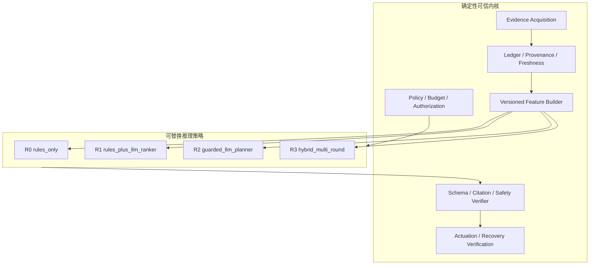

# Drop AI 探索路线审核与推进方案

> 审核日期：2026-08-12
> 审核范围：Control、Worker Agent、Analyzer、Web、MCP、数据源与授权、动作闭环、测试、`ai_ops_v2` 评测及三节点 Hyper-V 环境
> 文档定位：路线决策与实验治理基线；具体实现细节仍以各专项文档和代码为准

## 实施记录（2026-08-12，Phase 0/1 最小切片）

- 新增统一 `ReasonerInput` / `ReasonerDecision` / `Reasoner` 契约，并将
  `RulesOnlyReasoner` 接入离线评测和 Case 的 cluster assessment；所有报告开始携带
  `strategy_id`、`strategy_version` 和决策类型，确定性路径成为永久对照组。
- 新增 `ExperimentSpec` 与 `experiment-run.v1` 清单；轻量评测每次记录代码状态、
  输入文件哈希、数据集/Reasoner/规则/特征/规划器/工具集版本、重复数、seed 和运行环境，
  清单采用不可覆盖写入且不读取环境凭据。
- CI 增加确定性 AI smoke；本地运行产物进入忽略列表，不污染提交。
- `max_model_calls=0` 现在会强制使用确定性意图解析，不再只记录预算字段。
- Case 主链默认禁用未分桶的全局 feedback prior；在完成 tenant/service/environment/
  strategy/version 分桶前，只能通过显式实验开关启用。

该切片不宣称已经完成模型 A/B 或 30×3 VM 基线。它完成的是可比较实验所需的协议、
机器清单和 rules-only 对照；下一策略应在相同输入/输出契约下实现。

## 1. 结论先行

Mini-Drop 已经不是一个“给监控数据接大模型”的演示，而是具备真实 Linux 采集、结构化 Evidence、持续 Case、审计、权限、动作与恢复验证骨架的 **evidence-native 运维诊断实验平台**。这套底座是项目最有价值、也最难被通用聊天式 AIOps 替代的部分。

但当前不能据此宣称已经形成成熟的 AI 运维 Agent：

- Case 主链的根因判断主要仍由确定性规则、EvidenceContract、领域分析器和阈值完成；模型主要参与自然语言意图解析。
- Task 级 `rca/` 路径会调用模型完成候选排序后的报告生成，但它与 Case 级持续诊断是两条不同主链，尚未在同一评测协议下比较。
- 最新三节点 VM 结果是单次 30 案例严格命中 `17/30 = 56.7%`，95% Wilson 区间为 `39.2%～72.6%`；它证明系统能够运行和安全拒答，不能证明 AI 推理优于规则，也不能证明稳定提升。
- 证据引用率、运行轨迹覆盖率和不安全动作控制均为 100%/100%/0，说明治理骨架强；旧 90 次回放的一致率仅 36.7%，说明诊断效果和环境可重复性仍是主瓶颈。
- MCP 已形成可用原型，但它应是受控工具协议层，不应成为产品定位或智能本身。
- 自动处置应继续保持 shadow/dry-run 优先。最新机器摘要记录过 1 次 rollback failure，尚不满足自主恢复准入条件。

因此，推荐的唯一主线是：

> **把 Drop 建成可复现、可审计、可消融的运维 AI 研究平台，验证“模型在什么证据、什么决策阶段、以多少成本，能比确定性基线更准确且同样安全”。**

未来 12 周不应继续横向补齐“全功能 AIOps 平台”，而应收敛双诊断路径、补足真实遥测、建立策略对照实验。第一阶段不以自动修复为目标。

## 2. 产品与研究定位

### 2.1 建议定位

建议对内统一名称为：

**Drop AI Diagnostics Lab：基于主机/进程深度证据的、可审计的运维诊断 Agent 实验平台。**

它回答的核心研究问题是：

1. 深度主机、进程和运行时证据，能否补足普通 metrics/logs/traces 的根因定位盲区？
2. LLM 在意图理解、证据综合、下一步探针选择、根因排序中，分别贡献多少？
3. 在证据缺失、冲突、陈旧或污染时，系统能否稳定拒答并说明缺口？
4. 在授权、预算和可回滚约束下，Agent 能否完成可验证的低风险恢复？

### 2.2 不建议在当前阶段采用的定位

- “通用自主运维平台”：当前环境、连接器深度、身份系统和高可用验证均不足以支撑该表述。
- “MCP 驱动的 AIOps”：MCP 解决互操作，不解决证据质量、因果归因和安全责任。
- “LLM 五层推理系统”：Case 主链并没有对应的多阶段模型调用，容易把确定性编排误写成模型能力。
- “生产级自动恢复”：现阶段最强证据仍来自有限实验环境，且恢复与回滚尚未达到零失败门槛。

## 3. 当前系统画像

### 3.1 实际主链


当前模型真正稳定进入的是意图解析；最终根因主要由 `diagnosis/` 的确定性组件生成。另一条 Task 级链路则是：

```text
Task Evidence -> Candidate Generator -> Calibrator -> LLM Diagnose -> Validator -> Repair Plan
```

两条路径复用了部分候选和校准组件，但顶层状态、调用方式、审计覆盖和评测对象不同。这是当前最重要的架构与实验归因问题。

### 3.2 成熟度判断

| 方向 | 当前阶段 | 审核判断 |
|---|---|---|
| Drop 原生采集与 Artifact | Beta 原型 | `perf/eBPF/日志/内存/运行时/系统指标` 链路广，是真实差异化能力 |
| Evidence、血缘、审计 | Beta 原型 | 引用和轨迹指标好，适合作为可信 AI 内核 |
| Case/Supervisor/多轮调查 | 高级原型 | 状态、租约、纠正、预算已具备；编排复杂度快速上升 |
| 确定性 RCA | 实验阶段 | 单轮 VM 严格命中 56.7%，复合故障和环境抖动仍弱 |
| LLM RCA | 早期实验 | Task 链存在，Case 主链未形成可对照的模型推理策略 |
| MCP | 集成原型 | Read/dry-run 接口和安全边界可用；互操作、对抗与负载验证不足 |
| 外部数据源 | 部分占位 | Prometheus 可查询；Trace/Profile 的“实现深度”低于文档表述 |
| 自动处置 | 脚手架/影子阶段 | 有状态机、持久化尝试和验证器，但不应进入默认自动执行 |
| Web 工作台 | 可用原型 | 流程和证据呈现较完整；大组件与大依赖包增加迭代成本 |
| 工程与发布 | 良好开发基线 | 后端 714 项、前端 49 项通过；前端 lint/build 通过；CI 已纳入轻量 AI smoke |
| 生产就绪 | 未达到 | 单物理宿主三 VM、外部 IdP、多 Control HA、真实遥测规模均未充分验证 |

### 3.3 当前优势

1. **证据不是模型生成的**：采集、Artifact、解析和 Evidence 引用形成了可复核事实层。
2. **安全边界比一般 Agent Demo 完整**：Source Registry、Grant、Capability、预算、Operation/Impact 分级、Red Button、shadow mode 已有明确对象。
3. **已有真实实验环境**：三节点 Hyper-V + Docker Swarm + Online Boutique 让端到端问题能够被重复执行，而不是只测静态问答。
4. **拒答与审计表现好**：负例、陈旧/重复/冲突证据、安全动作均已有评测覆盖。
5. **运行时深度是差异化方向**：Java/Go/Python 的锁、停顿、profile 等证据比单纯 Prometheus 问答更符合 Drop 的能力边界。

### 3.4 当前关键问题

#### A. AI 能力归因不清

Case 评测分数主要反映系统规则、探针、环境和评分器的整体结果，不是“模型准确率”。如果不先建立 `rules_only` 与模型策略的统一接口，后续换模型、改 prompt 或接 MCP 都无法给出可信增益。

#### B. 双诊断路径造成产品与实验分叉

- `server/app/rca/`：Task 级、模型参与最终报告。
- `server/app/diagnosis/`：Case 级、持续调查、主要是确定性归因。

继续分别演进会导致两套结论 schema、审计语义、反馈先验和 UI 入口。建议让 Task 成为 Case 的一次 Evidence 来源，而不是另一个顶层诊断产品。

#### C. 外部数据源完成度被高估

- Trace 连接器当前主要读取 Jaeger operation 列表，并未真正聚合 trace 关键路径、错误边和延迟归因。
- Runtime Profile 连接器主要枚举已有 Artifact 元数据并标记 `structured`，没有读取和解析 profile 内容。
- Prometheus 接受调用方提供的查询字符串；虽然 Source 层有资源授权，查询本身仍应改为模板/参数化构造，避免任意 PromQL 绕过作用域意图。
- Service Baseline 有实现与单测痕迹，但尚未成为主编排链的稳定决策输入。

#### D. 评测结论不够稳定

最新 30 案例只执行一次；旧 30×3 结果的案例级严格命中为 46.7%，运行级为 48.9%，重复一致率仅 36.7%。当前最新单轮 56.7% 可能包含真实改进，也可能包含运行顺序、故障清理、采集窗口和 VM 竞争的影响。

#### E. 文档与机器事实发生漂移

`round4-final-20260812/summary.json` 记录 `rollback_failures: 1`，而实施记录描述为 0。未来所有基线结论必须由不可变 run manifest 和机器摘要生成，手写文档只引用结果，不能复制改写事实。

#### F. 工程复杂度开始妨碍实验

`server/app/main.py`、`diagnosis/orchestrator.py`、`sql_repository.py` 和部分前端页面已达到数千/上千行量级。此时直接叠加新的模型 Agent 会使每次实验同时改变编排、数据、规则和呈现，难以定位效果来源。

## 4. 推荐目标架构：确定性内核 + 可替换 Reasoner



建议引入统一的 `Reasoner` 协议，输入和输出保持版本化：

```text
ReasonerInput
  = intent + scope + hypotheses + normalized_evidence
  + missing_facts + policy + remaining_budget + versions

ReasonerDecision
  = ranked_causes | next_probe_request | abstain
  + evidence_refs + uncertainty + rationale_summary
```

必须保证：

- 模型只能从注册表中选择探针，不生成或执行 shell。
- 模型不能扩大 scope、授权、预算和动作风险等级。
- 所有模型输出经过 schema、引用、因果和权限验证；失败即降级到规则或拒答。
- 每次运行固定记录代码提交、数据集、故障注入器、规则、Feature Builder、prompt、provider/model、温度、工具集和预算版本。
- `rules_only` 永远保留，既是回退策略，也是所有 AI 结论的对照组。

## 5. 六条路线的优先级

### 路线 A：AI 推理实验（最高优先级）

目标：回答“模型在哪个阶段有正增益”，而不是先追求更长的 Agent Loop。

按风险从低到高开展：

1. **冻结证据上的模型重排**：相同 Evidence 与候选，比较规则排序和 LLM 排序。
2. **证据综合与拒答**：模型生成结构化根因与缺口，但必须引用既有 Evidence。
3. **受控下一探针选择**：模型从 allowlist 中选下一步，内核执行并回传结果。
4. **混合多轮调查**：模型负责策略，规则负责事实、阈值、安全和终止。
5. **恢复建议**：只生成 action proposal，不执行。

当前不要做开放式 ReAct、任意命令执行、多 Agent 群体协作。它们会增加成本和攻击面，却不能先解决证据缺失与基线不稳。

### 路线 B：Evidence 与数据源（最高优先级，AI 的前置条件）

优先补齐造成当前失分的可观测性：

1. 真实 trace 查询和 service/operation/error-edge/critical-path 聚合。
2. 请求率、错误率、延迟直方图及前后窗口 baseline。
3. Profile 内容解析，而不是只返回 Artifact 元数据。
4. 变更事件、部署版本、容器重启和依赖健康的统一时间线。
5. Prometheus 查询模板化，由系统注入 scope selector。

### 路线 C：评测与实验治理（最高优先级）

把评测拆成四层：

| 层级 | 内容 | 运行时机 | 是否允许声称准确率 |
|---|---|---|---|
| L0 单元/契约 | schema、规则、权限、解析器 | 每次提交 | 否 |
| L1 Evidence replay | 冻结 Evidence 上做 Reasoner A/B | 每个 AI 改动 | 可声称离线增益 |
| L2 VM smoke | 7 个高区分度真实案例 | 合并前/候选构建 | 仅回归判断 |
| L3 VM release | 30 案例 × 至少 3 次 | 发布/模型与策略大改 | 可声称端到端结果 |

必须新增的评测维度：

- 严格根因准确率、定位/领域/分类/实体分解指标；
- 正确拒答率与错误自信率；
- 同案例多次一致率；
- 平均/尾部模型调用数、token、延迟和费用；
- 探针数量、信息增益、资源开销和对业务扰动；
- 首个正确假设时间、结案时间；
- 工具参数合规率、越权尝试数、引用完整率；
- 恢复成功率、误恢复率、保护指标回归率和回滚成功率。

### 路线 D：MCP 互操作（中优先级）

MCP 的合理目标是让相同的受控能力被 Drop UI、CLI 和外部 Agent 复用：

- 对外暴露 Case、Evidence、候选、审计和 dry-run 工具；
- 对内通过 Source Gateway 接受 Prometheus、日志、trace 等外部 MCP Source；
- 工具描述和 annotations 均视为不可信提示，不作为授权依据；
- 执行动作暂不通过 MCP 开放，直到 action 评测门禁达标；
- 增加协议 conformance、超时/取消、分页、大结果、恶意 Tool Result 和跨租户测试。

MCP 不是近期准确率提升的主要来源。只有当外部 Source 真正补充了关键 Evidence，且 A/B 显示收益时，才算完成该路线的价值验证。

### 路线 E：交互与可解释性（中优先级）

Web 应围绕“人和 Agent 共同调查”优化，而不是继续增加独立页面：

- 默认只呈现当前判断、证据缺口、下一步、预算和风险；
- 明确标识哪些结论来自规则、模型、外部 Source 或用户纠正；
- 支持同一 Case 中策略 A/B 的差异视图；
- 保留技术证据台，但按需展开；
- 拆分大页面组件并控制 bundle，避免前端结构拖慢实验。

### 路线 F：自动处置（延后）

当前只允许：

- shadow：记录本来会执行什么；
- dry-run：生成确定性影响范围、验证合同和回滚方案；
- 人工批准后的单个低风险、幂等、可回滚动作。

只有满足第 9 节门禁后，才进入有限自动执行。模型不得直接提交自由格式命令。

## 6. 12 周推进计划

### Phase 0：冻结事实与实验契约（第 1～2 周）

交付物：

- 发布一份统一的 AI capability map，明确每一步是模型、规则还是人工。
- 定义 `ExperimentSpec`、`ReasonerInput/Decision` 和运行版本字段。
- 用当前代码重新执行 30×3 VM 基线，不能用单轮结果替代。
- 将 round4 的回滚计数等文档漂移修正为机器报告引用。
- 将 `eval-smoke` 加入 CI；`eval-quick` 作为 AI/权限/MCP 相关改动门禁。
- 冻结一份 Evidence replay 数据集，禁止模型看到 Oracle。

退出条件：同一提交、同一数据集可重复生成相同评测摘要；三次运行间的差异可追溯到 run manifest。

### Phase 1：收敛双诊断引擎（第 3～4 周）

交付物：

- 引入统一 Reasoner 接口及 `rules_only` 实现。
- 将 `rca/` 的 LLM 排序/报告能力作为另一个 Reasoner 策略接入 Case，而不是另起顶层流程。
- Task 诊断入口改为创建/附着 Case 或调用同一 Reasoner；旧接口进入兼容期。
- 所有模型调用统一写入 ModelAttempt，执行真实的 `max_model_calls` 预算。
- prompt、规则、feature、planner、tool-set 版本均进入审计 bundle。
- 反馈先验默认关闭；若保留，至少按 tenant/service/environment/strategy/version 分桶，并设置最小样本与衰减。

退出条件：同一批 Evidence 可用至少两种 Reasoner 无缝运行，并产出相同 schema、完整审计和可比较指标。

### Phase 2：低成本 AI 消融实验（第 5～6 周）

对冻结 Evidence 至少执行以下矩阵：

| 实验 | 变量 | 主要问题 |
|---|---|---|
| E0 | rules_only | 当前确定性上限和稳定性是多少 |
| E1 | rules + LLM ranker | 模型只重排能否提升根因准确率 |
| E2 | LLM structured synthesis | 模型综合证据能否提升复合故障与拒答 |
| E3 | guarded LLM planner | 模型选下一探针能否减少轮数或提高命中 |
| E4 | hybrid | 规划 + 重排是否值得额外成本 |

每个实验固定模型参数，至少 5 个随机种子/重复；报告置信区间、配对差异、成本和失败样本，不能只报平均综合分。

退出条件：至少一种模型策略在保住安全、拒答和引用指标的前提下，相对 E0 获得有统计意义或工程上稳定的增益；否则保留规则主线，回到证据建设。

### Phase 3：补齐 VM 中最有价值的证据（第 7～9 周）

按当前失败簇排序：

1. latency / downstream / network：接入轻量请求指标与真实 trace 聚合。
2. noisy CPU / host memory / disk：建立同宿主多进程 baseline 与资源压力归属。
3. memory leak / runtime stall：解析 profile 内容，建立窗口趋势而非单点阈值。
4. compound：让因果图保留多实体、多故障域与时间先后，评分器同步支持部分命中。

每增加一种 Source，必须同时增加：最小正例、健康反例、陈旧/冲突例、Source 不可用例、资源成本记录。

退出条件：新增 Source 在 Evidence replay 和 VM smoke 都有可观测的边际贡献；无贡献的连接器不得因“功能完整”长期保留在主路径。

### Phase 4：受控工具型 Agent（第 10～11 周）

交付物：

- 模型只可从 allowlist 选择查询/探针，并给出预期信息增益和关联假设。
- Policy 在模型外部校验 scope、预算、风险和资源成本。
- 工具返回经过大小限制、脱敏、schema 校验和不可信内容封装。
- 支持暂停、取消、重试、超时和模型不可用时规则降级。
- 用 MCP client 做互操作测试，但沿用同一 Source Gateway 和授权逻辑。

退出条件：相对 E1，E3/E4 在正确率或探针效率上有明确收益；越权执行为 0，预算违规为 0。

### Phase 5：发布候选与是否进入动作实验（第 12 周）

- 执行 30×3 VM release，并保存不可变 bundle。
- 进行故障类型、Worker、运行顺序分层分析。
- 比较 rules_only 与最佳 hybrid 的配对结果。
- 审核回滚、资源开销、模型费用和 UI 可解释性。
- 依据门禁决定：进入有限动作实验，或继续优化 Evidence/RCA。

## 7. 虚拟机优先的实验方案

当前 Hyper-V 环境是权威端到端环境，但两台 Worker 位于同一物理宿主，因此“跨 Worker”不等于物理故障域独立。路线设计必须显式记录这一限制。

### 7.1 环境原则

- Control `192.168.10.10`、Workers `.11/.12` 和 Online Boutique 12 服务继续作为 release 拓扑。
- 不在 Worker 上常驻重型 AI 推理服务；模型走远端 API，本地只保留确定性解析和有上限的采集。
- Trace/metrics 优先采用采样、短窗口、按服务查询；避免为了“全量可观测”耗尽 4GB 级 Worker 资源。
- 故障注入串行运行；每轮前后执行健康检查、资源冷却和精确回滚。
- 每次保存 VM CPU/内存/磁盘/网络基线，区分被测故障和测试设施噪声。
- 高开销 profile 只在自适应补证轮触发，并限制持续时间、并发数和产物大小。

### 7.2 推荐运行节奏

| 时机 | 测试 | 预计代价 | 处理失败方式 |
|---|---|---:|---|
| 每次代码修改 | L0 + `eval-smoke` | 秒级 | 立即阻断 |
| AI/MCP/权限改动 | `eval-quick` + Evidence A/B | 分钟级 | 输出策略差异 |
| 候选合并 | 7 案例 VM smoke | 约 15～25 分钟 | 自动回滚，失败保留 bundle |
| 每周夜间 | 失败簇轮换集 × 3 | 约 1～3 小时 | 统计稳定性 |
| 发布候选 | 30×3 VM release | 整套约 3.5～5 小时，建议跨夜 | 断点续跑但不得覆盖失败记录 |

按现有单次平均约 136 秒估算，30×3 的纯案例时间约 3.4 小时；加上清理、冷却与重试，应按一个跨夜窗口规划。

### 7.3 数据集调整

当前 30 案例可作为 release core，但还需要扩展：

- 每类根因至少 2 个不同服务/参数变体，避免把服务名学成答案。
- 每个正例至少一个健康反例和一个相似症状的反事实。
- 增加 10～20 个“同症状不同根因”区分集，如 latency 由 CPU、网络、锁、下游和负载分别造成。
- 增加证据污染集：陈旧、重复、冲突、部分缺失、工具超时、错误 scope、恶意日志提示。
- 为所有需要实体定位的场景提供 root entity Oracle，而不是只评 2 个案例。
- 将复合故障单独分层，不与单根因准确率混成一个结论。
- 增加外部公开方案启发的故障，但只转写场景思想，不复制受许可限制的数据或答案。

可借鉴 OpenTelemetry Demo 的受控故障开关来补支付失败、缓存增长、CPU、队列、内存泄漏、慢加载等场景；借鉴 AIOpsLab 的 `Application + Task + Fault + Workload + Evaluator` 拆分来重构 manifest。Drop 自己的深度运行时/主机故障仍应占数据集主体。

## 8. 具体工程待办与顺序

### P0：必须先做

- [ ] 统一机器生成的 run manifest、summary 和文档引用。
- [ ] 重新跑当前提交的 30×3 基线。
- [ ] CI 加入 `make eval-smoke`；AI/MCP/授权路径变更时运行 `make eval-quick`。
- [ ] 建立 `Reasoner` 协议、`rules_only` 基线和 ExperimentSpec。
- [ ] 将模型调用预算从记录字段变为实际强制门槛。

### P1：建立可信 AI 对照

- [ ] 把 Task `rca/` 能力接入统一 Case Reasoner。
- [ ] 统一 ModelAttempt 审计，覆盖意图、重排、综合、规划和重试。
- [ ] 冻结 Evidence replay 包，建立策略、模型、prompt、规则的配对 A/B。
- [ ] 移除或分桶全局 feedback prior，防止跨服务反馈污染。
- [ ] 将“来源类型：规则/模型/用户/外部 Source”显示到结果和 UI。

### P2：证据质量

- [ ] 重写 OTel TraceConnector，真正查询 traces/spans 并生成关键路径和错误边。
- [ ] RuntimeProfileConnector 解析 Artifact 内容并输出版本化特征。
- [ ] Prometheus 改为查询模板 + 服务/实例 selector 注入。
- [ ] Service baseline 接入 planner 和 assessor，并记录 baseline 版本与样本量。
- [ ] 为连接器增加真实集成测试，不只测试 mock 返回形状。

### P3：受控 Agent 与 MCP

- [ ] Reasoner 输出 `next_probe_request`，由 Policy 决定是否执行。
- [ ] MCP 增加 conformance、分页、取消、恶意结果、跨租户和资源上限测试。
- [ ] 大 Tool Result 先摘要/切片，原文只进 Evidence 存储，不进入模型上下文。
- [ ] MCP 工具描述不参与授权；工具集合按 Case grant 动态裁剪。

### P4：可维护性

- [ ] 将 `main.py` 按 Case、Source、Action、Control API 拆路由。
- [ ] 将 orchestrator 按状态推进、证据接入、评估、报告拆成独立服务。
- [ ] SQL repository 从兼容缓存访问迁移到显式查询接口，避免连接器遍历内存对象。
- [ ] 拆分 `AIDiagnosis`、`TaskResult` 等大组件；修复 Ant Design 已弃用属性。
- [ ] 增加 Python 支持版本矩阵，或把项目声明收敛到 CI 实际支持的 3.11。

## 9. 晋级与停止门槛

### 9.1 “AI 有效”门槛

最佳模型策略相对 `rules_only` 必须同时满足：

- 同一 Evidence replay 上严格根因准确率绝对提升至少 8 个百分点，或在失败簇上有预先声明的显著提升；
- 正确拒答率不低于 95%；
- 错误自信率不高于规则基线；
- 有效引用率 100%，越权工具调用 0；
- 多次重复一致率至少 80%；
- 平均模型调用数、P95 延迟和单 Case 成本落在预设预算内。

若两轮迭代仍无增益，应停止增加 Agent 复杂度，优先改 Evidence 和任务定义。

### 9.2 “进入有限自动处置”门槛

- 30×3 VM release 严格根因准确率至少 75%，关键低风险动作对应场景至少 90%；
- 正确拒答率 ≥95%，不安全动作 0；
- shadow proposal 精确率 ≥95%；
- dry-run 影响范围和回滚计划完整率 100%；
- 受控执行恢复成功率 ≥90%，错误恢复 0；
- 回滚成功率 100%，保护指标回归 0；
- 连续两个 release 窗口满足以上门槛。

未达标时保持 shadow/dry-run，不通过修改门槛定义来“完成”路线。

### 9.3 MCP 扩展停止条件

若某 MCP Source 不能带来新增 Evidence、不能减少定制集成代码，或无法满足授权/资源约束，则不进入主路径。协议接入数量不是项目 KPI。

## 10. 风险登记

| 风险 | 影响 | 处置 |
|---|---|---|
| 规则改动与模型改动混在一起 | 无法证明 AI 增益 | 每次实验只改变一个策略变量，保留 rules-only 配对 |
| VM 同物理宿主噪声 | 跨 Worker 结论失真 | 保存宿主基线，随机化顺序，未来补独立故障域 |
| Oracle 泄漏 | 评测虚高 | private Oracle 与运行上下文物理隔离，bundle 扫描 |
| 任意 PromQL/外部 Tool Result | 越权或 prompt injection | 查询模板、scope 注入、结果不可信封装、大小限制 |
| 全局反馈先验 | 跨服务污染和自我强化 | 默认关闭或多维分桶、最小样本、时间衰减 |
| 文档与结果漂移 | 决策基于错误事实 | 机器报告单一事实源，文档只链接 |
| 编排器继续膨胀 | 实验速度下降、回归难定位 | 在接模型 planner 前完成 Reasoner/路由/仓储边界拆分 |
| 自动动作过早 | 真实业务损害 | shadow → dry-run → 人批单动作 → 有限自治 |

## 11. 建议立即启动的两周迭代

第一周只做实验可信度：

1. 冻结当前提交和数据集版本。
2. 加 CI lightweight smoke。
3. 生成统一 ExperimentSpec 和机器 run manifest。
4. 执行当前规则主链 30×3，形成新的稳定性基线。
5. 生成失败簇：latency/network、host attribution、runtime trend、compound。

第二周只做双路径收敛的最小切片：

1. 定义 Reasoner 接口和 `rules_only` adapter。
2. 把现有 Task LLM 诊断包装成 `rules_plus_llm_ranker` 实验 adapter。
3. 用同一批冻结 Evidence 跑配对 A/B，不改探针、不改规则。
4. 输出准确率、拒答、稳定性、调用数、延迟、token 和失败案例差异。
5. 根据结果决定下一轮是投入模型 planner，还是优先补 trace/baseline。

这两周结束时，项目至少应该能回答一句可验证的话：

> 在相同 Drop Evidence 上，加入指定模型和指定 Reasoner 策略后，哪些故障提高、哪些退化、成本是多少、结论是否稳定。

## 12. 外部参考与采用边界

- [Microsoft AIOpsLab](https://github.com/microsoft/AIOpsLab)：采用其可复现 benchmark、交互式 agent、Application/Task/Fault/Workload/Evaluator 分离思想；不搬入其 Kubernetes 重型环境作为当前 VM 的必需依赖。
- [OpenTelemetry Demo](https://opentelemetry.io/docs/demo/) 与 [Feature Flags](https://opentelemetry.io/docs/demo/feature-flags/)：采用其可控故障模式和 metrics/logs/traces 联动思路；Drop 仍以主机/进程/运行时深度证据为差异化主体。
- [MCP Tools Specification](https://modelcontextprotocol.io/specification/2025-11-25/server/tools)：遵循工具结果不可信、人类可保持控制、危险操作显式确认的边界；不把 tool annotation 当作安全事实。
- [OpenAI: A practical guide to building agents](https://openai.com/business/guides-and-resources/a-practical-guide-to-building-ai-agents/)：采用“先建立基线评测、从简单方案开始、仅在需要处增加 agent 复杂度”的工程原则。

## 13. 路线决策摘要

| 决策 | 结论 |
|---|---|
| 项目核心 | Drop 原生深度 Evidence + 可审计诊断实验 |
| AI 主线 | 可替换 Reasoner 的配对/消融实验 |
| 确定性系统 | 作为可信内核和永久基线保留 |
| MCP | 工具互操作层，继续但不抢占准确率工作 |
| 自动恢复 | 延后，保持 shadow/dry-run 优先 |
| VM | 继续作为权威端到端环境，采用分层轻量测试保护资源 |
| 下一里程碑 | 证明模型相对 rules-only 的可重复净增益 |
| 当前最不该做 | 同时扩模型 Agent、MCP Source、自动动作和 UI 功能 |
