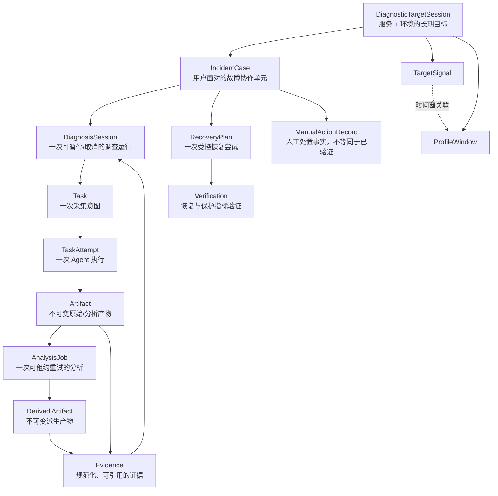
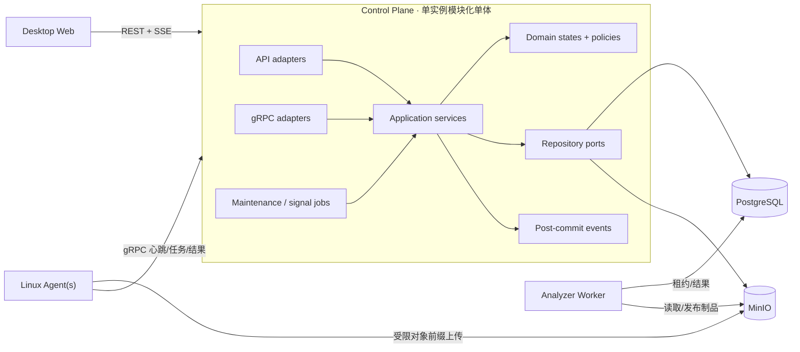
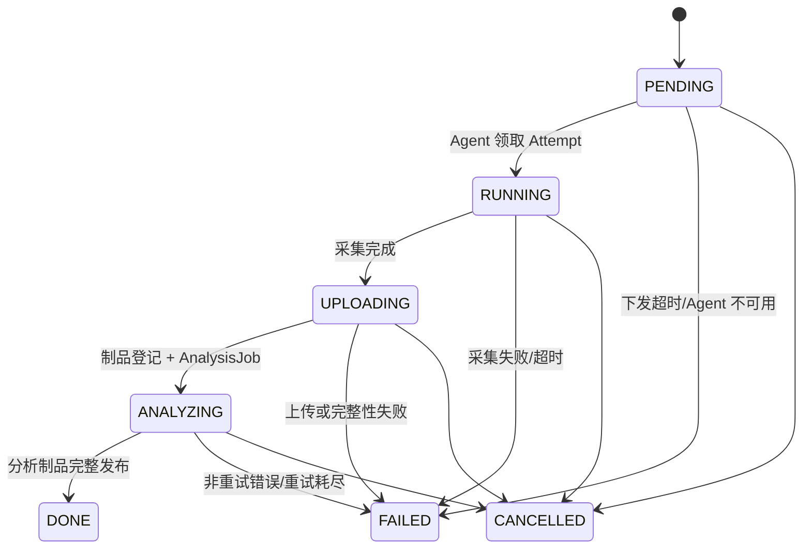
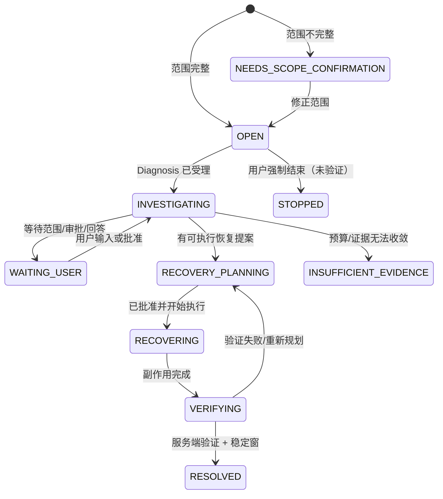
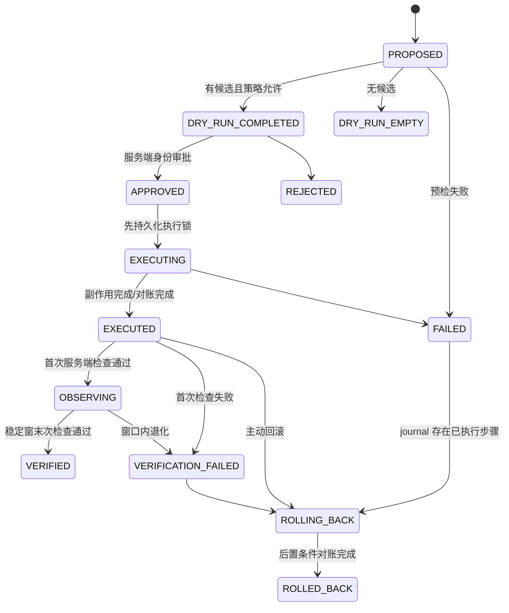

# Mini-Drop 单租户桌面端 Beta 推进指导书

> 状态：目标契约草案（2026-08-10，待 BETA-001 固化后升级为推进与验收真源）
> 审阅锚点：`main @ 6c90e1a` 加 2026-08-10 当前工作区；它不是可复现发布基线
> 产品范围：可信内网、单租户、桌面端优先、Linux 采集节点
> 设计依据：[`ai_diagnosis_agent_design.md`](ai_diagnosis_agent_design.md)
> 实现事实：[`ai_implementation_status.md`](ai_implementation_status.md)
> 需求追踪：[`ai_design_traceability.md`](ai_design_traceability.md)

本文不是新的愿景文档，而是把现有实现收束为一个可推进、可验收的单租户 Beta。它回答四个问题：

1. 当前版本对用户到底承诺什么；
2. 一条任务、一次诊断、一次审批和一次恢复如何完整结束；
3. 服务代码应按什么边界演进；
4. 下一项工作何时算真正完成。

---

## 1. 已确认的产品决策

### 1.1 “单租户”在本项目中的含义

单租户不是“只能一个人使用”，而是：

- 一套 Mini-Drop 控制面只服务一个组织或一个安全域；
- 可以有多个操作者、Agent、服务、集群和环境；
- `tenant_id` 由服务端部署配置固定，浏览器和 Agent 不能选择或覆盖；
- 本阶段不建设跨组织数据隔离、租户管理员、租户计费和租户级资源配额。

单租户不会取消安全边界。即使部署在可信内网，以下信息仍必须由服务端派生：

- 当前主体与角色；
- 审批人、执行人和审计 actor；
- 固定租户；
- 可执行动作、资源范围和有效期。

### 1.2 Beta 的明确承诺

Beta 承诺：

- 在桌面浏览器中完成“发现 Agent → 选择进程 → 采集 → 分析 → 查看证据”的闭环；
- 从问题或已有 Task 创建 Incident Case，持续记录范围、证据、判断、用户消息和诊断过程；
- 诊断只使用注册的数据源、采集器和动作，结论可追溯到持久化证据；
- 探针遵守审批边界；Case 交付可追溯恢复方案、人工执行回填和服务端验证；自动执行仅在另行安装并启用 incident-scoped 动作适配器时开放；
- 单控制面实例故障重启后，Task、Attempt、AnalysisJob、Case 和 RecoveryPlan 的事实仍可恢复；
- 页面在主目标宽度 `1280px–1920px` 可完整操作，错误与空数据不伪装成成功。

Beta 不承诺：

- 多租户 SaaS；
- 多控制面副本或无停机高可用；
- 移动端完整工作台；
- 自动订阅所有 Agent/事件流并长期自治；
- 7 天降采样、90 天基线已经交付；
- Prometheus、日志、Trace、Kubernetes/CMDB 等全套生产连接器；
- 通用业务服务的自动重启、变更或回滚；
- 当前 8 个真实案例已经达到 `verified_vm`。

### 1.3 交互优先级

1. 桌面端 `1440px` 是主要设计基准；
2. `1280px` 是发布门槛，标题、状态、主要操作不能被压缩到不可读；
3. `1024px` 保证核心流程可用，但允许信息密度下降；
4. 小于 `768px` 本阶段只保证能查看关键状态，不作为完整操作门槛。

---

## 2. 文档与事实的优先级

出现冲突时，按以下顺序判断：

| 优先级 | 文档/事实 | 作用 |
|---|---|---|
| 1 | 可重复执行的测试、迁移和运行结果 | 判断“是否真的工作” |
| 2 | 本指导书 | 决定 Beta 范围、阶段顺序和验收门槛 |
| 3 | `ai_diagnosis_agent_design.md` | 决定 AI Case 的产品与行为契约 |
| 4 | `ai_design_traceability.md` | 映射需求、实现和测试状态 |
| 5 | `ai_implementation_status.md` | 记录某一基线已验证的事实 |
| 6 | README | 安装入口与概览，不作为细节设计真源 |
| 7 | `design_doc_final.md`、`ai_functional_design_v3.md`、`diagnosis_pipeline_v2.md` 等旧文档 | 历史参考，不作为新实现依据 |

规则：

- “设计完成”不能写成“功能完成”；
- 本地单元测试通过不能写成“Linux VM 已验证”；
- 手工入口不能写成“自动订阅”；
- 数据表存在不能写成“用户流程已闭环”；
- 每次行为变更同时更新契约、自动化测试和追踪矩阵。

---

## 3. 当前完成度判断

| 领域 | 当前判断 | Beta 结论 |
|---|---|---|
| Agent 注册、心跳、任务领取 | 较成熟 | 保留并强化失败可见性 |
| Task/Attempt/Artifact/AnalysisJob | happy path 较成熟 | 不重写；失败、取消和租约收敛仍是发布阻断 |
| Analyzer 租约与完整性校验 | happy path 较成熟 | 保持独立 Worker；补最大重试与 fencing |
| Case 协作、证据和诊断编排 | 内部预览可用 | 补齐身份、环境和异常路径后进入 Beta |
| 恢复方案闭环 | Mini-Drop 平台维护动作可执行 | Case Beta 默认人工执行；不包装成业务自动修复 |
| TargetSession、Signal、ProfileWindow | 手工入口和数据模型可用 | 标记为“长期诊断预览” |
| 自动信号订阅、7/90 聚合 | 未实现 | 不阻塞本轮 Beta，不得对外宣称完成 |
| 桌面工作台 | 核心路径可用 | 修复 1280 布局和状态真实性 |
| 发布与镜像 | 存在关键缺口 | 必须先补运行时资源和镜像 smoke |

当前底座已经值得继续演进；本轮不应推倒重写，也不应先扩展更多 AI 能力。第一目标是让已有闭环在失败、重试、审批、打包和 UI 表达上可信。

### 3.1 已确认的发布阻断缺口

这些不是远期优化，而是当前代码可以进入不一致状态的路径：

| ID | 当前断点 | 目标行为 |
|---|---|---|
| GAP-01 | Case 可从多数状态直接 `resolve`，并把 recovery 强写为 `verified` | `RESOLVED` 只能来自服务端验证；人工结束使用 `STOPPED + MANUAL_UNVERIFIED` disposition |
| GAP-02 | 已批准 Plan 在 Case 暂停、停止、解决或修正范围后仍可能执行 | Case 状态与 scope revision 是执行 fencing 条件；旧 Plan 原子失效 |
| GAP-03 | Diagnosis 后台推进后没有可靠投影回 Case | 增加幂等 reconciler，使等待、完成、失败和终态最终同步 |
| GAP-04 | Signal 入库和触发 Case 分属两个事务，宕机后重放不会继续触发 | Signal disposition 采用事务内 outbox 或可重放 reconciler |
| GAP-05 | AnalysisJob 租约反复过期未受 `max_retries` 限制；Task stale recovery 不终结 Job | Task/Attempt/Job 作为一个聚合收敛，失败/取消后无可领取 Job |
| GAP-06 | Diagnosis 子 Task 的 `CANCELLED` 未进入完整收敛逻辑 | Probe 与 Diagnosis 在有限时间内进入明确终态或重新规划 |
| GAP-07 | Probe outbox 瞬时创建 Task 失败后永久失败 | 至少一次投递、有限退避、死信可见、重放幂等 |
| GAP-08 | Case 与 Diagnosis 的 pause/stop/correction 跨事务存在不可补偿窗口 | 以持久化命令/outbox + reconciler 实现最终一致，并用 scope revision fencing |
| GAP-09 | rollback 先执行副作用再写终态，没有 `ROLLING_BACK` 或崩溃对账 | 执行和回滚都使用 journal、fencing token 与 postcondition 对账 |
| GAP-10 | 查询 Diagnosis 默认可能触发 `advance` | GET 纯读取；推进只由显式命令或后台协调器触发 |
| GAP-11 | Case 从 `PAUSED` 恢复时按范围重算为 OPEN/待确认，丢失原阶段 | 持久化 `paused_from_state`，恢复到仍然有效的原状态 |
| GAP-12 | RecoveryPlan 在调查尚未形成可验证结论时也可创建 | 要求证据支持的恢复提案，或显式、受审计的人工 override |
| GAP-13 | 通用 Action execute 可绕过 Case RecoveryPlan 的持久审批链 | Case 副作用只走 Plan；平台维护入口隔离并可在 Beta 默认关闭 |
| GAP-14 | Probe 审批主体来自请求体，前端还能写死 `web_user` | approver 只取认证上下文，批准与不可变 action/scope hash 绑定 |
| GAP-15 | 相同 Artifact identity 重放时可覆盖 hash/大小/元数据 | 同 identity + 同 hash 幂等；不同 hash 冲突并隔离，原始制品不可覆盖 |
| GAP-16 | Task 硬删除可连带删除 Case/Evidence 依赖的制品与分析事实 | 被引用事实禁止硬删；使用 tombstone、保留期和可重试对象清理 |

在这些缺口修复前，“单元测试很多”仍不等于状态闭环可靠。

---

## 4. 统一对象模型



### 4.1 对象职责

| 对象 | 唯一职责 | 不应承担 |
|---|---|---|
| TargetSession | 累积一个 `service + environment` 的长期信号、窗口和 Case | 直接充当一次诊断运行 |
| IncidentCase | 保存用户问题、范围、恢复目标、协作时间线和最终结果 | 直接执行采集命令 |
| DiagnosisSession | 编排一次调查的证据复用、最小探针和结论 | 成为长期用户会话 |
| Task | 表示一次不可变采集请求 | 代表重试过程或分析租约 |
| TaskAttempt | 表示某 Agent 对 Task 的一次执行 | 覆盖先前尝试的事实 |
| Artifact | 保存不可变制品及完整性元数据 | 直接等同于证据结论 |
| AnalysisJob | 独立分析的租约、重试和完成状态 | 修改采集事实 |
| Evidence | 规范化事实，带来源、时间、范围、质量和哈希 | 保存无依据的模型推断 |
| RecoveryPlan | 一次提案、预检、审批、执行、验证和回滚链 | 混入普通平台维护入口 |
| ManualActionRecord | 记录操作者在外部系统完成的动作、范围、时间和工单引用 | 自动证明动作成功或问题已恢复 |

### 4.2 两套 Diagnosis 概念的收束

仓库目前同时存在：

- `DiagnosisRun`：旧的、绑定单 Task 的智能归因记录；
- `DiagnosisSession`：新的、由 Case 编排的多证据调查工作流。

Beta 规则是：**Case 只编排 `DiagnosisSession`**。旧 `DiagnosisRun` 保持兼容读取，不再扩展新的协作、审批或恢复能力；UI 逐步将它归入 Task 结果的“旧版归因”，避免用户误以为它与 Case 是两个并列主产品。

### 4.3 归属与传播规则

单租户阶段不要求给所有旧表补全 SaaS 式 tenant 字段，但必须解决跨环境和跨范围误用：

1. `Task.environment` 必填，由创建入口显式给出；不得在 Task→Case 时硬编码为 `production`；
2. Task 保存创建时的不可变目标快照：`service_id`（可为空）、`instance_id`、`agent_id`、`boot_id`、`pid`、`process_start_time` 和 `target_scope_snapshot`；PID 本身不是稳定进程身份；
3. Artifact、AnalysisJob 和 Evidence 继承 Task 的上下文，不接受前端再次指定；
4. Case 绑定 TargetSession 时继承其 `environment` 与范围，冲突请求返回 `409`；
5. Task 作为 Case 初始证据时必须满足：`DONE`、有结构化产物、实例范围一致、环境一致、时间窗重叠；
6. 无法确认服务归属的手工 Task 可以独立查看，但不能被自动复用到 Case；
7. 历史 Task 在迁移中回填为 `environment=unknown` 和未分类范围，不自动猜测为 production；经用户确认的映射要写审计；
8. 被 Case/Evidence 引用的 Task、Attempt、Artifact 只能 tombstone，不能级联硬删；对象存储删除通过可重试队列执行并保留审计；
9. `tenant_id` 始终来自服务端配置；为将来多租户预留字段可以做，但不作为本 Beta 的前置工程。

### 4.4 状态真源收束

| 聚合 | 当前真源 | 目标 |
|---|---|---|
| Task | `server/app/state_machine.py`，另有 collection/analysis 自由字符串 | 一个领域模块同时定义主状态、子状态和组合不变量 |
| DiagnosisSession | `diagnosis/schemas.py` + `diagnosis/orchestrator.py` 迁移表 | 状态、迁移、终态、超时与 Case 投影同一真源 |
| IncidentCase | `case_collaboration.py` 枚举 + Repository 分支 | 增加暂停前状态、恢复中与未验证关闭语义 |
| RecoveryPlan | `sql_repository.py` 顶部迁移表 | 状态迁移、Case fencing、journal 与 DB 约束一致 |
| TargetSession/Signal | Repository 分支 | Target 迁移和 Signal disposition 分开定义且可 reconcile |

UI 只消费服务端返回的稳定状态和可用动作集合，不在前端复制迁移表推断“下一步能做什么”。数据库逐步增加 CHECK/唯一约束，防止绕过服务层写入非法组合。

---

## 5. 目标逻辑架构

### 5.1 部署视图



### 5.2 为什么本阶段采用模块化单体

- 用户场景是单租户内网，部署简单和故障定位优先于独立扩缩容；
- 当前 HTTP、gRPC 和 sweeper 已共享 Repository，立即拆服务会放大分布式事务和运维成本；
- Analyzer 已有清晰租约边界，应继续独立；Agent 天然是独立数据面；
- 先拆代码职责，可以在未来不改领域契约的前提下再拆进程。

Beta 期间允许 HTTP、gRPC 和定时巡检同进程，但必须遵守：

- 控制面只运行一个写入实例；
- 阻塞数据库/对象存储工作不得占用 HTTP 事件循环；
- sweeper 每次操作必须幂等；
- GET 请求不触发状态推进或外部副作用；
- 未来增加第二副本前，先拆 scheduler 或引入明确的 leader/lease。

### 5.3 目标代码边界

建议按“先抽门面，再移动代码”的顺序演进，不做一次性目录大搬家。

```text
server/app/
├── bootstrap/            # typed Settings、app factory、依赖组装
├── interfaces/
│   ├── http/routers/     # 参数校验、身份映射、HTTP 状态码
│   └── grpc/
├── application/
│   ├── task_service.py
│   ├── case_service.py
│   ├── diagnosis_service.py
│   ├── recovery_service.py
│   └── target_monitoring_service.py
├── domain/
│   ├── task.py           # 状态、迁移、不变量
│   ├── case.py
│   ├── diagnosis.py
│   ├── recovery.py
│   └── policies.py
├── infrastructure/
│   ├── repositories/
│   ├── object_storage.py
│   ├── eventing.py
│   └── identity.py
└── workers/
    ├── maintenance.py
    └── signal_ingest.py
```

### 5.4 模块与数据所有权

模块是代码和写入所有权边界，不是独立微服务。模块间不能直接操作对方 ORM Model；先通过窄 Repository 门面和 DTO 协作，底层仍共享一个 PostgreSQL。

| 模块 | 业务职责 | 独占写入的数据 |
|---|---|---|
| Platform | 类型化配置、身份、健康、授权、审计、SSE 读模型 | Audit、Grant 与平台配置 |
| Collection | Agent、Task、Attempt、结果接收、Artifact 元数据、AnalysisJob | Agent/Task/Attempt/Artifact/AnalysisJob |
| Incident | Target、Signal、Change、Case、消息、范围与状态 | TargetSession/Signal/ProfileWindow/Case/Event/Change |
| Diagnosis | 意图、证据、假设、探针、outbox、结论与推进 | DiagnosisSession/Probe/Evidence/NodeRun/Hypothesis |
| Recovery | 动作策略、Plan、审批、执行、验证、回滚 | RecoveryPlan 与副作用 journal |

关联关系逐步从 JSON 列表升级为显式链接表，例如 `case_diagnosis_links` 和 `case_task_links`；JSON 可以保留为读模型缓存，但不能长期作为唯一关系真源。

### 5.5 应用服务职责

| 服务 | 负责 | 不负责 |
|---|---|---|
| TaskService | 创建、取消、重试、Attempt 关联、任务查询投影 | 运行采集器、分析火焰图 |
| CaseService | 创建/修正/暂停/恢复/停止 Case，协调 Diagnosis 生命周期 | 自行决定探针和执行副作用 |
| DiagnosisService | 证据复用、预算、探针提案、审批、收敛与报告 | HTTP 身份解析、直接写任意表 |
| RecoveryService | 动作策略、dry-run、审批、执行锁、对账、验证、回滚 | 提供默认业务修复动作 |
| TargetMonitoringService | Target 生命周期、信号幂等、冷却、Case 孵化、窗口查询 | 把所有原始指标送给模型 |
| ArtifactService | 对象键约束、大小/hash、presign、制品读取 | 判断业务根因 |
| Identity/Policy | 主体、角色、固定租户、授权包络 | 信任请求体中的 approver/tenant |

通用 `/actions/{id}/execute` 入口只保留给明确标识的平台运维动作，并放到“设置与运维”。Case 中的任何恢复副作用必须经过 RecoveryPlan，不允许从 Case 工作台绕过 dry-run、审批、执行锁和验证。

Analyzer 后续只依赖稳定的 `AnalysisJobPort` 与 `ArtifactStorePort`，不再导入 Server gRPC service 的私有帮助函数。配置由一个类型化 `Settings` 在启动时一次校验并注入，核心业务不再散落读取 `os.getenv`。

### 5.6 事务和事件边界

应用服务的一次命令应拥有一个明确事务。数据库事实提交后才发送 SSE/内部事件：

```text
校验身份与版本
→ 加锁/读取聚合
→ 校验领域迁移
→ 写状态 + 事件 + 审计
→ commit
→ 发布通知
```

禁止在事务提交前向浏览器宣称成功；禁止先执行外部副作用、后补 `EXECUTING` 状态。

领域事件统一使用以下信封，审计日志与领域事件可以共享 request id，但职责不同：事件驱动投影，审计回答“谁因为什么做了什么”。

```json
{
  "event_id": "evt_...",
  "event_type": "case.state_changed",
  "schema_version": 1,
  "aggregate_type": "incident_case",
  "aggregate_id": "case_...",
  "aggregate_version": 7,
  "actor_id": "api-key:...",
  "reason": "verification_passed",
  "request_id": "req_...",
  "occurred_at": "2026-08-10T08:00:00Z",
  "payload": {}
}
```

必须覆盖的事件族：Task/Attempt 状态、Artifact/AnalysisJob 结果、Case 创建/修正/状态、Diagnosis 状态、Probe 提案/审批/派发、Signal disposition、RecoveryPlan 预检/审批/执行/验证/回滚以及授权撤销。

---

## 6. 六条必须闭环的用户流程

> 本节定义 **Beta 目标契约**，不是当前实现状态声明。图中新增的 `RECOVERING`、`OBSERVING`、`ROLLING_BACK`、`INVALIDATED` 和 `paused_from_state` 必须通过 BETA-009/108/109/111 的枚举、迁移、历史回填、API、Web 与测试后才算存在。

### F1. 手工采集与异步分析



正常路径：

1. 用户选择环境、在线 Agent、进程和采集类型；
2. Server 校验能力、PID、参数上限和幂等键，在同一事务写 Task 与首个状态事件；
3. Agent 空闲心跳领取 TaskAttempt，Task 进入 `RUNNING`；
4. Collector 在子进程中执行，Agent 上传并可在网络失败时本地 spool；
5. Server 以 Attempt 为幂等边界登记 Artifact 和 AnalysisJob；
6. Analyzer 通过租约处理并验证大小/hash：先上传派生产物，再以 lease fencing 提交数据库状态；跨 MinIO/DB 不宣称原子，上传后宕机留下的 orphan 由 reconciler 清理，最终 Task 才进入 `DONE`；
7. 页面同时显示主状态、采集子状态和分析子状态。

异常规则：

- 重放相同 Attempt 结果不得创建重复 Artifact/AnalysisJob；
- 相同 Artifact identity 重放时，同 hash 返回原记录；不同 hash 返回冲突并隔离新对象，禁止覆盖元数据或对象内容；
- 取消后的迟到结果要确认接收但不能复活 Task；
- Analyzer 租约过期可被另一 Worker 回收；
- 租约过期次数达到 `max_retries` 后 Job 与 Task 必须失败收敛，不能无限重领；
- Task 被 stale recovery、取消或失败时，其可领取 AnalysisJob 必须一并终结；
- 已登记 Artifact 但尚未创建 AnalysisJob 的中断状态由 reconciler 补建唯一 Job；持有效续租的长 Job 不被 Task stale scanner 误杀；
- 重试创建新 Task/Attempt 并保留原失败事实，不覆写原记录；
- 无任务时成功率显示“暂无数据”，不能显示 `100%`；
- SSE 只负责及时性，页面刷新和查询 API 必须能恢复完整事实。

### F2. 从已有 Task 创建 Case

1. 用户在 Task 结果页选择“基于此证据创建 Case”；
2. 页面继承 Task 的环境、实例和真实采集时间窗，不得硬编码 `production`；
3. Server 校验 Task 已 `DONE`、有结构化 Artifact、范围/环境/时间一致；
4. Case 创建后先复用已有 Evidence；证据充分时不创建冗余探针；
5. 任何不一致都返回可操作错误，用户可回到范围编辑器修正。

失败时不得创建“半个 Case”或挂接孤立 Diagnosis。若 Diagnosis 创建成功但 Case 关联失败，必须取消孤立运行并留下审计记录。

### F3. 从问题创建并推进 Case

1. 创建时至少填写问题、恢复目标、环境和服务；实例范围可稍后补齐；
2. 缺少可执行实例范围时进入 `NEEDS_SCOPE_CONFIRMATION`，不得用空关键词自动扫描；
3. 范围确认后才启动 Diagnosis；
4. 先分析已有证据，再按缺失证据选择最小探针；
5. Case 核心详情先显示，事件、理解、提案、恢复计划等投影分别加载；一个可选投影失败不能清空整个页面；
6. 用户修正范围时，旧 Diagnosis 被取消并解除关联，旧假设标为需要重新验证；
7. scope revision 改变时，同一数据库事务递增 revision、标记旧 Probe/RecoveryPlan 失效并写取消命令；子 Task/Diagnosis 的实际取消由 reconciler 最终完成；
8. `pause` 暂停当前调查并 fence 新工作，`resume` 恢复；`stop` 取消关联诊断、撤销授权并禁止新动作；
9. Diagnosis 的等待审批、证据不足、失败、取消和完成状态由 reconciler 最终投影到 Case；
10. `RESOLVED` 只在服务端验证通过及稳定窗满足后产生；用户强制结束但未验证时进入 `STOPPED` 并记录 `closure_disposition=MANUAL_UNVERIFIED`，绝不写 `verified`。

目标 Case 状态投影：



除外部副作用正在 `EXECUTING/ROLLING_BACK` 外，活动 Case 可进入 `PAUSED`，并保存 `paused_from_state`；恢复时先重新校验 scope revision、授权和依赖，再回到原状态。副作用在途时，暂停、停止、resolve 和范围修正统一返回 `409 CASE_SIDE_EFFECT_IN_FLIGHT`，不承诺撤销已经发出的外部动作；待 journal 对账收敛后用户再操作。`STOPPED` 的含义是“停止处理”，不是“已经恢复”。

| 内部事实 | Case 投影 |
|---|---|
| Diagnosis `CREATED/UNDERSTANDING/PLANNING/ANALYZING_EXISTING_DATA/COLLECTING/ANALYZING/NEED_MORE_EVIDENCE` | `INVESTIGATING` |
| Diagnosis `NEEDS_SCOPE_CONFIRMATION` | `NEEDS_SCOPE_CONFIRMATION` |
| Diagnosis `WAITING_APPROVAL` | `WAITING_USER` |
| Diagnosis `PAUSED` | `PAUSED`，保留原 Case 阶段 |
| Diagnosis `COMPLETED/PARTIAL_COMPLETED` 且有可执行提案 | `RECOVERY_PLANNING` |
| Diagnosis `COMPLETED/PARTIAL_COMPLETED` 且无可执行提案 | `WAITING_USER`，等待人工处置/关闭 |
| Diagnosis `FAILED/TOPOLOGY_UNAVAILABLE/BUDGET_EXHAUSTED/USER_CANCELED` | `WAITING_USER`，展示可重试或修正原因，不伪装成 Case 已解决 |
| RecoveryPlan `PROPOSED/DRY_RUN_COMPLETED/APPROVED` | `RECOVERY_PLANNING` |
| RecoveryPlan `EXECUTING` | `RECOVERING` |
| RecoveryPlan `EXECUTED/OBSERVING` | `VERIFYING` |
| RecoveryPlan `VERIFIED` 且稳定窗满足 | `RESOLVED` |
| Diagnosis `INSUFFICIENT_EVIDENCE` | `INSUFFICIENT_EVIDENCE`，保留已获证据和原因 |
| 用户未验证强制关闭 | `STOPPED + MANUAL_UNVERIFIED`，不得填写 verified/stable_since |

### F4. 探针提案与审批

1. Diagnosis 只能从注册表中选择候选探针；未知证据域明确暴露缺口；
2. 候选内只读采集可按授权包络自动进行；扩大范围或候选缺失兜底必须审批；
3. 提案卡必须显示依据、目标实例、持续时间、预估成本、风险和预期获得的证据；
4. `approver_id` 由 Server 从当前请求身份派生，前端不得提交或覆盖；
5. 批准与 `diagnosis_id + step_id + scope + action hash + expiry` 绑定，仅可消费一次；
6. Probe outbox 至少一次投递，瞬时失败有限退避；Task 已创建但回填中断时按 `step_id` 找回原 Task；
7. 并发批准只能创建一个 Task；过期、范围变化或 Case 暂停/停止后批准无效。

### F5. Case 恢复与可选执行器

基础 Beta 走人工恢复闭环：

```text
证据支持的恢复提案
→ 用户审查并在目标系统人工执行
→ Case 记录操作人、时间、范围、命令/工单引用和结果
→ 注册 Source 可验证时由服务端验证
→ 验证通过进入稳定观察；无法独立验证则 STOPPED + MANUAL_UNVERIFIED
```

当前 `mini-drop.cleanup-expired-cache` 等动作属于 Mini-Drop 平台维护，留在“设置与运维”，不能作为业务 Case 自动恢复能力的证明。默认 Beta 不启用 Case 自动执行。只有安装并显式启用一个绑定具体服务、范围、后置条件和回滚器的 incident-scoped adapter 后，才开放下列执行链：



强制规则：

- 新建 Case 不预选 `mini-drop.cleanup-expired-cache` 或其他动作；
- 平台存储维护与业务故障恢复分开入口、分开文案、分开 capability flag；
- 只有 `implementation_status=executable` 且存在服务端执行器的动作可创建 RecoveryPlan；
- 创建 Plan 还必须引用证据支持的 Diagnosis 提案；无 Diagnosis 的人工方案要求显式 override、理由和更高审批；
- dry-run 卡片显示候选明细、影响范围、不会做什么、回滚方法和验证方法，不能只显示数量；
- 用户真实看过这些信息后才能审批，UI 不得代写“已核对影响清单”等事实；
- `EXECUTING` 必须先提交，再执行副作用；进程崩溃后通过后置条件对账，不能重复执行或虚报；
- Plan 的参数、dry-run 清单和 scope revision 在批准后冻结并以 hash 校验；
- 范围修正、Case 暂停/停止或授权撤销发生在执行前时，Plan 进入 `INVALIDATED` 并记录原因；执行/回滚在途时按 `CASE_SIDE_EFFECT_IN_FLIGHT` 拒绝这些命令；
- 回滚也必须先进入持久化 `ROLLING_BACK`（或等价 journal 状态），每个副作用步骤可对账；
- `EXECUTED → ROLLED_BACK` 允许主动回滚；`FAILED` 只有在 journal 证明产生过副作用时才可回滚，否则保持失败终态；
- 验证同时检查恢复目标和保护指标；失败时给出回滚或人工接管路径；
- Case 停止、范围变化或授权撤销后，尚未执行的 Plan 失效。

稳定观察的最小 Beta 契约：

- Plan 在批准时冻结结构化 `verification_spec`：恢复指标、保护指标、Source、阈值、查询范围和 evaluator version；
- 首次服务端检查通过后进入 `OBSERVING`，持久化 `stability_started_at`、`stability_deadline_at` 和最近检查结果；
- `MINI_DROP_RECOVERY_STABILITY_WINDOW_SEC` 默认 `300` 秒；生产不能配置为 `0`，测试可使用虚拟时钟；
- 稳定窗至少在起点和截止点各检查一次，窗口内任一失败进入 `VERIFICATION_FAILED`；
- 协调器按数据库 deadline 推进，Server 重启后继续；达到 deadline 不等于通过，必须完成末次检查；
- 只有 `VERIFIED` 可推动 Case 到 `RESOLVED`。

### F6. 长期目标与信号孵化

1. 一个租户内的 `service_id + environment` 只有一个 TargetSession；
2. Target 状态为 `ACTIVE → PAUSED/ARCHIVED`，`PAUSED → ACTIVE/ARCHIVED`，归档不可恢复；
3. Signal 的 identity、observed_at 和观测 payload 不可变，disposition、关联窗口与 Case 按状态机推进；重复提交返回同一 Signal；
4. Signal 从 `RECEIVED` 必须最终收敛为 `RECORDED/TRIGGERED/SUPPRESSED_COOLDOWN/FAILED`；重启后可重放未决 Signal；
5. 高严重度信号按策略创建 Case，冷却窗口按 `observed_at` 与配置窗口计算；不能用“存在任意非终态 Case”永久代替 cooldown；
6. 暂停 Target 不孵化新 Case；归档后拒绝新 Signal/ProfileWindow，但已创建 Case 继续按自身状态处理，历史数据在保留期内可查；
7. ProfileWindow 必须匹配明确实例和时间窗，过期窗口不可作为新证据；
8. 当前 Beta 将信号入口标记为“手工/接口预览”；接入自动心跳信号和 7/90 聚合前，不展示“持续自治已开启”。

---

## 7. 跨流程不变量

这些规则优先于具体页面和函数名。

| ID | 不变量 |
|---|---|
| INV-01 | 固定租户、主体、角色、approver 和 actor 由服务端派生 |
| INV-02 | 环境和目标范围随 Task→Artifact→Evidence 传播，不由下游重新猜测 |
| INV-03 | 没有持久化 Evidence 引用的内容不能标记为 confirmed |
| INV-04 | AI 不能发明采集器、Source、Action、知识引用或命令 |
| INV-05 | 终态单调；所有晚到结果提交都受当前状态、row version 或 lease fencing 约束 |
| INV-06 | `RUNNING` Task 恰有一个当前非终态 Attempt；`ANALYZING` 恰有一个可执行 Job；Task 终态无可领取 Job |
| INV-07 | 创建、结果上报、信号、审批消费和恢复执行均有明确幂等边界 |
| INV-08 | 事件只在事务提交后发布；SSE 丢失不影响数据库事实 |
| INV-09 | `row_version` 冲突返回 `409`，客户端刷新后再决策，不静默覆盖 |
| INV-10 | `stop` 立即阻止新调查/恢复动作并撤销 Case 授权 |
| INV-11 | 暂停不等于取消，失败不等于证据不存在，采集成功不等于分析成功 |
| INV-12 | 核心对象查询成功时，可选投影失败只能局部降级 |
| INV-13 | 统计无样本时显示“暂无数据”，不构造成功率或健康结论 |
| INV-14 | 所有事故时间使用带时区时间，比较前规范化为 UTC |
| INV-15 | 原始 Artifact 不可变；重新分析生成新 AnalysisJob/派生产物 |
| INV-16 | 日志、上下文包和 SSE 不包含 API Key、对象存储凭据或原始敏感命令输出 |
| INV-17 | 一个 Case scope revision 至多一个有效 Diagnosis；旧 revision 的 Probe/Plan 永不执行 |
| INV-18 | Signal、Probe outbox 和跨聚合命令的未决状态必须可重放且最终收敛 |
| INV-19 | Recovery 执行和回滚均先持久化 journal，再做副作用，并可用 postcondition 对账 |
| INV-20 | `VERIFIED` 只能由服务端验证器产生，人工关闭不能伪装为验证通过 |
| INV-21 | 同 Artifact identity + 同 hash 的重放幂等；不同 hash 不得覆盖既有事实 |
| INV-22 | 被 Case、Evidence 或审计引用的 Task/Attempt/Artifact 不得硬删除；清理由 tombstone 和可重试工作流完成 |
| INV-23 | 执行中副作用不能被“逻辑暂停”掩盖；控制命令必须拒绝或持久化为待处理请求 |

---

## 8. API 与错误契约

### 8.1 命令接口

- 创建类命令支持 `Idempotency-Key`，同 key 同 payload 返回原资源；同 key 不同 payload 返回 `409`；
- 状态迁移要求 `reason`，涉及并发编辑时要求 `expected_row_version`；
- 审批、执行、回滚等高价值命令返回最终持久化状态和新版本号；
- 请求体中的 tenant、actor、approver 即使保留兼容字段也必须被忽略或拒绝。
- 启动 Diagnosis 的目标语义是 `202 Accepted`：先持久化命令和关联关系，再由协调器推进；
- GET 永不调用模型、创建 Task、推进状态或执行副作用；
- OpenAPI 为核心响应提供具体 Pydantic 类型，逐步退出 `data: Any`。

### 8.2 错误格式

逐步统一为：

```json
{
  "code": "CASE_VERSION_CONFLICT",
  "message": "Case 已被其他操作更新，请刷新后重试",
  "request_id": "req_...",
  "details": {
    "resource_id": "case_...",
    "retryable": true
  }
}
```

错误码应稳定，中文 message 可以演进。至少区分：输入错误 `400/422`、未认证 `401`、无权 `403`、不存在 `404`、版本/状态冲突 `409`、依赖暂不可用 `503`。

### 8.3 健康与实时连接

- `/api/livez` 只回答进程是否存活，不访问 MinIO；
- `/api/readyz` 检查接流量所需的数据库等关键依赖；
- `/api/healthz` 返回分项状态，外部依赖有独立、短且可配置的超时；
- Web 对健康检查的超时应大于 Server 单次预算，或分别调用 shallow/deep check；
- SSE 建连后立即发送 `connected`/注释帧，不能让 UI 等首个业务事件或 30 秒保活才显示已连接；
- 客户端断线重连后以查询 API 校准，不能仅依赖进程内 64 条历史。

SSE 只传轻量失效通知，例如 `event_id/event_type/aggregate_type/aggregate_id/row_version/occurred_at`；客户端收到后重新 GET 权威状态，不能把进程内 EventBus 当成持久消息系统。

---

## 9. 桌面端信息架构

### 9.1 一级入口

Beta 建议只突出五个入口：

1. **总览**：Agent、任务、异常和系统健康；
2. **采集任务**：创建、追踪、取消、重试和结果；
3. **AI 诊断**：Case 列表、对话时间线、当前理解和数据台；
4. **长期目标（预览）**：TargetSession、Signal、ProfileWindow；
5. **设置与运维**：认证状态、健康检查、对象存储维护。

旧页面和重复入口在确认无调用后删除或放入“高级/历史”，避免 Task、旧 Diagnosis、Case 三套心智模型并列争夺主入口。

### 9.2 Case 工作台层级

- 顶部：Case 标题、服务、环境、状态、暂停/停止；
- 左栏：Case/Target 列表和筛选；
- 中栏：对话、证据回流、提案和恢复卡；
- 右栏或抽屉：当前理解、范围、时间窗、诊断详情；
- 数据台作为可展开区域，不挤压主标题和关键动作。

### 9.3 P0 界面修正

- 修复 Dashboard 固定高度/flex 导致内容区塌陷；
- 修复 `1280px` 下数据台标题被压成竖排；
- Case 核心详情与可选投影改为渐进加载；
- Task→Case 使用真实环境，不再硬编码 `production`；
- 取消恢复动作默认值，展示 dry-run 候选明细；
- 删除前端 `web_user` 审批身份和代写的核对声明；
- 无任务时成功率显示“暂无数据”；
- 设置页根据真实认证开关显示状态，不固定提示“API Key 必需”；
- 健康错误翻译为可行动文案，并显示失败的是 DB、MinIO 还是控制面；
- 深色模式一致性列入 P1，移动端完整工作台列入后续。

---

## 10. 分阶段推进清单

每项只有在对应验收用例通过后才能勾选。不要以“代码已写”作为完成依据。

### M0：固定可复现基线（发布阻断）

| ID | 工作项 | 完成条件 |
|---|---|---|
| BETA-001 | 保留、盘点并固化当前正向改动 | 用户确认后形成可定位 commit/build manifest；迁移、源码、测试、文档、测试集和资源清单完整；从干净 checkout 重跑门禁；无运行生成物混入 |
| BETA-002 | 修复发布物运行时资源 | Server 镜像和 wheel 包含 Knowledge、RCA 规则、Analyzer 脚本/eBPF 等必需资源；从发布物启动的诊断 smoke 通过 |
| BETA-003 | 固定依赖与静态门禁 | dev 依赖包含 ruff/mypy；命令不再跳过；先固化明确模块范围和已审计 baseline，新改动零新增违规 |
| BETA-004 | 增加真实依赖 CI | PostgreSQL + MinIO 集成、迁移、Server 镜像 build/smoke 进入 CI |
| BETA-005 | 校正文档真源 | README 架构与独立 Analyzer 一致；旧文档显式标记历史 |
| BETA-006 | 类型化 Beta 配置 | Settings 启动校验；认证/TLS/密码/目录不安全时 fail-closed；生产 Cookie `Secure`；Web 不把 API Key 留在 localStorage |
| BETA-007 | Agent 结果 spool 持久化 | 默认使用 `/var/lib/mini-drop/result-spool` 或持久卷；主机重启后仍可重放 |
| BETA-008 | 建立应用服务门面 | AppContainer 注入 Task/Case/Diagnosis/Recovery/Target Service；先委托旧实现，不做大搬家 |
| BETA-009 | 冻结状态/错误/事件契约 | 新旧 enum、迁移表、终态、历史回填、稳定错误码、事件 schema 和兼容规则均有 characterization tests |
| BETA-010 | 分离对象存储身份 | Control、Analyzer、Agent 使用独立用户/policy；Agent 限定前缀；凭据可轮换 |
| BETA-011 | 备份、升级与回退演练 | 明确迁移执行者；PostgreSQL+MinIO 一致性备份；应用/schema 前滚与失败恢复演练通过 |
| BETA-012 | 强制单 Control 约束 | Beta 启动时用配置检查 + PostgreSQL advisory lock（或等价 lease）拒绝多 API/scheduler；Analyzer 仍是合法独立写入方 |

### M1：让核心流程真实可信（Beta 必须）

| ID | 工作项 | 依赖 | 完成条件 |
|---|---|---|---|
| BETA-101 | Task 增加环境、范围与显式关联 | BETA-009 | proto/API 向后兼容；目标快照完整；`case_task_links` 或等价关系有唯一约束；PID 复用可识别；Task→Case 校验环境/范围/时间 |
| BETA-102 | 所有身份字段服务端化 | BETA-008 | Diagnosis creator、Probe/Recovery approver、actor 均来自 RequestContext；以 `/api/v1/identity` 为唯一正式接口，移除硬编码 demo `/api/me` 双真源 |
| BETA-103 | Case 渐进加载 | 无 | 任一可选投影 500 时核心详情、其他投影仍显示 |
| BETA-104 | 恢复卡真实性 | BETA-102 | 默认人工执行；无默认动作；清楚标识 manual/executor；展示明细、影响、回滚、验证；不代写用户声明 |
| BETA-105 | 健康与 SSE 语义 | 无 | 建连立即可见；公开健康状态脱敏，认证后才返回分项详情；MinIO 超时不造成模糊整页失败 |
| BETA-106 | 桌面布局和空状态 | 无 | `1280/1440/1920` 关键流程截图验收；零样本不显示 100% |
| BETA-107 | Task/Attempt/Artifact/Job 收敛 | BETA-009 | max retry、全状态取消竞态、stale recovery、租约 fencing 和 Artifact 不可变场景全绿 |
| BETA-108 | Case/Diagnosis 一致性 | BETA-008、009、101 | `case_diagnosis_links` 或等价关系按 scope revision 唯一；pause/stop/correction/resolve 可重放；reconciler 二次执行零变化 |
| BETA-109 | Resolve 与 Plan fencing | BETA-102、108 | `RECOVERING`、`paused_from_state`、closure disposition 的 enum/迁移/API/UI/终态集合落地；未验证不得 RESOLVED；在途副作用期间控制命令返回 409；旧 Plan 无法执行 |
| BETA-110 | Signal disposition 收敛 | BETA-008、009 | 状态枚举统一；入库/触发宕机可重放；真实 cooldown 可到期；PAUSED/ARCHIVED 行为与 AC-52 一致 |
| BETA-111 | 执行、回滚与稳定观察 journal | BETA-104、109 | `INVALIDATED/ROLLING_BACK/OBSERVING` 状态、字段和迁移落地；execute/rollback/观察各崩溃点可对账且不重复副作用 |
| BETA-112 | 查询与动作入口收口 | BETA-008 | GET 无推进副作用；Case 恢复无法绕过 RecoveryPlan |
| BETA-113 | 端到端故障恢复 | BETA-002、004、107–112 | Agent 断连、结果重放、Worker/Server 崩溃和重启场景通过 |
| BETA-114 | 写命令幂等与异步受理 | BETA-008、009 | Case/Target/RecoveryPlan create 和 Diagnosis start 可安全重放；start 持久化后返回 202，由协调器推进 |
| BETA-115 | Probe outbox 可靠派发 | BETA-008、009、107 | 创建前失败可退避重试；创建后回填失败按 step id 找回；耗尽进入可见死信并可人工重放 |
| BETA-116 | 引用保留与可恢复删除 | BETA-101 | Case/Evidence 引用的 Task/Artifact 禁止硬删；tombstone、对象清理重试、orphan reconcile 可审计 |

发布阻断项必须能追溯到具体工作和验收：

| 缺口 | 工作项 | 验收场景 |
|---|---|---|
| GAP-01/02 | BETA-108/109 | AC-26/27 |
| GAP-03/08/11 | BETA-108 | AC-28/31 |
| GAP-04 | BETA-110 | AC-24 |
| GAP-05 | BETA-107 | AC-03/04/22/39/40 |
| GAP-06/07 | BETA-115 | AC-23/25/41 |
| GAP-09 | BETA-111 | AC-29/35/36/37 |
| GAP-10 | BETA-112 | AC-30 |
| GAP-12 | BETA-104/109 | AC-33 |
| GAP-13 | BETA-112 | AC-34 |
| GAP-14 | BETA-102 | AC-09/10 |
| GAP-15 | BETA-107 | AC-38 |
| GAP-16 | BETA-116 | AC-42/43 |

### M2：收束服务逻辑边界（Beta 后续小版本）

| ID | 工作项 | 完成条件 |
|---|---|---|
| ARCH-201 | 从 `main.py` 抽出五组 Router | 路由只做协议转换；行为测试不变 |
| ARCH-202 | 完成 Application Service 收口 | Web、gRPC、sweeper 全部通过同一用例服务修改聚合，移除旁路写入 |
| ARCH-203 | 拆分 Repository 接口 | Task、Case、Recovery、Target、Artifact 各自有窄接口；保留同一 DB |
| ARCH-204 | 状态与错误码单一真源 | API、Repository、UI 不再复制自由字符串迁移表 |
| ARCH-205 | 外部副作用端口化 | MinIO、Action、事件发布可替换并有失败注入测试 |
| ARCH-206 | 状态 reconciler 统一入口 | Signal、Probe、Task/Job、Diagnosis/Case 的修复器幂等且有观测指标 |

拆分顺序：先加特征测试 → 引入服务门面委托旧实现 → 移动一个用例 → 验证 → 再处理下一个。禁止同时重写状态机、数据表和 UI。

### M3：补齐长期目标的最小闭环（可选 Beta+）

| ID | 工作项 | 完成条件 |
|---|---|---|
| TARGET-301 | Target 管理页面 | 可创建、查看、暂停、恢复、归档并解释状态影响 |
| TARGET-302 | Agent 指标转规范化 Signal | 程序阈值过滤、幂等、冷却、回压；不把原始流全送模型 |
| TARGET-303 | ProfileWindow 生命周期 | 自动索引、24h detail 过期、孤儿清理和存储预算可观察 |
| TARGET-304 | 7 日/90 日聚合 | schema、任务、查询、过期策略和趋势用例均完成后再宣称交付 |
| TARGET-305 | 首批只读生产 Source | 按实际需要选择 metrics/logs/traces/topology 中最小集合，每个都有范围和超时 |

### 明确暂缓

- 多租户传播与租户管理后台；
- 控制面多副本和跨区域部署；
- Kafka 等外部消息平台；
- 通用脚本执行器；
- 高风险动作的自动批准；
- 全量 Kubernetes、APM 和 CMDB 连接器；
- 移动端完整编辑与诊断工作台。

---

## 11. 验收场景矩阵

所有条目均为 Beta 阻断门槛。“执行器关闭/开启”是同一个必测能力分支，不是可跳过项。

| ID | 里程碑 | Beta 阻断 | 场景 | 预期结果 | 当前覆盖/需补 |
|---|---|---|---|---|---|
| AC-01 | M1 | 是 | 相同 Task 幂等键重复提交 | 同 payload 返回同 Task；不同 payload 为 409 | 已有测试，保留 |
| AC-02 | M1 | 是 | Agent 上报成功后网络断开并重放 | 同一 Attempt 只生成一组事实 | 已有测试，补真实 gRPC/DB |
| AC-03 | M1 | 是 | 在 PENDING/RUNNING/UPLOADING/ANALYZING 取消并与完成竞态 | 最终只能 CANCELLED；无可领 Job；迟到结果确认但不逆转 | 部分已有，扩展 |
| AC-04 | M1 | 是 | Analyzer 租约过期后旧 owner 晚提交 | 旧 owner 被 fencing；Job 只由新 owner 完成一次 | 部分已有，扩展 |
| AC-05 | M1 | 是 | 从 staging Task 创建 production Case | 拒绝并指出环境冲突 | 新增 |
| AC-06 | M1 | 是 | 已有证据充分的 Case 启动诊断 | 先复用证据，不创建冗余 Task | 已有测试 |
| AC-07 | M1 | 是 | Case 无实例范围 | 停在范围确认，不发空关键词扫描 | 新增 Web/API 联测 |
| AC-08 | M1 | 是 | 可选提案接口失败 | Case、时间线、理解仍可查看 | 新增 Web 测试 |
| AC-09 | M1 | 是 | body 冒充 creator/approver/actor | 全部忽略或拒绝；审计记录服务端 principal | 新增 |
| AC-10 | M1 | 是 | 两个窗口同时批准同一探针 | 只创建一个 Task | 已有测试，适配服务端身份 |
| AC-11 | M1 | 是 | 未 dry-run/未批准直接执行 | 返回 409，无副作用；执行器关闭时入口不可用 | 已有测试，补 capability 分支 |
| AC-12 | M1 | 是 | 副作用后、提交前 Server 崩溃 | 开启执行器时重启对账且不重复；关闭时接口不可达 | 部分已有，补进程级 smoke |
| AC-13 | M1 | 是 | 验证失败 | 不标记恢复；给出回滚或人工接管 | 已有逻辑，补 UI 联测 |
| AC-14 | M1 | 是 | Case 停止后发送消息/批准/执行 | 全部拒绝，授权已撤销 | 部分已有，补 Recovery |
| AC-15 | M1 | 是 | 同一 Signal 重放 | 返回同 Signal，不重复建 Case | 已有测试 |
| AC-16 | M1 | 是 | cooldown 窗口内、到期后及原 Case 已终态 | 窗口内关联；到期后可新建；终态 Case 不永久抑制 | 现有测试仅覆盖部分，扩展 |
| AC-17 | M0 | 是 | 从 Server 镜像/wheel 执行知识检索 | Knowledge、规则与脚本可读，不因发布物缺件失败 | 新增发布物 smoke |
| AC-18 | M1 | 是 | MinIO 不可达 | `/api/livez` 正常；健康页明确依赖异常且不假死 | 新增 |
| AC-19 | M1 | 是 | 首次打开 SSE | 立即显示已连接 | 新增 |
| AC-20 | M1 | 是 | 零任务新安装 | 显示暂无数据，不显示 100% 成功 | 新增 Web 测试 |
| AC-21 | M1 | 是 | 1280px 打开数据台 | 标题、筛选、主要动作可读且不重叠 | 新增截图验收 |
| AC-22 | M1 | 是 | 连续超过 max retry 次杀死 Analyzer | Job 与 Task 失败，不能继续领取 | 新增 |
| AC-23 | M1 | 是 | 单独取消 Diagnosis 子 Task | Probe/Diagnosis 在期限内收敛，不永久等待 | 新增 |
| AC-24 | M1 | 是 | Signal 入库后、建 Case 前宕机 | 重启后只创建/关联一个 Case；二次 reconcile 零变化 | 新增 |
| AC-25 | M1 | 是 | Probe 建 Task 后、关联前宕机 | 按 step id 找回唯一 Task | 新增 |
| AC-26 | M1 | 是 | Case 暂停/停止/修正后执行旧 Plan | 执行前旧 Plan 已 INVALIDATED；在途命令返回明确 409 | 新增 |
| AC-27 | M1 | 是 | 未验证 Case 请求 resolve | 不写 RESOLVED/verified；可 STOPPED + MANUAL_UNVERIFIED | 修改现有正向测试为负向门禁 |
| AC-28 | M1 | 是 | Diagnosis 各等待/失败/取消/完成终态 | 按第 6 节唯一投影到 Case；二次 reconcile 零变化 | 新增 |
| AC-29 | M1 | 是 | execute/rollback 各关键点 kill/restart | 开启执行器时 journal 与后置条件一致且不重复；关闭时 capability 不暴露 | 新增故障注入 |
| AC-30 | M1 | 是 | GET Diagnosis 详情 | 状态、row version、Task 数均不变化 | 新增 |
| AC-31 | M1 | 是 | 从调查/验证阶段暂停后恢复 | 回到有效原阶段，不错误回到 OPEN | 新增 |
| AC-32 | M1 | 是 | 同 Agent、同 PID 被新进程复用 | boot id/start time 不同，旧证据不自动关联 | 新增 |
| AC-33 | M1 | 是 | OPEN Case 无当前 revision 的诊断提案直接建 Plan | 默认拒绝；manual override 需理由、审计和更高审批 | 新增 |
| AC-34 | M1 | 是 | 从 Case 绕过 Plan 调通用 Action execute | 默认拒绝且零副作用；平台维护入口独立 | 新增 |
| AC-35 | M1 | 是 | 首次验证通过但稳定窗未到 | Plan 为 OBSERVING，Case 为 VERIFYING，不提前 resolved | 新增 |
| AC-36 | M1 | 是 | 稳定窗中途重启并跨过 deadline | 重启后补做末次检查；仅检查通过才 VERIFIED | 新增虚拟时钟/重启测试 |
| AC-37 | M1 | 是 | 稳定窗内指标退化 | VERIFICATION_FAILED，可按 journal 回滚 | 新增 |
| AC-38 | M1 | 是 | 相同 Artifact identity 重放 | 同 hash 幂等；不同 hash 冲突隔离，原记录/对象不变 | 新增 |
| AC-39 | M1 | 是 | Artifact 已登记、AnalysisJob 未创建时宕机 | reconciler 补建恰一个 Job 并最终收敛 | 新增故障注入 |
| AC-40 | M1 | 是 | 长 Job 持续续租；另一个 stale Task 带活 Job | 前者不被误杀；后者终结全部 Job | 新增 |
| AC-41 | M1 | 是 | Probe 建 Task 前瞬时失败及重试耗尽 | 前者退避后成功；后者进入可见死信且可人工重放 | 新增 |
| AC-42 | M1 | 是 | 删除被 Case/Evidence 引用的 Task/Artifact | 拒绝硬删或只写 tombstone，引用仍可追溯 | 新增 |
| AC-43 | M1 | 是 | DB tombstone 后 MinIO 删除失败/存在 orphan | 重试和 orphan reconcile 收敛，事件与审计完整 | 新增 |
| AC-44 | M1 | 是 | Case/Target/RecoveryPlan create 网络重放 | 同 key/payload 返回同资源；payload 冲突为 409 | 新增 |
| AC-45 | M1 | 是 | Diagnosis start 重放并在受理后重启 | 返回同 diagnosis 的 202；协调器继续推进且 GET 无副作用 | 新增 |
| AC-46 | M0 | 是 | Agent/Analyzer 使用越权 MinIO 前缀并轮换凭据 | 越权拒绝；合法任务不中断或可恢复 | 新增部署集成测试 |
| AC-47 | M0 | 是 | PostgreSQL+MinIO 备份后升级失败并恢复 | schema、元数据、对象 hash 和引用一致 | 新增演练，关联发布 runbook |
| AC-48 | M0 | 是 | Beta 配置尝试启动多个 Control/scheduler | 启动失败并给出明确配置错误 | 新增 |
| AC-49 | M0 | 是 | Agent/容器重启后重放持久 spool | 每个 Attempt 只产生一次有效结果，ACK 后清除 | 扩展现有 spool 测试 |
| AC-50 | M0 | 是 | 浏览器保存 API Key | 仅 Secure/HttpOnly Cookie 持有；localStorage 不留明文 | 新增 Web/API 测试 |
| AC-51 | M1 | 是 | 未认证请求访问健康接口且依赖抛异常 | 只返回脱敏状态；认证后可见受控详情 | 新增 |
| AC-52 | M1 | 是 | PAUSED/ARCHIVED Target 接收 Signal 或索引窗口 | PAUSED 可记录但不孵化；ARCHIVED 拒绝新事实；既有 Case 可继续 | 扩展 Target 测试 |

---

## 12. 发布门槛

### 12.1 每个变更的 Definition of Done

- 行为契约和失败路径已写清；
- 自动化覆盖正常、冲突、取消/重试或依赖失败中的相关分支；
- 新状态变化有事件和审计；
- 新写接口有身份、范围、幂等/版本控制；
- UI 同时覆盖加载、空、成功、部分失败和终态；
- 数据库变更提供前向迁移，并通过 ORM drift 检查；
- 文档只更新已经验证的事实；
- 没有凭据、原始敏感数据或不受限命令进入日志/上下文。

### 12.2 本地门禁

```bash
.venv/bin/python -m pytest -q
.venv/bin/python scripts/check_migrations.py
.venv/bin/python scripts/check_repo_hygiene.py
.venv/bin/python scripts/validate_testsets.py testsets
.venv/bin/python scripts/run_diagnosis_eval.py --output-dir reports/eval
.venv/bin/python -m ruff check server agent analyzer tests
.venv/bin/python -m mypy server agent analyzer --ignore-missing-imports

npm --prefix web ci
npm --prefix web run audit:prod
npm --prefix web run lint
npm --prefix web test -- --run
npm --prefix web run build
```

静态检查应成为强制命令，不能在工具缺失时静默跳过。BETA-003 先在 `pyproject.toml` 固化版本、检查范围和经审阅的既有 baseline；此后新改动不得新增告警，baseline 只能减少，不能用扩大 exclude 通过门禁。

### 12.3 Beta 发布 Go/No-Go

只有同时满足以下条件才进入 Beta：

- M0 和 M1 全部完成；
- Python、Web、迁移、Golden 全绿；
- PostgreSQL/MinIO 集成测试和 Server 镜像 smoke 全绿；
- 至少一台真实 Linux Agent 完成采集、取消、断网重放和 Analyzer 恢复演练；
- AC-01 至 AC-52 全绿；执行器关闭时也必须通过“能力不暴露、接口无副作用”的对应分支；
- 已知限制在 UI 和 README 中可见；
- 依据 [`release-baseline-runbook.md`](release-baseline-runbook.md) 对当前 `0001–0014` 迁移基线完成备份、升级和失败恢复演练。

真实案例可保持 `designed` 或 `local_simulated`，但不得标记为 `verified_vm`；这不会阻塞受控 Beta，却会阻塞“生产准确率已验证”的宣传。

---

## 13. 运行与安全基线

可信内网的最低部署要求：

- HTTP 与 gRPC 认证均开启；API Key/Token 通过 Secret 注入，不写入镜像或仓库；
- 控制面端口只允许受控网段访问；跨主机 HTTP/gRPC 必须启用 TLS；
- Beta 只运行一个 Control/Uvicorn worker；增加副本前先解决 gRPC 端口、leader 和持久事件投影；
- Agent 使用最小必要权限；需要 host PID/privileged 的采集器明确标记风险；
- Agent result spool 使用持久目录或持久卷，不能依赖 `/tmp` 跨主机重启恢复；
- MinIO 凭据按组件分离，Agent 只允许写入受限对象前缀；
- PostgreSQL 和 MinIO 有备份、容量告警与恢复演练；
- 审计日志覆盖创建、审批、执行、回滚、停止、授权和范围修正；
- 生产配置 fail-closed：缺关键认证配置时拒绝启动或拒绝敏感能力，而不只打印 warning。

Beta 可以暂用一个共享操作者身份，但 UI 必须如实显示；若需要多人追责，再升级为反向代理/OIDC 派生身份，不在业务请求体中补用户名。

---

## 14. 风险台账

| 风险 | 触发信号 | 当前控制 | 下一步 |
|---|---|---|---|
| 镜像缺运行时资源 | 容器诊断 500 | 源码运行可用 | BETA-002 镜像 smoke |
| 环境证据串用 | staging Task 被当成 production | Case 有环境，Task 没有 | BETA-101 |
| 审批不可追责 | 前端传 `web_user` | API 有固定 principal 基础 | BETA-102 |
| 恢复误操作 | 默认动作、只显示候选数 | 窄白名单、dry-run | BETA-104 |
| 把平台维护冒充业务恢复 | 当前可执行器只操作 Mini-Drop 缓存 | 有动作注册表 | 默认关闭 Case 执行，按 F5 分流 |
| 人工结案污染验证事实 | resolve 直接写 verified | 暂无可靠门禁 | BETA-109 |
| 停止后仍执行旧 Plan | Plan 只校验自身状态 | 乐观版本只覆盖 Plan | BETA-108/109 |
| Signal 永久停在 RECEIVED | 两事务之间宕机 | dedupe 防重复但不能续跑 | BETA-110 |
| AnalysisJob 无限重领 | Worker 连续租约过期 | 有 retry_count 但 claim 未封顶 | BETA-107 |
| 回滚副作用重复/失配 | 回滚后、落库前宕机 | 仅执行侧有部分对账 | BETA-111 |
| 已引用证据被删除 | Task 删除可级联 Artifact/Job | 删除路径有审计但无引用保护 | BETA-116 |
| 制品 identity 被覆盖 | 同 identity 重放可更新 hash/metadata | 有 identity key | BETA-107 |
| 组件共享 MinIO root 凭据 | 任一 Agent 泄露扩大到全 bucket | 内网边界 | BETA-010 |
| 单进程职责过重 | HTTP 被存储/巡检阻塞 | 部分 `to_thread` | ARCH-201/202 |
| 进程内 SSE 丢事件 | 重启、历史仅 64 条 | DB 是事实源 | 立即连接 + 查询校准 |
| 文档过度承诺 | 手工 Signal 被描述成自动 | 追踪矩阵已标未实现 | 保持真源层级 |
| 测试环境偏理想 | SQLite/Mock 通过但部署失败 | 单元测试较多 | PostgreSQL/MinIO/镜像/VM 门禁 |
| 巨型模块改动冲突 | `main.py`、Repository、Orchestrator 并发修改 | 暂无稳定服务门面 | 小步抽取 + 特征测试 |

---

## 15. 如何使用这份指导书推进

每轮只选择一个可验收的纵向切片：

1. 在第 10 节选择一个 ID；
2. 明确它影响的 F1–F6 流程和 INV 不变量；
3. 先补或固定第 11 节对应的验收场景；
4. 通过 Application Service 门面修改，不让新业务继续堆入 `main.py`；
5. 跑相关测试，再跑完整本地门禁；
6. 更新追踪矩阵中的状态和证据；
7. 只有验收证据齐全后勾选工作项。

建议第一批按以下顺序执行：

```text
BETA-002 运行时打包
→ BETA-004/006/008/009 基础门禁、配置、门面和契约
→ BETA-010/011/012 存储身份、恢复演练和单 Control 约束
→ BETA-102 审批身份
→ BETA-114 写命令幂等/异步受理
→ BETA-101 环境、进程身份与显式关联
→ BETA-107 Task/Job 收敛
→ BETA-116 引用保留与可恢复删除
→ BETA-115 Probe outbox
→ BETA-110 Signal disposition
→ BETA-108/109 Case-Diagnosis 与恢复 fencing
→ BETA-111 执行/回滚对账
→ BETA-104/103 恢复卡与渐进加载
→ BETA-105/106 健康、SSE、桌面真实性
→ BETA-113 全链路集成与恢复门禁
→ ARCH-201/202/206 代码边界收束
```

这个顺序先处理运行缺件、错误授权、状态污染和重复副作用，再做界面、数据迁移和结构性拆分，能够最大限度保留现有已通过的任务与分析底座。每一组状态修复都必须包含并发重放、故障注入和“reconciler 第二次运行零变化”，不能只验证 happy path 返回 `200`。

---

## 16. 决策记录

| 决策 | 结论 |
|---|---|
| ADR-001 | 本阶段是一组织一控制面，不建设多租户 SaaS |
| ADR-002 | 桌面端优先，`1280px` 为最低完整操作宽度 |
| ADR-003 | 保留当前正向未提交改动，先形成可复现基线再继续扩展 |
| ADR-004 | 控制面采用模块化单体，Analyzer 与 Agent 保持独立 |
| ADR-005 | 单控制面实例是 Beta 明确部署约束；扩副本前先解决 leader/lease |
| ADR-006 | IncidentCase 是主用户对象，DiagnosisSession 是内部运行 |
| ADR-007 | AI 增强诊断但不是事实源；证据、策略与状态机确定边界 |
| ADR-008 | 单租户也必须服务端派生身份、审批人与固定租户 |
| ADR-009 | 平台维护动作不作为业务 Case 的默认恢复动作 |
| ADR-010 | 自动信号订阅和 7/90 聚合属于后续里程碑，不阻塞本轮 Beta |
| ADR-011 | 旧 DiagnosisRun 只读兼容，Case 只编排 DiagnosisSession |
| ADR-012 | GET 只读；推进由命令或后台协调器负责 |
| ADR-013 | 未经服务端验证的人工关闭使用 `STOPPED + MANUAL_UNVERIFIED`，不写 verified |
| ADR-014 | Case Beta 默认人工执行恢复；incident-scoped executor 未安装时不暴露自动执行能力 |
| ADR-015 | Signal 观测事实不可变，disposition 可按唯一状态机推进 |
| ADR-016 | Case/Evidence 引用的执行与制品事实采用 tombstone/保留策略，不硬删除 |
